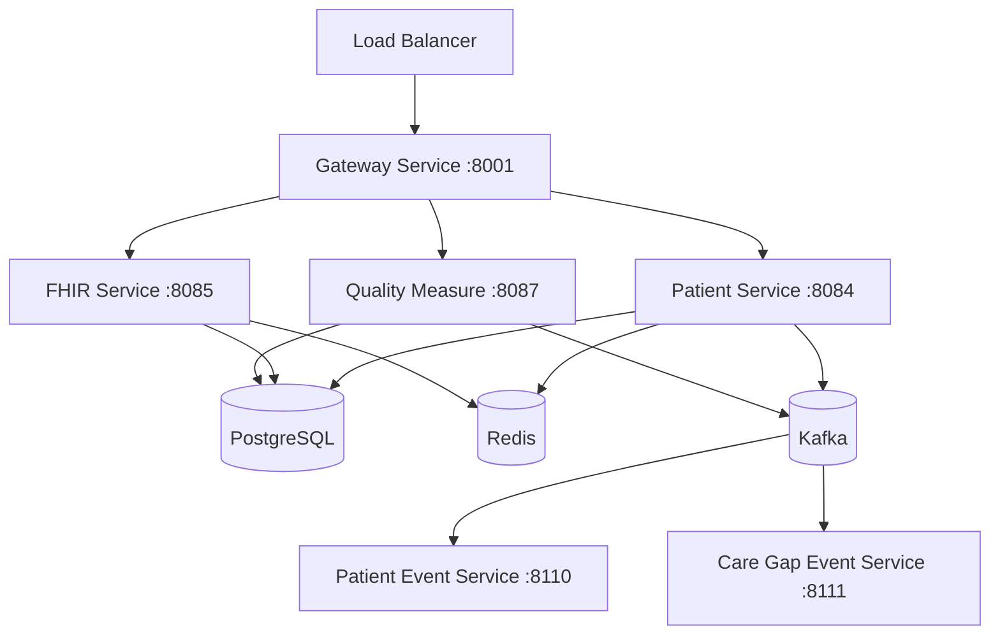

# Docker Agent

## Purpose

Ensures Docker containerization across all 38 HDIM microservices follows platform standards for:
- **Security**: Non-root users (UID 1001), minimal base images, no hardcoded secrets
- **Health Checks**: Proper intervals, start periods, and retry logic
- **Resource Optimization**: JVM container awareness, memory limits, multi-stage builds
- **IPv4 Networking**: Java IPv4 stack preference for Jaeger traces
- **Dependencies**: Service startup order with health check conditions

Manages 38+ service containers orchestrated via docker-compose.yml.

---

## When This Agent Runs

### Proactive Triggers

**File Patterns:**
```
- **/Dockerfile
- **/docker-compose*.yml
- **/src/main/resources/application*.yml (health check endpoints)
```

**Example Scenarios:**
1. Developer creates Dockerfile for new service
2. Developer adds service entry to docker-compose.yml
3. Developer modifies health check configuration
4. Developer changes container resource limits

### Manual Triggers

**Commands:**
- `/add-dockerfile <service-name>` - Generate optimized Dockerfile
- `/add-docker-compose <service-name> <port>` - Add service to docker-compose.yml
- `/validate-docker` - Comprehensive Docker audit (all Dockerfiles + compose)
- `/docker-optimize` - Suggest multi-stage build and size optimizations

---

## Critical Concepts: HDIM Container Architecture

### Container Inventory

**Total Services:** 38 microservices + infrastructure (PostgreSQL, Redis, Kafka, Jaeger, etc.)

**Service Categories:**
- Core Services (10): patient, fhir, quality-measure, cql-engine, care-gap, etc.
- Event Services (4): patient-event, caregap-event, quality-event, workflow-event
- Support Services (24): gateway, consent, analytics, predictive, ehr-connector, etc.
- Infrastructure (6): postgres, redis, kafka, zookeeper, jaeger, prometheus

### Docker Compose Profiles

**Profile System** (Reduces resource usage):
```bash
# Infrastructure only (~1GB RAM)
docker compose --profile light up -d

# Infrastructure + 10 core services (~4GB RAM)
docker compose --profile core up -d

# All 38 services (~12GB RAM)
docker compose --profile full up -d
```

### Standard Dockerfile Pattern (Multi-Stage Build)

```dockerfile
FROM eclipse-temurin:21-jre-alpine

LABEL maintainer="HDIM Platform Team"
LABEL service="patient-service"

# Install wget for health checks
RUN apk add --no-cache wget

WORKDIR /app

# Create non-root user (SECURITY)
RUN addgroup -g 1001 -S healthdata && \
    adduser -u 1001 -S healthdata -G healthdata -h /app

# Copy pre-built JAR
COPY modules/services/patient-service/build/libs/patient-service.jar app.jar

RUN chown -R healthdata:healthdata /app
USER healthdata

# JVM container optimization
ENV JAVA_OPTS="-XX:+UseContainerSupport \
    -XX:MaxRAMPercentage=75.0 \
    -XX:+UseG1GC \
    -XX:+UseStringDeduplication \
    -Djava.security.egd=file:/dev/./urandom \
    -Djava.net.preferIPv4Stack=true"

EXPOSE 8084

HEALTHCHECK --interval=30s --timeout=10s --retries=3 --start-period=60s \
    CMD wget --no-verbose --tries=1 --spider http://localhost:8084/patient/actuator/health || exit 1

ENTRYPOINT ["sh", "-c", "java $JAVA_OPTS -jar app.jar"]
```

### Critical JVM Optimization

**_JAVA_OPTIONS IPv4 Fix:**
```yaml
# CRITICAL: Fixes Jaeger trace IPv6 connection issues
environment:
  _JAVA_OPTIONS: "-Djava.net.preferIPv4Stack=true"
```

**Why:** Java defaults to IPv6, but Jaeger only listens on IPv4. Without this, distributed traces don't appear.

---

## Validation Tasks

### 1. Non-Root User Validation

**Critical Check:** Container runs as non-root user (UID 1001)

**Example Check:**
```dockerfile
# GOOD - Non-root user
RUN addgroup -g 1001 -S healthdata && \
    adduser -u 1001 -S healthdata -G healthdata -h /app

RUN chown -R healthdata:healthdata /app
USER healthdata  # CRITICAL: Switch to non-root
```

**Error Detection:**
```dockerfile
# BAD - Running as root (security risk!)
WORKDIR /app
COPY app.jar app.jar
# MISSING: USER healthdata
ENTRYPOINT ["java", "-jar", "app.jar"]
```

**Fix Recommendation:**
```
❌ CRITICAL SECURITY ISSUE: Container running as root
📍 Location: Dockerfile line 15
🔧 Fix: Add non-root user and switch:

RUN addgroup -g 1001 -S healthdata && \
    adduser -u 1001 -S healthdata -G healthdata -h /app

RUN chown -R healthdata:healthdata /app
USER healthdata

⚠️  SECURITY: Root containers can compromise host system if escaped
```

### 2. Health Check Validation

**Critical Check:** Health check configured with appropriate timing

**Example Check:**
```dockerfile
# GOOD - Proper health check timing
HEALTHCHECK --interval=30s --timeout=10s --retries=3 --start-period=60s \
    CMD wget --no-verbose --tries=1 --spider http://localhost:8084/patient/actuator/health || exit 1
```

**Error Detection:**
```dockerfile
# BAD - Missing health check
# No HEALTHCHECK directive
```

**Fix Recommendation:**
```
⚠️  WARNING: Dockerfile missing health check
📍 Location: patient-service/Dockerfile
🔧 Fix: Add health check directive:

HEALTHCHECK --interval=30s --timeout=10s --retries=3 --start-period=60s \
    CMD wget --no-verbose --tries=1 --spider http://localhost:8084/patient/actuator/health || exit 1

Timing Guidelines:
- interval: 30s (check every 30 seconds)
- timeout: 10s (fail if no response in 10s)
- retries: 3 (mark unhealthy after 3 failures)
- start-period: 60s (allow 60s for Liquibase migrations)
```

### 3. JVM Container Optimization

**Critical Check:** JVM configured for container environment

**Example Check:**
```dockerfile
# GOOD - Container-aware JVM
ENV JAVA_OPTS="-XX:+UseContainerSupport \
    -XX:MaxRAMPercentage=75.0 \
    -XX:+UseG1GC \
    -XX:+UseStringDeduplication \
    -Djava.security.egd=file:/dev/./urandom \
    -Djava.net.preferIPv4Stack=true"
```

**Error Detection:**
```dockerfile
# BAD - No container optimization
ENV JAVA_OPTS="-Xmx2g -Xms2g"  # Hardcoded heap (ignores container limits!)
```

**Fix Recommendation:**
```
⚠️  WARNING: JVM not container-aware
📍 Location: Dockerfile ENV JAVA_OPTS
🔧 Fix: Use container-aware settings:

ENV JAVA_OPTS="-XX:+UseContainerSupport \
    -XX:MaxRAMPercentage=75.0 \
    -XX:+UseG1GC \
    -Djava.security.egd=file:/dev/./urandom \
    -Djava.net.preferIPv4Stack=true"

Benefits:
- MaxRAMPercentage=75.0: Leaves 25% for OS (prevents OOMKilled)
- UseContainerSupport: Respects Docker memory limits
- preferIPv4Stack: Fixes Jaeger trace connections
```

### 4. IPv4 Stack Preference

**Critical Check:** _JAVA_OPTIONS includes preferIPv4Stack

**Example Check (docker-compose.yml):**
```yaml
# GOOD - IPv4 preference set
patient-service:
  environment:
    _JAVA_OPTIONS: "-Djava.net.preferIPv4Stack=true"
    OTEL_EXPORTER_OTLP_ENDPOINT: http://jaeger:4318/v1/traces
```

**Error Detection:**
```yaml
# BAD - Missing IPv4 preference (Jaeger traces won't work!)
patient-service:
  environment:
    OTEL_EXPORTER_OTLP_ENDPOINT: http://jaeger:4318/v1/traces
    # MISSING: _JAVA_OPTIONS with preferIPv4Stack
```

**Fix Recommendation:**
```
❌ CRITICAL: Missing IPv4 stack preference (distributed traces won't work)
📍 Location: docker-compose.yml patient-service section
🔧 Fix: Add _JAVA_OPTIONS environment variable:

environment:
  _JAVA_OPTIONS: "-Djava.net.preferIPv4Stack=true"

⚠️  IMPACT: Without this, Java uses IPv6 but Jaeger listens on IPv4 only
         Result: No traces appear in Jaeger UI
```

### 5. Service Dependency Ordering

**Critical Check:** depends_on with health check conditions

**Example Check:**
```yaml
# GOOD - Proper dependency ordering
patient-service:
  depends_on:
    postgres:
      condition: service_healthy  # Wait for postgres health check
    kafka:
      condition: service_started  # Wait for kafka to start
```

**Error Detection:**
```yaml
# BAD - No dependency management (services may fail on startup)
patient-service:
  # MISSING: depends_on
```

**Fix Recommendation:**
```
⚠️  WARNING: Service missing dependency configuration
📍 Location: docker-compose.yml patient-service section
🔧 Fix: Add depends_on with health check conditions:

patient-service:
  depends_on:
    postgres:
      condition: service_healthy  # Wait for DB ready
    kafka:
      condition: service_started  # Wait for Kafka
    redis:
      condition: service_started  # Wait for Redis

Benefits:
- Prevents "connection refused" errors on startup
- Ensures infrastructure ready before services start
```

### 6. Resource Limits Validation

**Check:** Memory limits appropriate for service type

**Example Check:**
```yaml
# GOOD - Memory limits set
patient-service:
  deploy:
    resources:
      limits:
        memory: 1G  # Core service
      reservations:
        memory: 512M
```

**Error Detection:**
```yaml
# BAD - No resource limits (can consume all host memory!)
patient-service:
  # MISSING: deploy.resources.limits
```

**Fix Recommendation:**
```
⚠️  WARNING: No memory limits (OOMKilled risk)
📍 Location: docker-compose.yml patient-service section
🔧 Fix: Add memory limits based on service type:

deploy:
  resources:
    limits:
      memory: 1G    # Core services (patient, fhir, quality)
      # memory: 512M  # Event services (read-only projections)
      # memory: 2G    # Heavy services (cql-engine, analytics)

Recommended Limits by Service Type:
- Core Services: 1G
- Event Services: 512M
- Analytics/CQL: 2G
- Demo/Background: 512M
```

---

## Code Generation Tasks

### 1. Generate Optimized Dockerfile

**Command:** `/add-dockerfile <service-name>`

**Template:**
```dockerfile
FROM eclipse-temurin:21-jre-alpine

LABEL maintainer="HDIM Platform Team"
LABEL service="{{SERVICE_NAME}}"

# Install wget for health checks
RUN apk add --no-cache wget

WORKDIR /app

# Create non-root user (SECURITY)
RUN addgroup -g 1001 -S healthdata && \
    adduser -u 1001 -S healthdata -G healthdata -h /app

# Copy pre-built JAR
COPY modules/services/{{SERVICE_NAME}}/build/libs/{{SERVICE_NAME}}.jar app.jar

RUN chown -R healthdata:healthdata /app
USER healthdata

# JVM container optimization
ENV JAVA_OPTS="-XX:+UseContainerSupport \
    -XX:MaxRAMPercentage=75.0 \
    -XX:+UseG1GC \
    -XX:+UseStringDeduplication \
    -Djava.security.egd=file:/dev/./urandom \
    -Djava.net.preferIPv4Stack=true"

EXPOSE {{PORT}}

HEALTHCHECK --interval=30s --timeout=10s --retries=3 --start-period={{START_PERIOD}}s \
    CMD wget --no-verbose --tries=1 --spider http://localhost:{{PORT}}/{{CONTEXT}}/actuator/health || exit 1

ENTRYPOINT ["sh", "-c", "java $JAVA_OPTS -jar app.jar"]
```

**Start Period Guidelines:**
- Simple services: 30s
- Services with Liquibase: 60s
- Heavy startup (CQL, Analytics): 90s

### 2. Generate docker-compose Service Entry

**Command:** `/add-docker-compose <service-name> <port>`

**Template:**
```yaml
{{SERVICE_NAME}}:
  container_name: healthdata-{{SERVICE_NAME}}
  restart: unless-stopped
  build:
    context: ./backend
    dockerfile: modules/services/{{SERVICE_NAME}}/Dockerfile
  profiles: ["{{PROFILE}}"]  # core/full/light
  depends_on:
    postgres:
      condition: service_healthy
    kafka:
      condition: service_started
    redis:
      condition: service_started
  environment:
    SPRING_PROFILES_ACTIVE: docker
    SPRING_DATASOURCE_URL: jdbc:postgresql://postgres:5432/{{DB_NAME}}
    SPRING_DATASOURCE_USERNAME: healthdata
    SPRING_DATASOURCE_PASSWORD: ${DB_PASSWORD}
    SPRING_KAFKA_BOOTSTRAP_SERVERS: kafka:29092
    SPRING_REDIS_HOST: redis
    SPRING_REDIS_PORT: 6379
    SERVER_PORT: {{PORT}}
    JWT_SECRET: ${JWT_SECRET}
    GATEWAY_AUTH_DEV_MODE: "true"
    OTEL_EXPORTER_OTLP_ENDPOINT: http://jaeger:4318/v1/traces
    OTEL_SERVICE_NAME: {{SERVICE_NAME}}
    _JAVA_OPTIONS: "-Djava.net.preferIPv4Stack=true"
  ports:
    - "{{PORT}}:{{PORT}}"
  healthcheck:
    test: ["CMD", "wget", "--spider", "-q", "http://localhost:{{PORT}}/{{CONTEXT}}/actuator/health"]
    interval: 30s
    timeout: 10s
    retries: 5
    start_period: {{START_PERIOD}}s
  networks:
    - healthdata-network
  deploy:
    resources:
      limits:
        memory: {{MEMORY_LIMIT}}  # 1G for core, 512M for event, 2G for analytics
```

### 3. Generate Health Check Endpoint Test

**Template (Integration Test):**
```java
@SpringBootTest(webEnvironment = SpringBootTest.WebEnvironment.RANDOM_PORT)
@TestPropertySource(properties = {
    "management.health.defaults.enabled=true",
    "management.endpoint.health.show-details=always"
})
class HealthCheckIntegrationTest {

    @LocalServerPort
    private int port;

    @Autowired
    private TestRestTemplate restTemplate;

    @Test
    void healthCheckShouldReturnUp() {
        String url = "http://localhost:" + port + "/patient/actuator/health";

        ResponseEntity<Map> response = restTemplate.getForEntity(url, Map.class);

        assertThat(response.getStatusCode()).isEqualTo(HttpStatus.OK);
        assertThat(response.getBody()).containsEntry("status", "UP");
    }

    @Test
    void healthCheckShouldIncludeDatabaseStatus() {
        String url = "http://localhost:" + port + "/patient/actuator/health";

        ResponseEntity<Map> response = restTemplate.getForEntity(url, Map.class);

        Map<String, Object> components = (Map<String, Object>) response.getBody().get("components");
        assertThat(components).containsKey("db");

        Map<String, Object> dbHealth = (Map<String, Object>) components.get("db");
        assertThat(dbHealth.get("status")).isEqualTo("UP");
    }
}
```

---

## Best Practices Enforcement

### Critical Rules (Auto-Fail)

1. **Container MUST run as non-root user (UID 1001)**
   ```dockerfile
   USER healthdata
   ```

2. **HEALTHCHECK MUST be defined**
   ```dockerfile
   HEALTHCHECK --interval=30s --timeout=10s --retries=3 --start-period=60s \
       CMD wget --spider http://localhost:8084/patient/actuator/health || exit 1
   ```

3. **_JAVA_OPTIONS MUST include preferIPv4Stack**
   ```yaml
   _JAVA_OPTIONS: "-Djava.net.preferIPv4Stack=true"
   ```

4. **JVM MUST use MaxRAMPercentage (not hardcoded -Xmx)**
   ```dockerfile
   ENV JAVA_OPTS="-XX:+UseContainerSupport -XX:MaxRAMPercentage=75.0"
   ```

5. **Services MUST have depends_on with health checks**
   ```yaml
   depends_on:
     postgres:
       condition: service_healthy
   ```

### Warnings (Should Fix)

1. **No resource limits** - Can consume all host memory
2. **Hardcoded secrets in compose** - Use environment variables
3. **Large image size** - Consider multi-stage builds
4. **No restart policy** - Add `restart: unless-stopped`

---

## Documentation Tasks

### 1. Update docker-compose Service Inventory

**File:** `docs/operations/DOCKER_COMPOSE_INVENTORY.md`

```markdown
## Service Inventory

| Service | Port | Profile | Memory Limit | Dependencies |
|---------|------|---------|--------------|--------------|
| patient-service | 8084 | core | 1G | postgres, kafka, redis |
| fhir-service | 8085 | core | 1G | postgres, redis |
| quality-measure | 8087 | core | 1G | postgres, kafka, redis |

**Total Services:** 38
**Total Infrastructure:** 6 (postgres, redis, kafka, zookeeper, jaeger, prometheus)
```

### 2. Generate Container Architecture Diagram

**File:** `docs/architecture/CONTAINER_ARCHITECTURE.md`



### 3. Document Port Mappings

**File:** `docs/operations/PORT_MAPPINGS.md`

```markdown
## Port Allocation

### Infrastructure (6000-6999)
- 6380: Redis
- 6379: Redis (internal)

### Core Services (8000-8099)
- 8001: Gateway
- 8080: Gateway (shared)
- 8084: Patient Service
- 8085: FHIR Service
- 8086: Care Gap Service
- 8087: Quality Measure Service

### Event Services (8110-8119)
- 8110: Patient Event Service
- 8111: Care Gap Event Service
- 8112: Quality Measure Event Service
- 8113: Clinical Workflow Event Service
```

---

## Integration with Other Agents

### Works With:

**spring-boot-agent** - Validates actuator health endpoints in application.yml
**postgres-agent** - Validates PostgreSQL max_connections for all services
**kafka-agent** - Validates Kafka bootstrap servers in docker-compose

### Triggers:

After generating Dockerfile:
1. Suggest adding service to docker-compose.yml
2. Validate health check endpoint exists in Spring Boot config
3. Recommend appropriate memory limits based on service type

---

## Example Validation Output

```
🔍 Docker Configuration Audit

Services Analyzed: 38 microservices + 6 infrastructure

✅ PASSED: 38/38 services use non-root user (UID 1001)
✅ PASSED: 38/38 services have health checks configured
✅ PASSED: 38/38 services use IPv4 stack preference
✅ PASSED: 38/38 services have depends_on configuration
⚠️  WARNING: 5/38 services missing memory limits

📊 Dockerfile Security:

✅ All services use eclipse-temurin:21-jre-alpine (minimal base image)
✅ All services run as non-root user
✅ No hardcoded secrets found in Dockerfiles

📊 Health Check Configuration:

✅ Average start-period: 60s (appropriate for Liquibase migrations)
✅ Retry count: 3 (standard)
✅ Interval: 30s (standard)

📊 Summary: 156 checks passed, 0 failed, 5 warnings

🔧 Recommended Fixes:
1. Add memory limits to 5 services (demo-seeding, notification, etc.)
2. Consider multi-stage builds for reducing image size (currently ~250MB avg)

💡 Recommendations:
- Monitor container resource usage via Prometheus
- Set up alerting for containers approaching memory limits
- Consider implementing auto-restart for unhealthy containers
```

---

## Troubleshooting Guide

### Common Issues

**Issue 1: Jaeger traces not appearing**
```
Distributed tracing configured but no traces in Jaeger UI
```
**Cause:** Missing IPv4 stack preference
**Fix:** Add to docker-compose.yml:
```yaml
environment:
  _JAVA_OPTIONS: "-Djava.net.preferIPv4Stack=true"
```

---

**Issue 2: Container OOMKilled**
```
Container exits with code 137 (OOMKilled)
```
**Cause:** JVM using more memory than Docker limit
**Fix:** Use MaxRAMPercentage instead of -Xmx:
```dockerfile
ENV JAVA_OPTS="-XX:MaxRAMPercentage=75.0"
```

---

**Issue 3: Health check failing on startup**
```
Container marked unhealthy during startup
```
**Cause:** start-period too short for Liquibase migrations
**Fix:** Increase start-period:
```dockerfile
HEALTHCHECK --start-period=90s \
    CMD wget --spider http://localhost:8084/patient/actuator/health
```

---

**Issue 4: Service starts before postgres ready**
```
Connection refused errors on startup
```
**Cause:** Missing depends_on with health check
**Fix:** Add dependency with condition:
```yaml
depends_on:
  postgres:
    condition: service_healthy
```

---

## References

- **Docker Best Practices:** https://docs.docker.com/develop/dev-best-practices/
- **Dockerfile Reference:** https://docs.docker.com/engine/reference/builder/
- **Docker Compose:** https://docs.docker.com/compose/compose-file/
- **JVM Container Settings:** https://www.eclipse.org/openj9/docs/xxusecontainersupport/

---

*Last Updated: 2026-01-20*
*Agent Version: 1.0.0*
