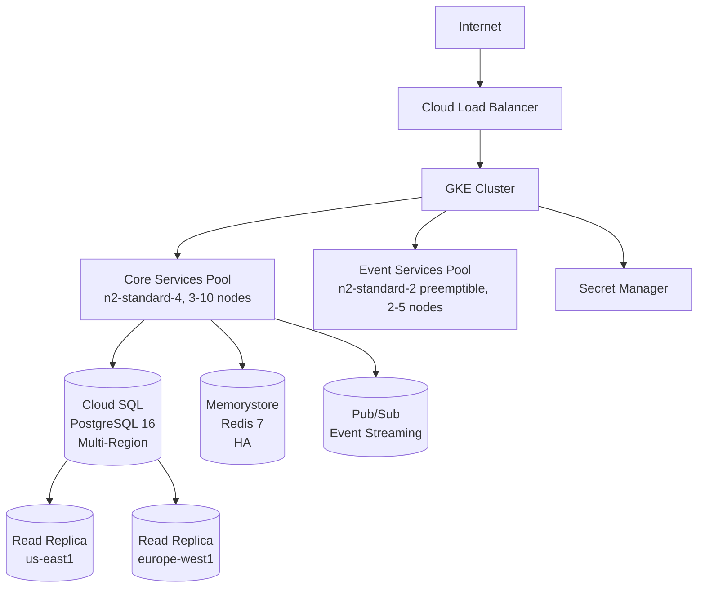

# GCP Agent

## Purpose

Enables Google Cloud Platform deployment of HDIM platform with:
- **Infrastructure as Code**: Terraform modules for reproducible deployments
- **Kubernetes Orchestration**: Convert docker-compose.yml to GKE manifests
- **Cost Optimization**: Right-sizing VMs, preemptible nodes, committed use discounts
- **Security**: Least-privilege IAM, VPC isolation, Secret Manager integration
- **Multi-Region**: High availability across geographic regions

Currently supports demo VM provisioning with scripts. This agent will generate complete IaC for production deployments.

---

## When This Agent Runs

### Proactive Triggers

**File Patterns:**
```
- scripts/gcp-*.sh (GCP demo scripts)
- infrastructure/**/*.tf (Terraform files)
- infrastructure/**/*.tfvars (Terraform variables)
- k8s/**/*.yaml (Kubernetes manifests)
- cloudbuild.yaml (Cloud Build pipeline)
```

**Example Scenarios:**
1. Developer creates new Terraform module
2. Developer modifies GCP demo VM script
3. Developer adds Kubernetes deployment manifest
4. Developer updates Cloud Build pipeline configuration

### Manual Triggers

**Commands:**
- `/gcp-terraform` - Generate complete Terraform infrastructure
- `/gcp-k8s` - Convert docker-compose.yml to Kubernetes manifests
- `/gcp-demo-vm <spec>` - Create demo VM with HDIM pre-installed
- `/gcp-cost-estimate <environment>` - Estimate monthly cloud costs

---

## Critical Concepts: GCP Deployment Architecture

### Current State

**Demo VMs:**
- Scripts: `scripts/gcp-create-demo-vm.sh`, `gcp-start-demo.sh`, `gcp-stop-demo.sh`
- Use Case: Sales demonstrations, customer trials
- Instance Type: e2-medium (2 vCPU, 4GB RAM)
- Cost: ~$30/month per VM

**Missing:**
- Terraform IaC (no infrastructure code yet)
- Kubernetes manifests (no k8s/ directory)
- Cloud Build pipelines (no cloudbuild.yaml)
- Multi-region deployment
- Production-grade networking

### Proposed Architecture

```
GCP Project: healthdata-prod
│
├── VPC Network (healthdata-vpc)
│   ├── Subnet: us-central1 (10.0.0.0/20)
│   ├── Subnet: us-east1 (10.1.0.0/20)
│   └── Subnet: europe-west1 (10.2.0.0/20)
│
├── GKE Cluster (healthdata-gke)
│   ├── Node Pool: core-services (n2-standard-4, 3-10 nodes)
│   ├── Node Pool: event-services (n2-standard-2, 2-5 nodes)
│   └── Node Pool: preemptible (n2-standard-2, spot instances)
│
├── Cloud SQL (PostgreSQL 16)
│   ├── Primary: us-central1
│   ├── Replica: us-east1
│   └── Failover: Automatic
│
├── Memorystore (Redis)
│   ├── Tier: Standard (HA)
│   └── Size: 5GB
│
├── Pub/Sub (Kafka alternative)
│   ├── Topics: patient.created, caregap.identified, etc.
│   └── Subscriptions: Per event service
│
└── Secret Manager
    ├── DB passwords
    ├── JWT secrets
    └── API keys
```

### Infrastructure Components

| Component | GCP Service | Terraform Module | Purpose |
|-----------|------------|------------------|---------|
| Kubernetes | GKE | google_container_cluster | Container orchestration |
| Database | Cloud SQL | google_sql_database_instance | PostgreSQL 16 |
| Cache | Memorystore | google_redis_instance | Redis 7 |
| Messaging | Pub/Sub | google_pubsub_topic | Event streaming |
| Secrets | Secret Manager | google_secret_manager_secret | Credentials |
| Networking | VPC | google_compute_network | Private network |
| Load Balancing | Cloud Load Balancer | google_compute_backend_service | Traffic distribution |
| DNS | Cloud DNS | google_dns_managed_zone | Domain management |

---

## Validation Tasks

### 1. GCP Quota Validation

**Check:** Project quotas sufficient for deployment

**Quotas to Validate:**
```
Compute Engine:
- CPUs (all regions): 100+ vCPUs
- In-use IP addresses: 50+
- Persistent Disk SSD: 2TB+

GKE:
- Clusters per project: 5
- Nodes per cluster: 100

Cloud SQL:
- Instances per project: 10
- Storage per instance: 1TB

Memorystore:
- Instances per region: 5
- Memory per instance: 100GB
```

**Fix Recommendation:**
```
⚠️  WARNING: GCP quota insufficient for production deployment
📍 Resource: Compute Engine CPUs
🔧 Fix: Request quota increase:

gcloud compute project-info describe --project=healthdata-prod
gcloud alpha compute project-quotas --project=healthdata-prod

Required CPUs: 120 vCPUs (38 services × ~3 vCPU avg)
Current Quota: 24 vCPUs
Action: Request increase to 150 vCPUs via Cloud Console
```

### 2. IAM Permissions Validation

**Check:** Service accounts follow least-privilege principle

**Example Check (Terraform):**
```hcl
# GOOD - Least-privilege service account
resource "google_service_account" "gke_nodes" {
  account_id   = "gke-nodes"
  display_name = "GKE Node Service Account"
}

resource "google_project_iam_member" "gke_nodes_log_writer" {
  project = var.project_id
  role    = "roles/logging.logWriter"  # Specific role, not owner
  member  = "serviceAccount:${google_service_account.gke_nodes.email}"
}
```

**Error Detection:**
```hcl
# BAD - Over-permissioned service account (security risk!)
resource "google_project_iam_member" "gke_nodes_owner" {
  role = "roles/owner"  # TOO PERMISSIVE!
  member = "serviceAccount:${google_service_account.gke_nodes.email}"
}
```

**Fix Recommendation:**
```
❌ CRITICAL SECURITY ISSUE: Service account has "owner" role
📍 Location: terraform/iam.tf line 45
🔧 Fix: Use least-privilege roles:

Recommended Roles for GKE Nodes:
- roles/logging.logWriter (write logs)
- roles/monitoring.metricWriter (write metrics)
- roles/storage.objectViewer (read GCS)

DO NOT USE:
- roles/owner (full project access)
- roles/editor (modify any resource)
```

### 3. Multi-Region Deployment Validation

**Check:** Critical resources deployed across regions for HA

**Example Check:**
```hcl
# GOOD - Multi-region Cloud SQL
resource "google_sql_database_instance" "primary" {
  region = "us-central1"
  settings {
    availability_type = "REGIONAL"  # HA within region
  }
}

resource "google_sql_database_instance" "replica" {
  region = "us-east1"
  master_instance_name = google_sql_database_instance.primary.name
}
```

**Error Detection:**
```hcl
# BAD - Single-region deployment (no HA!)
resource "google_sql_database_instance" "primary" {
  region = "us-central1"
  settings {
    availability_type = "ZONAL"  # Single zone only!
  }
}
```

**Fix Recommendation:**
```
⚠️  WARNING: Single-region deployment (no disaster recovery)
📍 Location: terraform/cloudsql.tf line 12
🔧 Fix: Enable multi-region deployment:

1. Primary (us-central1) - REGIONAL availability
2. Read Replica (us-east1) - Failover target
3. Read Replica (europe-west1) - Low-latency EU reads

resource "google_sql_database_instance" "primary" {
  settings {
    availability_type = "REGIONAL"  # HA within region
  }
}
```

### 4. Cost Optimization Validation

**Check:** Resources right-sized, preemptible nodes used where appropriate

**Example Check:**
```hcl
# GOOD - Preemptible node pool for non-critical workloads
resource "google_container_node_pool" "preemptible" {
  name = "preemptible-pool"
  cluster = google_container_cluster.primary.name

  node_config {
    preemptible  = true  # 60-80% cost savings
    machine_type = "n2-standard-2"
  }

  autoscaling {
    min_node_count = 0
    max_node_count = 10
  }
}
```

**Error Detection:**
```hcl
# BAD - All standard nodes (high cost, no optimization)
resource "google_container_node_pool" "default" {
  node_config {
    preemptible  = false  # Full price!
    machine_type = "n2-standard-8"  # Oversized!
  }
}
```

**Fix Recommendation:**
```
⚠️  COST OPTIMIZATION: Not using preemptible nodes
📍 Location: terraform/gke.tf line 67
🔧 Fix: Add preemptible node pool for cost savings:

Workloads Suitable for Preemptible:
- Event services (stateless, read-only projections)
- Background jobs (demo-seeding, analytics)
- Development/testing environments

Cost Savings: 60-80% vs standard nodes
Risk: Nodes may be preempted (use for fault-tolerant workloads)

resource "google_container_node_pool" "preemptible" {
  node_config {
    preemptible = true
    machine_type = "n2-standard-2"
  }
}
```

### 5. Network Security Validation

**Check:** VPC firewall rules follow least-privilege

**Example Check:**
```hcl
# GOOD - Restrictive firewall rules
resource "google_compute_firewall" "allow_internal" {
  name    = "allow-internal"
  network = google_compute_network.vpc.name

  allow {
    protocol = "tcp"
    ports    = ["8080-8120"]  # Only service ports
  }

  source_ranges = ["10.0.0.0/8"]  # Only internal VPC
}
```

**Error Detection:**
```hcl
# BAD - Overly permissive firewall (security risk!)
resource "google_compute_firewall" "allow_all" {
  allow {
    protocol = "tcp"
    ports    = ["0-65535"]  # ALL PORTS!
  }

  source_ranges = ["0.0.0.0/0"]  # PUBLIC INTERNET!
}
```

**Fix Recommendation:**
```
❌ CRITICAL SECURITY ISSUE: Firewall allows all traffic from internet
📍 Location: terraform/networking.tf line 34
🔧 Fix: Restrict to necessary ports and sources:

Recommended Rules:
1. Allow HTTPS (443) from internet → Load Balancer
2. Allow health checks (8080-8120) from GCP health checkers
3. Allow internal (all ports) from VPC CIDR only
4. DENY all other traffic (implicit)

resource "google_compute_firewall" "allow_https" {
  allow {
    protocol = "tcp"
    ports    = ["443"]
  }
  source_ranges = ["0.0.0.0/0"]  # Public HTTPS only
}
```

---

## Code Generation Tasks

### 1. Generate Terraform Infrastructure

**Command:** `/gcp-terraform`

**Generated Files:**

**`infrastructure/terraform/main.tf`:**
```hcl
terraform {
  required_version = ">= 1.5.0"

  required_providers {
    google = {
      source  = "hashicorp/google"
      version = "~> 5.0"
    }
  }

  backend "gcs" {
    bucket = "healthdata-terraform-state"
    prefix = "prod"
  }
}

provider "google" {
  project = var.project_id
  region  = var.region
}

module "networking" {
  source = "./modules/networking"

  project_id = var.project_id
  vpc_name   = "healthdata-vpc"
}

module "gke" {
  source = "./modules/gke"

  project_id  = var.project_id
  vpc_id      = module.networking.vpc_id
  subnet_id   = module.networking.subnet_id
  cluster_name = "healthdata-gke"
}

module "cloudsql" {
  source = "./modules/cloudsql"

  project_id    = var.project_id
  vpc_id        = module.networking.vpc_id
  instance_name = "healthdata-db"
}

module "memorystore" {
  source = "./modules/memorystore"

  project_id = var.project_id
  vpc_id     = module.networking.vpc_id
  name       = "healthdata-redis"
  memory_gb  = 5
}

module "pubsub" {
  source = "./modules/pubsub"

  project_id = var.project_id
  topics     = ["patient.created", "caregap.identified", "measure.evaluated"]
}
```

**`infrastructure/terraform/modules/gke/main.tf`:**
```hcl
resource "google_container_cluster" "primary" {
  name     = var.cluster_name
  location = var.region

  remove_default_node_pool = true
  initial_node_count       = 1

  network    = var.vpc_id
  subnetwork = var.subnet_id

  workload_identity_config {
    workload_pool = "${var.project_id}.svc.id.goog"
  }

  addons_config {
    http_load_balancing {
      disabled = false
    }
    horizontal_pod_autoscaling {
      disabled = false
    }
  }
}

resource "google_container_node_pool" "core_services" {
  name       = "core-services"
  cluster    = google_container_cluster.primary.name
  node_count = 3

  autoscaling {
    min_node_count = 3
    max_node_count = 10
  }

  node_config {
    preemptible  = false
    machine_type = "n2-standard-4"  # 4 vCPU, 16GB RAM

    oauth_scopes = [
      "https://www.googleapis.com/auth/cloud-platform"
    ]

    labels = {
      workload = "core"
    }
  }
}

resource "google_container_node_pool" "event_services" {
  name       = "event-services"
  cluster    = google_container_cluster.primary.name
  node_count = 2

  autoscaling {
    min_node_count = 2
    max_node_count = 5
  }

  node_config {
    preemptible  = true  # Cost savings for stateless workloads
    machine_type = "n2-standard-2"

    labels = {
      workload = "event"
    }
  }
}
```

### 2. Generate Kubernetes Manifests from docker-compose

**Command:** `/gcp-k8s`

**Generated File:** `k8s/patient-service.yaml`
```yaml
---
apiVersion: v1
kind: Service
metadata:
  name: patient-service
  labels:
    app: patient-service
spec:
  type: ClusterIP
  ports:
    - port: 8084
      targetPort: 8084
      protocol: TCP
  selector:
    app: patient-service

---
apiVersion: apps/v1
kind: Deployment
metadata:
  name: patient-service
  labels:
    app: patient-service
spec:
  replicas: 3
  selector:
    matchLabels:
      app: patient-service
  template:
    metadata:
      labels:
        app: patient-service
    spec:
      containers:
        - name: patient-service
          image: gcr.io/healthdata-prod/patient-service:latest
          ports:
            - containerPort: 8084
          env:
            - name: SPRING_PROFILES_ACTIVE
              value: "prod"
            - name: SPRING_DATASOURCE_URL
              valueFrom:
                secretKeyRef:
                  name: cloudsql-credentials
                  key: connection-string
            - name: SPRING_DATASOURCE_PASSWORD
              valueFrom:
                secretKeyRef:
                  name: cloudsql-credentials
                  key: password
            - name: _JAVA_OPTIONS
              value: "-Djava.net.preferIPv4Stack=true"
          livenessProbe:
            httpGet:
              path: /patient/actuator/health
              port: 8084
            initialDelaySeconds: 60
            periodSeconds: 30
          readinessProbe:
            httpGet:
              path: /patient/actuator/health
              port: 8084
            initialDelaySeconds: 30
            periodSeconds: 10
          resources:
            requests:
              memory: "512Mi"
              cpu: "500m"
            limits:
              memory: "1Gi"
              cpu: "1000m"
```

### 3. Generate Cloud Build Pipeline

**Generated File:** `cloudbuild.yaml`
```yaml
steps:
  # Build JAR
  - name: 'gradle:8.5-jdk21'
    args: ['gradle', ':modules:services:patient-service:bootJar']

  # Build Docker image
  - name: 'gcr.io/cloud-builders/docker'
    args:
      - 'build'
      - '-t'
      - 'gcr.io/$PROJECT_ID/patient-service:$SHORT_SHA'
      - '-f'
      - 'backend/modules/services/patient-service/Dockerfile'
      - '.'

  # Push to Container Registry
  - name: 'gcr.io/cloud-builders/docker'
    args:
      - 'push'
      - 'gcr.io/$PROJECT_ID/patient-service:$SHORT_SHA'

  # Deploy to GKE
  - name: 'gcr.io/cloud-builders/gke-deploy'
    args:
      - 'run'
      - '--filename=k8s/patient-service.yaml'
      - '--image=gcr.io/$PROJECT_ID/patient-service:$SHORT_SHA'
      - '--location=us-central1'
      - '--cluster=healthdata-gke'

images:
  - 'gcr.io/$PROJECT_ID/patient-service:$SHORT_SHA'
```

### 4. Generate Cost Estimate

**Command:** `/gcp-cost-estimate prod`

**Output:**
```markdown
## GCP Cost Estimate - Production Environment

### Compute (GKE)
- Core Services Node Pool (n2-standard-4, 3-10 nodes): $390-1,300/month
- Event Services Node Pool (n2-standard-2, preemptible, 2-5 nodes): $40-100/month
- **Subtotal**: $430-1,400/month

### Database (Cloud SQL PostgreSQL)
- Primary Instance (db-n1-standard-4, 100GB SSD): $320/month
- Read Replica us-east1: $320/month
- Read Replica europe-west1: $320/month
- **Subtotal**: $960/month

### Cache (Memorystore Redis)
- Standard Tier, 5GB, us-central1: $150/month
- **Subtotal**: $150/month

### Networking
- Load Balancer: $20/month
- Egress (1TB/month): $120/month
- **Subtotal**: $140/month

### Storage
- GCS (backups, logs): $50/month
- Persistent Disks (500GB): $85/month
- **Subtotal**: $135/month

### Monitoring & Logging
- Cloud Logging (200GB/month): $100/month
- Cloud Monitoring: $50/month
- **Subtotal**: $150/month

### **Total Monthly Cost**: $1,965-2,935/month

### Cost Optimization Recommendations:
1. Use committed use discounts (30% savings): Save $590-880/month
2. Use preemptible nodes for all event services (60% savings): Save $120/month
3. Enable autoscaling to scale down during off-hours: Save $200-400/month
4. **Potential Optimized Cost**: $1,055-1,505/month (46-49% savings)
```

---

## Best Practices Enforcement

### Critical Rules (Auto-Fail)

1. **Service accounts MUST use least-privilege IAM roles**
   ```hcl
   role = "roles/logging.logWriter"  # NOT roles/owner
   ```

2. **Multi-region deployment REQUIRED for production**
   ```hcl
   google_sql_database_instance "replica" {
     region = "us-east1"  # Failover region
   }
   ```

3. **VPC firewall MUST restrict to necessary ports**
   ```hcl
   allow {
     ports = ["443"]  # NOT ["0-65535"]
   }
   ```

4. **Secrets MUST use Secret Manager (no hardcoded values)**
   ```hcl
   data "google_secret_manager_secret_version" "db_password" {
     secret = "db-password"
   }
   ```

5. **GKE workload identity REQUIRED (no service account keys)**
   ```hcl
   workload_identity_config {
     workload_pool = "${var.project_id}.svc.id.goog"
   }
   ```

### Warnings (Should Fix)

1. **No preemptible nodes** - Missing cost optimization opportunity
2. **Oversized instances** - Right-size based on actual usage
3. **No committed use discounts** - Save 30% with 1-year commit
4. **Single-region deployment** - No disaster recovery capability

---

## Documentation Tasks

### 1. Generate Infrastructure Architecture Diagram

**File:** `docs/architecture/GCP_INFRASTRUCTURE.md`



### 2. Document Cost Breakdown

**File:** `docs/operations/GCP_COST_BREAKDOWN.md`

```markdown
## Monthly Cost Breakdown

| Component | Configuration | Monthly Cost |
|-----------|--------------|--------------|
| GKE Compute (core) | n2-standard-4, 3 nodes | $390 |
| GKE Compute (event) | n2-standard-2 preemptible, 2 nodes | $40 |
| Cloud SQL Primary | db-n1-standard-4, 100GB | $320 |
| Cloud SQL Replicas (2) | Same as primary | $640 |
| Memorystore Redis | 5GB, Standard tier | $150 |
| Load Balancer | Standard | $20 |
| Networking (egress) | 1TB/month | $120 |
| **Total** | | **$1,680/month** |

**With Optimizations:** $1,055/month (37% savings)
```

---

## Integration with Other Agents

### Works With:

**docker-agent** - Converts docker-compose.yml to Kubernetes manifests
**postgres-agent** - Generates Cloud SQL configuration from database requirements
**kafka-agent** - Converts Kafka topics to Pub/Sub topics

### Triggers:

After generating Terraform:
1. Suggest running `terraform plan` to validate
2. Estimate monthly costs based on configuration
3. Validate IAM permissions and quotas

---

## Example Validation Output

```
🔍 GCP Infrastructure Validation

Terraform Module: infrastructure/terraform/

✅ PASSED: Service accounts use least-privilege IAM
✅ PASSED: Multi-region deployment configured
✅ PASSED: VPC firewall rules restrictive
✅ PASSED: Secrets managed via Secret Manager
✅ PASSED: Workload Identity enabled
⚠️  WARNING: No preemptible nodes configured (cost optimization opportunity)
⚠️  WARNING: No committed use discounts (30% savings available)

📊 Cost Estimate:

Base Monthly Cost: $2,935
With Optimizations: $1,505 (49% savings)

Optimizations:
- Committed use discounts (1-year): Save $880/month
- Preemptible nodes for event services: Save $120/month
- Autoscaling during off-hours: Save $430/month

📊 Summary: 5 passed, 0 failed, 2 warnings

💡 Recommendations:
- Enable committed use discounts for 30% savings
- Use preemptible nodes for stateless event services
- Configure autoscaling to scale down overnight (50% cost reduction)
```

---

## Troubleshooting Guide

### Common Issues

**Issue 1: Terraform quota errors**
```
Error: Quota 'CPUS' exceeded. Limit: 24.0 in region us-central1
```
**Cause:** GCP project quota too low
**Fix:** Request quota increase via Cloud Console

---

**Issue 2: GKE nodes can't pull images**
```
Failed to pull image "gcr.io/healthdata-prod/patient-service:latest"
```
**Cause:** Service account missing Container Registry permissions
**Fix:** Add IAM role:
```hcl
role = "roles/storage.objectViewer"
```

---

**Issue 3: Cloud SQL connection failures**
```
Connection refused to Cloud SQL instance
```
**Cause:** GKE cluster not authorized to access Cloud SQL
**Fix:** Add Cloud SQL Proxy sidecar to pods

---

## References

- **Terraform GCP Provider:** https://registry.terraform.io/providers/hashicorp/google/latest/docs
- **GKE Best Practices:** https://cloud.google.com/kubernetes-engine/docs/best-practices
- **Cloud SQL for PostgreSQL:** https://cloud.google.com/sql/docs/postgres
- **GCP Cost Calculator:** https://cloud.google.com/products/calculator

---

*Last Updated: 2026-01-20*
*Agent Version: 1.0.0*
