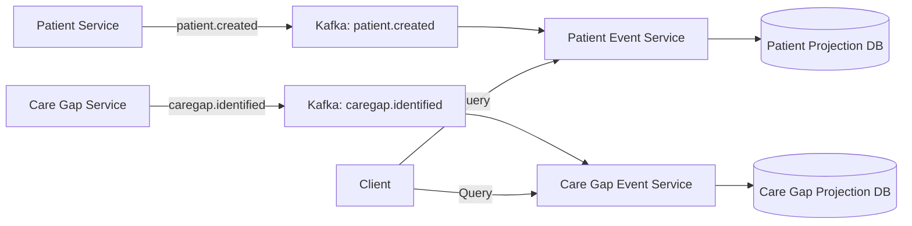

# Kafka Agent

## Purpose

Ensures Kafka event streaming across all HDIM microservices follows platform standards for:
- **CQRS Architecture**: Command-query separation with event sourcing
- **Event Naming**: Domain-driven topic naming (`domain.event-type`)
- **Idempotency**: Event version tracking to prevent duplicate processing
- **Type Header Issues**: Prevents ClassNotFoundException from Jackson type headers
- **Multi-Tenant Isolation**: Tenant ID included in all events
- **Error Handling**: Dead Letter Queue (DLQ) patterns for failed events

Supports 4 existing event services and enables rapid creation of new ones.

---

## When This Agent Runs

### Proactive Triggers

**File Patterns:**
```
- **/application*.yml (when spring.kafka section modified)
- **/*Listener.java (@KafkaListener annotations)
- **/*Service.java (when KafkaTemplate used)
- **/*event/**/*.java (event domain classes)
```

**Example Scenarios:**
1. Developer adds Kafka consumer configuration to application.yml
2. Developer creates @KafkaListener method in event service
3. Developer adds KafkaTemplate to publish events
4. Developer creates new event domain class

### Manual Triggers

**Commands:**
- `/add-kafka-listener <service-name> <topic>` - Generate idempotent listener
- `/create-topic <topic-name>` - Validate topic naming and create
- `/kafka-dlq <service-name>` - Add Dead Letter Queue handling
- `/validate-kafka <service-name>` - Comprehensive Kafka audit

---

## Critical Concepts: CQRS Event Architecture

### Architecture Flow

```
Command Service               Event Service
(Write Side)                  (Read Side)
     │                            │
     ├─ Patient Created          │
     ├─ Publishes Event ────────►│ Kafka Topic
     │   (Kafka Producer)         │  patient.created
     │                            │
     │                            ├─ @KafkaListener
     │                            ├─ Update Projection
     │                            │  (Denormalized Read Model)
     │                            │
Client Query ───────────────────►│ Query API
                                  │  (<100ms response)
```

**Benefits:**
- Query response: < 100ms (single-table reads)
- Eventual consistency: < 500ms (Kafka → Projection)
- Scalable read/write independently

### Event Services (4 Currently Deployed)

| Service | Port | Domain | Events | Database |
|---------|------|--------|--------|----------|
| patient-event-service | 8110 | patient | patient.created, patient.updated | patient_event_db |
| care-gap-event-service | 8111 | caregap | caregap.identified, caregap.closed | caregap_event_db |
| quality-measure-event-service | 8112 | quality | measure.evaluated, measure.calculated | quality_event_db |
| clinical-workflow-event-service | 8113 | workflow | workflow.started, workflow.completed | workflow_event_db |

### Topic Naming Convention

**Pattern:** `{domain}.{past-tense-action}`

**Examples:**
- ✅ `patient.created`
- ✅ `care-gap.identified`
- ✅ `quality-measure.evaluated`
- ✅ `clinical-workflow.started`
- ❌ `PatientCreated` (not lowercase/hyphenated)
- ❌ `patient_created` (use hyphen, not underscore)

---

## Validation Tasks

### 1. Producer Configuration Validation

**Critical Check:** Producer `acks=all` for durability

**Example Check:**
```yaml
# GOOD - Durable message delivery
spring:
  kafka:
    bootstrap-servers: ${KAFKA_BOOTSTRAP_SERVERS:localhost:9094}
    producer:
      key-serializer: org.apache.kafka.common.serialization.StringSerializer
      value-serializer: org.springframework.kafka.support.serializer.JsonSerializer
      acks: all  # CRITICAL: Wait for all replicas
      retries: 3
      properties:
        spring.json.add.type.headers: false  # CRITICAL: Prevents ClassNotFoundException
```

**Error Detection:**
```yaml
# BAD - Type headers will cause ClassNotFoundException
spring:
  kafka:
    producer:
      properties:
        spring.json.add.type.headers: true  # Will break cross-service consumption!
```

**Fix Recommendation:**
```
❌ CRITICAL: Type headers enabled (ClassNotFoundException risk)
📍 Location: application.yml line 28
🔧 Fix: Disable type headers to prevent deserialization errors:

spring:
  kafka:
    producer:
      properties:
        spring.json.add.type.headers: false

⚠️  ISSUE: When enabled, Jackson adds Java class type info to Kafka headers.
         If consumer doesn't have the exact class, deserialization fails.
         Use domain-agnostic JSON instead.
```

### 2. Consumer Configuration Validation

**Critical Check:** Consumer configured for idempotent processing

**Example Check:**
```yaml
# GOOD - Idempotent consumer configuration
spring:
  kafka:
    consumer:
      group-id: care-gap-event-service
      auto-offset-reset: earliest  # Process all events from beginning
      value-deserializer: org.springframework.kafka.support.serializer.JsonDeserializer
      properties:
        spring.json.trusted.packages: "*"
        spring.json.use.type.headers: false  # CRITICAL: Ignore type headers
        spring.json.value.default.type: java.util.HashMap  # Deserialize to Map
```

**Error Detection:**
```yaml
# BAD - Will fail on Jackson type deserialization
spring:
  kafka:
    consumer:
      properties:
        spring.json.use.type.headers: true  # Will fail if producer class not found!
```

**Fix Recommendation:**
```
❌ CRITICAL: Consumer using type headers (deserialization will fail)
📍 Location: application.yml line 35
🔧 Fix: Disable type headers and use generic deserialization:

spring:
  kafka:
    consumer:
      properties:
        spring.json.use.type.headers: false
        spring.json.value.default.type: java.util.HashMap

Pattern: Deserialize to HashMap, then map to domain objects in @KafkaListener
```

### 3. Topic Naming Validation

**Check:** Topics follow `{domain}.{past-tense-action}` pattern

**Example Check:**
```java
// GOOD - Proper topic naming
@KafkaListener(topics = "care-gap.identified", groupId = "care-gap-event-service")
public void onCareGapIdentified(String message) {
    // Handle event
}
```

**Error Detection:**
```java
// BAD - Incorrect topic naming
@KafkaListener(topics = "CareGapIdentified")  // Wrong: not lowercase/hyphenated
@KafkaListener(topics = "care_gap_created")   // Wrong: underscore instead of hyphen
```

**Fix Recommendation:**
```
⚠️  WARNING: Topic naming doesn't follow convention
📍 Location: CareGapEventListener.java line 45
🔧 Fix: Use domain.past-tense-action pattern:

@KafkaListener(topics = "care-gap.identified", groupId = "care-gap-event-service")

Naming Convention:
- Lowercase with hyphens (not underscores)
- Format: {domain}.{past-tense-action}
- Examples: patient.created, measure.evaluated, workflow.completed
```

### 4. Idempotency Validation

**Check:** Event listeners implement idempotent handling

**Example Check:**
```java
// GOOD - Idempotent event handling with version tracking
@Service
@RequiredArgsConstructor
@Slf4j
public class CareGapEventListener {

    private final CareGapProjectionRepository repository;

    @KafkaListener(topics = "care-gap.identified", groupId = "care-gap-event-service")
    @Transactional
    public void onCareGapIdentified(String message) {
        CareGapEvent event = parseEvent(message);

        // Idempotent: find-or-create pattern
        repository.findByTenantIdAndCareGapId(event.getTenantId(), event.getCareGapId())
            .ifPresentOrElse(
                projection -> {
                    // Check event version to prevent duplicate processing
                    if (event.getEventVersion() > projection.getEventVersion()) {
                        updateProjection(projection, event);
                        log.info("Updated projection for careGapId={}", event.getCareGapId());
                    } else {
                        log.debug("Skipping duplicate event version={}", event.getEventVersion());
                    }
                },
                () -> {
                    // Create new projection
                    CareGapProjection projection = createProjection(event);
                    repository.save(projection);
                    log.info("Created projection for careGapId={}", event.getCareGapId());
                }
            );
    }
}
```

**Error Detection:**
```java
// BAD - Non-idempotent processing (duplicate events cause issues!)
@KafkaListener(topics = "care-gap.identified")
public void onCareGapIdentified(String message) {
    CareGapEvent event = parseEvent(message);
    // WRONG: Always creates new projection (duplicates on replay!)
    repository.save(createProjection(event));
}
```

**Fix Recommendation:**
```
❌ CRITICAL: Event listener not idempotent (duplicate processing risk)
📍 Location: CareGapEventListener.java line 58
🔧 Fix: Implement find-or-create pattern with event version tracking:

repository.findByTenantIdAndCareGapId(tenantId, careGapId)
    .ifPresentOrElse(
        existing -> {
            if (event.getEventVersion() > existing.getEventVersion()) {
                updateProjection(existing, event);
            }
        },
        () -> repository.save(createProjection(event))
    );

⚠️  IMPACT: Without idempotency, Kafka consumer retries create duplicate projections
```

### 5. Event Versioning Validation

**Check:** Events include `eventVersion` field for idempotency

**Example Check:**
```java
// GOOD - Event with version tracking
public class CareGapEvent {
    private UUID eventId;
    private String eventType;
    private String tenantId;
    private UUID careGapId;
    private Long eventVersion;  // CRITICAL: For idempotency
    private Instant timestamp;
}
```

**Error Detection:**
```java
// BAD - Missing eventVersion (can't detect duplicates!)
public class CareGapEvent {
    private UUID eventId;
    private String eventType;
    private String tenantId;
    private UUID careGapId;
    // MISSING: private Long eventVersion;
}
```

**Fix Recommendation:**
```
⚠️  WARNING: Event schema missing eventVersion field
📍 Location: CareGapEvent.java
🔧 Fix: Add eventVersion for idempotent processing:

public class CareGapEvent {
    private Long eventVersion;  // Incremented on each update

    // Projection entity should track this
}

Projection Entity:
@Column(name = "event_version", nullable = false)
@Builder.Default
private Long eventVersion = 0L;

Usage:
if (event.getEventVersion() > projection.getEventVersion()) {
    // Safe to update
}
```

### 6. Multi-Tenant Event Isolation

**Check:** Events include `tenantId` for tenant isolation

**Example Check:**
```java
// GOOD - Tenant isolation in events
public class PatientEvent {
    private String tenantId;  // CRITICAL: For multi-tenant isolation
    private UUID patientId;
    // ...
}

@KafkaListener(topics = "patient.created")
public void onPatientCreated(String message) {
    PatientEvent event = parseEvent(message);

    // Find projection with tenant isolation
    repository.findByTenantIdAndPatientId(
        event.getTenantId(),  // CRITICAL: Filter by tenant
        event.getPatientId()
    );
}
```

**Error Detection:**
```java
// BAD - Missing tenant isolation (security risk!)
@KafkaListener(topics = "patient.created")
public void onPatientCreated(String message) {
    PatientEvent event = parseEvent(message);
    // WRONG: No tenant filtering
    repository.findByPatientId(event.getPatientId());  // TENANT LEAK!
}
```

**Fix Recommendation:**
```
❌ CRITICAL SECURITY ISSUE: Event processing without tenant isolation
📍 Location: PatientEventListener.java line 67
🔧 Fix: Add tenantId filtering:

1. Ensure event includes tenantId field:
   public class PatientEvent {
       private String tenantId;  // Required
   }

2. Filter projection queries by tenant:
   repository.findByTenantIdAndPatientId(event.getTenantId(), event.getPatientId())

⚠️  SECURITY: Without tenant filtering, users can access other tenants' data
```

---

## Code Generation Tasks

### 1. Generate Kafka Producer Configuration

**Template:**
```yaml
spring:
  kafka:
    bootstrap-servers: ${KAFKA_BOOTSTRAP_SERVERS:localhost:9094}
    producer:
      key-serializer: org.apache.kafka.common.serialization.StringSerializer
      value-serializer: org.springframework.kafka.support.serializer.JsonSerializer
      acks: all  # Wait for all replicas (durability)
      retries: 3
      properties:
        # CRITICAL: Prevents ClassNotFoundException on consumer side
        spring.json.add.type.headers: false
```

### 2. Generate Kafka Consumer Configuration

**Template:**
```yaml
spring:
  kafka:
    bootstrap-servers: ${KAFKA_BOOTSTRAP_SERVERS:localhost:9094}
    consumer:
      group-id: {{SERVICE_NAME}}
      auto-offset-reset: earliest  # Process all events
      value-deserializer: org.springframework.kafka.support.serializer.JsonDeserializer
      properties:
        spring.json.trusted.packages: "*"
        # CRITICAL: Ignore type headers to avoid ClassNotFoundException
        spring.json.use.type.headers: false
        spring.json.value.default.type: java.util.HashMap
```

### 3. Generate Idempotent @KafkaListener

**Template:**
```java
package com.healthdata.{{DOMAIN}}event.listener;

import com.fasterxml.jackson.databind.ObjectMapper;
import com.healthdata.{{DOMAIN}}event.domain.{{Domain}}Projection;
import com.healthdata.{{DOMAIN}}event.repository.{{Domain}}ProjectionRepository;
import lombok.RequiredArgsConstructor;
import lombok.extern.slf4j.Slf4j;
import org.springframework.kafka.annotation.KafkaListener;
import org.springframework.stereotype.Service;
import org.springframework.transaction.annotation.Transactional;

import java.util.Map;
import java.util.UUID;

@Service
@RequiredArgsConstructor
@Slf4j
public class {{Domain}}EventListener {

    private final {{Domain}}ProjectionRepository repository;
    private final ObjectMapper objectMapper;

    @KafkaListener(topics = "{{domain}}.{{event}}", groupId = "{{service-name}}")
    @Transactional
    public void on{{Domain}}{{Event}}(String message) {
        try {
            Map<String, Object> eventMap = objectMapper.readValue(message, Map.class);

            String tenantId = (String) eventMap.get("tenantId");
            UUID {{domain}}Id = UUID.fromString((String) eventMap.get("{{domain}}Id"));
            Long eventVersion = ((Number) eventMap.get("eventVersion")).longValue();

            // Idempotent find-or-create pattern
            repository.findByTenantIdAnd{{Domain}}Id(tenantId, {{domain}}Id)
                .ifPresentOrElse(
                    projection -> {
                        if (eventVersion > projection.getEventVersion()) {
                            updateProjection(projection, eventMap);
                            log.info("Updated projection for {}Id={}", "{{domain}}", {{domain}}Id);
                        } else {
                            log.debug("Skipping duplicate event version={}", eventVersion);
                        }
                    },
                    () -> {
                        {{Domain}}Projection projection = createProjection(eventMap);
                        repository.save(projection);
                        log.info("Created projection for {}Id={}", "{{domain}}", {{domain}}Id);
                    }
                );

        } catch (Exception e) {
            log.error("Failed to process {{domain}}.{{event}} event: {}", message, e);
            // TODO: Send to DLQ
            throw new RuntimeException("Event processing failed", e);
        }
    }

    private void updateProjection({{Domain}}Projection projection, Map<String, Object> eventMap) {
        // Update projection fields from event
        Long eventVersion = ((Number) eventMap.get("eventVersion")).longValue();
        projection.setEventVersion(eventVersion);
        projection.setLastUpdatedAt(java.time.Instant.now());
        // Update other fields based on event type
        repository.save(projection);
    }

    private {{Domain}}Projection createProjection(Map<String, Object> eventMap) {
        return {{Domain}}Projection.builder()
            .tenantId((String) eventMap.get("tenantId"))
            .{{domain}}Id(UUID.fromString((String) eventMap.get("{{domain}}Id")))
            .eventVersion(((Number) eventMap.get("eventVersion")).longValue())
            .createdAt(java.time.Instant.now())
            .lastUpdatedAt(java.time.Instant.now())
            // Set other fields from event
            .build();
    }
}
```

### 4. Generate Dead Letter Queue (DLQ) Handler

**Template:**
```java
@Service
@RequiredArgsConstructor
@Slf4j
public class {{Domain}}EventDLQHandler {

    private final KafkaTemplate<String, String> kafkaTemplate;

    public void sendToDLQ(String topic, String message, Exception error) {
        String dlqTopic = topic + ".dlq";

        try {
            kafkaTemplate.send(dlqTopic, message);
            log.error("Sent failed event to DLQ topic={}, error={}", dlqTopic, error.getMessage());
        } catch (Exception e) {
            log.error("CRITICAL: Failed to send to DLQ topic={}", dlqTopic, e);
            // Alert operations team
        }
    }
}

// Usage in @KafkaListener
@KafkaListener(topics = "care-gap.identified")
public void onCareGapIdentified(String message) {
    try {
        processEvent(message);
    } catch (RecoverableException e) {
        // Retry via Kafka consumer backoff
        throw e;
    } catch (NonRecoverableException e) {
        // Send to DLQ
        dlqHandler.sendToDLQ("care-gap.identified", message, e);
    }
}
```

---

## Best Practices Enforcement

### Critical Rules (Auto-Fail)

1. **Producer MUST disable type headers**
   ```yaml
   spring.json.add.type.headers: false
   ```

2. **Consumer MUST ignore type headers**
   ```yaml
   spring.json.use.type.headers: false
   ```

3. **Event listeners MUST be idempotent**
   ```java
   repository.findByTenantIdAndId(...).ifPresentOrElse(update, create)
   ```

4. **Events MUST include tenantId**
   ```java
   private String tenantId;  // Required for multi-tenant isolation
   ```

5. **Events MUST include eventVersion**
   ```java
   private Long eventVersion;  // Required for idempotency
   ```

6. **Topics MUST follow naming convention**
   ```
   {domain}.{past-tense-action}  // e.g., patient.created
   ```

### Warnings (Should Fix)

1. **Producer acks not set to "all"** - May lose messages on broker failure
2. **Consumer auto-offset-reset not specified** - Defaults to "latest" (misses old events)
3. **Missing DLQ handling** - Failed events lost forever
4. **No event version tracking** - Can't detect duplicates

---

## Documentation Tasks

### 1. Update Event Topology Diagram

**File:** `docs/architecture/EVENT_TOPOLOGY.md`



### 2. Document Topic Inventory

**File:** `docs/operations/KAFKA_TOPICS.md`

```markdown
## Kafka Topic Inventory

| Topic | Producer | Consumer | Schema | Retention |
|-------|----------|----------|--------|-----------|
| patient.created | patient-service | patient-event-service | PatientEvent | 7 days |
| patient.updated | patient-service | patient-event-service | PatientEvent | 7 days |
| caregap.identified | care-gap-service | caregap-event-service | CareGapEvent | 30 days |
| caregap.closed | care-gap-service | caregap-event-service | CareGapEvent | 30 days |
```

### 3. Generate Event Schema Registry

**File:** `docs/events/EVENT_SCHEMAS.md`

```markdown
## Event Schemas

### patient.created

```json
{
  "eventId": "uuid",
  "eventType": "patient.created",
  "tenantId": "string",
  "patientId": "uuid",
  "eventVersion": 1,
  "timestamp": "2026-01-20T10:30:00Z",
  "firstName": "string",
  "lastName": "string",
  "dateOfBirth": "date"
}
```
```

---

## Integration with Other Agents

### Works With:

**spring-boot-agent** - Validates Kafka bootstrap servers in application.yml
**postgres-agent** - Ensures projection tables have proper indexes
**docker-agent** - Validates Kafka container configuration

### Triggers:

After adding @KafkaListener:
1. Check idempotency pattern (find-or-create)
2. Validate event version tracking
3. Suggest DLQ handling

---

## Example Validation Output

```
🔍 Kafka Configuration Audit

Service: care-gap-event-service
Topics: care-gap.identified, care-gap.closed

✅ PASSED: Producer acks = all (durable delivery)
✅ PASSED: Producer type headers disabled
✅ PASSED: Consumer type headers ignored
✅ PASSED: Consumer auto-offset-reset = earliest
✅ PASSED: Topic naming follows convention (care-gap.identified)

📊 @KafkaListener Audit (2 listeners analyzed):

✅ onCareGapIdentified() - Idempotent (find-or-create pattern)
✅ onCareGapClosed() - Idempotent (event version tracking)

📊 Event Schema Validation:

✅ CareGapEvent includes tenantId
✅ CareGapEvent includes eventVersion
⚠️  CareGapEvent missing timestamp field

📊 Summary: 8 passed, 0 failed, 1 warning

💡 Recommendations:
- Add timestamp field to CareGapEvent for audit trail
- Implement DLQ handling for failed events
- Monitor consumer lag via Kafka Manager UI
- Consider adding retry configuration with exponential backoff
```

---

## Troubleshooting Guide

### Common Issues

**Issue 1: ClassNotFoundException on consumer**
```
Caused by: java.lang.ClassNotFoundException: com.healthdata.patient.domain.PatientCreatedEvent
```
**Cause:** Producer has type headers enabled
**Fix:** Disable type headers:
```yaml
spring.kafka.producer.properties.spring.json.add.type.headers: false
```

---

**Issue 2: Duplicate projections created**
```
Unique constraint violation on (tenant_id, patient_id)
```
**Cause:** Event listener not idempotent
**Fix:** Use find-or-create pattern with event version tracking

---

**Issue 3: Consumer lag increasing**
```
Consumer lag: 10,000 messages behind
```
**Cause:** Slow event processing
**Fix:** Increase consumer concurrency:
```yaml
spring:
  kafka:
    listener:
      concurrency: 3  # Process 3 messages in parallel
```

---

## References

- **CQRS Event-Driven Skill:** `.claude/plugins/hdim-accelerator/skills/cqrs-event-driven.md`
- **Kafka Docs:** https://kafka.apache.org/documentation/
- **Spring Kafka:** https://docs.spring.io/spring-kafka/reference/html/
- **Event Sourcing Patterns:** https://martinfowler.com/eaaDev/EventSourcing.html

---

*Last Updated: 2026-01-20*
*Agent Version: 1.0.0*
