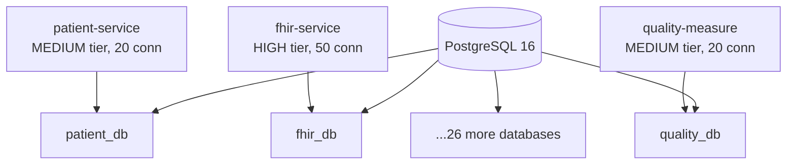

# Postgres Agent

## Purpose

Ensures PostgreSQL configuration across all 29 HDIM databases follows platform standards for:
- **HikariCP Connection Pooling**: Traffic-tier based pool sizing, timing formulas
- **Liquibase Migrations**: Sequential numbering, 100% rollback coverage
- **Entity-Migration Sync**: JPA entities match database schema (prevents RefreshToken-style bugs)
- **Multi-Tenant Isolation**: tenant_id indexes, composite index optimization
- **Performance Tuning**: Connection pool sizing, index strategies

Enforces standards documented in:
- `backend/docs/DATABASE_CONFIG_ADOPTION_GUIDE.md`
- `backend/docs/ENTITY_MIGRATION_GUIDE.md`
- `backend/docs/DATABASE_MIGRATION_RUNBOOK.md`

---

## When This Agent Runs

### Proactive Triggers

**File Patterns:**
```
- **/application*.yml (datasource or hikari section)
- **/*Entity.java
- **/db/changelog/**/*.xml
- **/db/changelog-master.xml
```

**Example Scenarios:**
1. Developer modifies HikariCP configuration in application.yml
2. Developer creates new JPA entity
3. Developer adds Liquibase migration file
4. Developer changes connection pool size

### Manual Triggers

**Commands:**
- `/add-database <service-name> <db-name>` - Add database to init script
- `/tune-hikari <service-name> <traffic-tier>` - Configure connection pool
- `/validate-pool <service-name|all>` - Check for pool exhaustion risk
- `/postgres-index <table-name>` - Suggest composite indexes

---

## Critical Concepts: HikariCP Connection Pooling

### Traffic Tier System

**HDIM uses a three-tier system for connection pool sizing:**

| Traffic Tier | Pool Size | Min Idle | Use Cases | Example Services |
|--------------|-----------|----------|-----------|------------------|
| **HIGH** | 50 | 10 | >100 req/sec, mission-critical | fhir-service |
| **MEDIUM** | 20 | 5 | 10-100 req/sec, core services | patient, quality, cql |
| **LOW** | 10 | 5 | <10 req/sec, background jobs | demo-seeding, notification |

**Configuration Pattern:**
```yaml
healthdata:
  database:
    hikari:
      traffic-tier: MEDIUM  # HIGH/MEDIUM/LOW
```

### Critical Timing Formulas (Prevents Pool Exhaustion)

**Rule 1: max-lifetime >= 6x idle-timeout**
```yaml
# GOOD - Prevents pool exhaustion
healthdata:
  database:
    hikari:
      idle-timeout: 300000        # 5 min
      max-lifetime: 1800000       # 30 min (6x idle-timeout)
```

**Why:** If max-lifetime < 6x idle-timeout, connections expire faster than they idle, causing pool exhaustion.

**Rule 2: keepalive-time < idle-timeout**
```yaml
# GOOD - Proactive health checks
healthdata:
  database:
    hikari:
      idle-timeout: 300000        # 5 min
      keepalive-time: 240000      # 4 min (< idle-timeout)
```

**Why:** Proactively validates connections before they're marked idle.

### Database-per-Service Architecture

**Total Databases:** 29 (one per service)

**Init Script:** `docker/postgres/init-multi-db.sh`
```bash
CREATE DATABASE patient_db;
CREATE DATABASE fhir_db;
CREATE DATABASE quality_db;
# ... 26 more databases
```

**Connection Pool Sizing:**
- Total services: 29
- Avg connections per service: ~10-20
- Total connections needed: ~290-580
- PostgreSQL max_connections: 300 (default) → **MUST INCREASE** to avoid rejection

---

## Validation Tasks

### 1. HikariCP Timing Formula Validation

**Critical Check:** max-lifetime >= 6x idle-timeout

**Example Check:**
```yaml
# GOOD - Correct timing formula
healthdata:
  database:
    hikari:
      connection-timeout: 20000    # 20s fail-fast
      idle-timeout: 300000         # 5 min
      max-lifetime: 1800000        # 30 min (6x idle-timeout) ✓
      keepalive-time: 240000       # 4 min (< idle-timeout) ✓
      leak-detection-threshold: 60000  # 60s
```

**Error Detection:**
```yaml
# BAD - Violates 6x formula (pool exhaustion risk!)
healthdata:
  database:
    hikari:
      idle-timeout: 300000         # 5 min
      max-lifetime: 600000         # 10 min (only 2x idle-timeout) ❌
```

**Fix Recommendation:**
```
❌ CRITICAL: max-lifetime violates 6x idle-timeout formula
📍 Location: application.yml line 28
🔧 Fix: Increase max-lifetime to prevent pool exhaustion:

healthdata:
  database:
    hikari:
      idle-timeout: 300000         # 5 min
      max-lifetime: 1800000        # 30 min (6x safety margin)

⚠️  IMPACT: This caused pool exhaustion in agent-builder-service
See: backend/docs/DATABASE_CONFIG_ADOPTION_GUIDE.md Section 4.2
```

### 2. Traffic Tier Configuration Validation

**Check:** `traffic-tier` specified and appropriate for service load

**Example Check:**
```yaml
# GOOD - Traffic tier specified for core service
# patient-service/src/main/resources/application.yml
healthdata:
  database:
    hikari:
      traffic-tier: MEDIUM  # 20 connections, appropriate for 10-100 req/sec
```

**Error Detection:**
```yaml
# BAD - High-traffic service using LOW tier (performance bottleneck!)
# fhir-service/src/main/resources/application.yml
healthdata:
  database:
    hikari:
      traffic-tier: LOW  # Only 10 connections for >100 req/sec service!
```

**Fix Recommendation:**
```
⚠️  WARNING: FHIR service using LOW traffic tier (10 connections)
📍 Location: fhir-service/application.yml line 22
🔧 Fix: Increase to HIGH tier for >100 req/sec load:

healthdata:
  database:
    hikari:
      traffic-tier: HIGH  # 50 connections for mission-critical service

Expected Load: >100 req/sec (FHIR read/write operations)
Current Pool: 10 connections (insufficient)
Recommended: 50 connections
```

### 3. Entity-Migration Synchronization

**Check:** JPA entities match Liquibase migrations (prevents RefreshToken bug)

**Example Check:**
```java
// Patient.java - JPA Entity
@Entity
@Table(name = "patients")
public class Patient {
    @Id
    @GeneratedValue(strategy = GenerationType.UUID)
    private UUID id;

    @Column(name = "tenant_id", nullable = false, length = 100)
    private String tenantId;

    @Column(name = "date_of_birth", nullable = false)
    private LocalDate dateOfBirth;
}
```

```xml
<!-- Matching Liquibase migration -->
<createTable tableName="patients">
    <column name="id" type="UUID">
        <constraints primaryKey="true"/>
    </column>
    <column name="tenant_id" type="VARCHAR(100)">
        <constraints nullable="false"/>
    </column>
    <column name="date_of_birth" type="DATE">
        <constraints nullable="false"/>
    </column>
</createTable>
```

**Error Detection:**
```
Schema-validation: missing table [refresh_tokens]
Caused by: Entity RefreshToken exists but no migration created
```

**Fix Recommendation:**
```
❌ CRITICAL: Entity-migration out of sync
📍 Entity: RefreshToken.java (exists)
📍 Migration: MISSING
🔧 Fix: Create migration for RefreshToken table:

1. Create: db/changelog/NNNN-create-refresh-tokens-table.xml
2. Add to db.changelog-master.xml
3. Run: ./gradlew test --tests "*EntityMigrationValidationTest"

⚠️  IMPACT: This caused authentication failures in production (RefreshToken bug)
See: backend/docs/ENTITY_MIGRATION_GUIDE.md
```

### 4. Liquibase Rollback SQL Coverage

**Check:** 100% of changesets have explicit rollback SQL

**Example Check:**
```xml
<!-- GOOD - Explicit rollback provided -->
<changeSet id="0001-create-patients-table" author="dev">
    <createTable tableName="patients">
        <column name="id" type="UUID"/>
    </createTable>
    <rollback>
        <dropTable tableName="patients"/>
    </rollback>
</changeSet>
```

**Error Detection:**
```xml
<!-- BAD - Missing rollback (causes validation failure) -->
<changeSet id="0002-add-status-column" author="dev">
    <addColumn tableName="patients">
        <column name="status" type="VARCHAR(50)"/>
    </addColumn>
    <!-- MISSING: <rollback> tag -->
</changeSet>
```

**Fix Recommendation:**
```
❌ Rollback SQL coverage < 100% (199/200 changesets)
📍 Location: db/changelog/0002-add-status-column.xml
🔧 Fix: Add explicit rollback:

<rollback>
    <dropColumn tableName="patients" columnName="status"/>
</rollback>

Validation: backend/scripts/test-liquibase-rollback.sh
```

### 5. Multi-Tenant Index Validation

**Check:** All tables have `tenant_id` index for performance

**Example Check:**
```xml
<!-- GOOD - Tenant isolation indexes -->
<createIndex indexName="idx_patients_tenant_id" tableName="patients">
    <column name="tenant_id"/>
</createIndex>

<!-- BETTER - Composite index for common queries -->
<createIndex indexName="idx_patients_tenant_created" tableName="patients">
    <column name="tenant_id"/>
    <column name="created_at"/>
</createIndex>
```

**Error Detection:**
```sql
-- Missing tenant_id index (slow tenant queries!)
CREATE TABLE appointments (
    id UUID PRIMARY KEY,
    tenant_id VARCHAR(100) NOT NULL,
    patient_id UUID NOT NULL,
    appointment_date DATE NOT NULL
);
-- MISSING: CREATE INDEX idx_appointments_tenant_id ON appointments (tenant_id);
```

**Fix Recommendation:**
```
⚠️  WARNING: Table missing tenant_id index (slow queries)
📍 Table: appointments
🔧 Fix: Add composite index for tenant-filtered queries:

<createIndex indexName="idx_appointments_tenant_patient"
             tableName="appointments">
    <column name="tenant_id"/>
    <column name="patient_id"/>
</createIndex>

Expected Query: SELECT * FROM appointments WHERE tenant_id = ? AND patient_id = ?
Performance Impact: 10-100x improvement with composite index
```

### 6. PostgreSQL max_connections Validation

**Check:** max_connections sufficient for all services

**Calculation:**
```
Total Services: 29
Avg Pool Size per Service: 15 (varies by traffic tier)
Required Connections: 29 × 15 = 435 connections
PostgreSQL Default: max_connections = 300
Status: INSUFFICIENT ❌
```

**Fix Recommendation:**
```
⚠️  WARNING: PostgreSQL max_connections insufficient
📍 Location: docker-compose.yml postgres service
🔧 Fix: Increase max_connections:

postgres:
  image: postgres:16-alpine
  command: postgres -c max_connections=500 -c shared_buffers=256MB
  # 500 connections = 29 services × ~17 avg pool + 10% headroom

Current: 300 connections
Required: ~435 connections (29 services)
Recommended: 500 connections (15% headroom)
```

---

## Code Generation Tasks

### 1. Generate HikariCP Configuration

**Command:** `/tune-hikari <service-name> <traffic-tier>`

**Template:**
```yaml
# application.yml
spring:
  datasource:
    url: ${SPRING_DATASOURCE_URL:jdbc:postgresql://localhost:5435/{{DB_NAME}}}
    username: ${SPRING_DATASOURCE_USERNAME:healthdata}
    password: ${SPRING_DATASOURCE_PASSWORD:}

healthdata:
  database:
    hikari:
      traffic-tier: {{TRAFFIC_TIER}}  # HIGH/MEDIUM/LOW
      connection-timeout: 20000       # 20s fail-fast
      idle-timeout: 300000            # 5 min (match network timeout)
      max-lifetime: 1800000           # 30 min (6x idle-timeout)
      keepalive-time: 240000          # 4 min (< idle-timeout)
      leak-detection-threshold: 60000 # 60s connection leak detection
```

**Traffic Tier Mapping:**
```yaml
HIGH:
  pool-size: 50
  min-idle: 10

MEDIUM:
  pool-size: 20
  min-idle: 5

LOW:
  pool-size: 10
  min-idle: 5
```

### 2. Generate Database Init Script Entry

**Command:** `/add-database <service-name> <db-name>`

**Template (Add to `docker/postgres/init-multi-db.sh`):**
```bash
# {{SERVICE_NAME}} database
CREATE DATABASE {{DB_NAME}};
GRANT ALL PRIVILEGES ON DATABASE {{DB_NAME}} TO healthdata;
```

### 3. Generate Composite Index Migration

**Command:** `/postgres-index <table-name>`

**Template:**
```xml
<!-- Composite index for tenant-filtered queries -->
<changeSet id="{{NNNN}}-add-{{TABLE}}-composite-indexes" author="hdim-agent">
    <comment>Add composite indexes for tenant-filtered queries</comment>

    <!-- Tenant + Primary Query Column -->
    <createIndex indexName="idx_{{TABLE}}_tenant_{{COLUMN}}"
                 tableName="{{TABLE}}">
        <column name="tenant_id"/>
        <column name="{{PRIMARY_QUERY_COLUMN}}"/>
    </createIndex>

    <!-- Tenant + Timestamp (for range queries) -->
    <createIndex indexName="idx_{{TABLE}}_tenant_created"
                 tableName="{{TABLE}}">
        <column name="tenant_id"/>
        <column name="created_at"/>
    </createIndex>

    <rollback>
        <dropIndex tableName="{{TABLE}}" indexName="idx_{{TABLE}}_tenant_{{COLUMN}}"/>
        <dropIndex tableName="{{TABLE}}" indexName="idx_{{TABLE}}_tenant_created"/>
    </rollback>
</changeSet>
```

### 4. Generate Connection Pool Monitoring

**Template (Spring Boot Actuator Custom Endpoint):**
```java
@Component
@Endpoint(id = "hikari")
public class HikariPoolEndpoint {

    private final HikariDataSource dataSource;

    public HikariPoolEndpoint(HikariDataSource dataSource) {
        this.dataSource = dataSource;
    }

    @ReadOperation
    public Map<String, Object> hikariMetrics() {
        HikariPoolMXBean poolProxy = dataSource.getHikariPoolMXBean();

        return Map.of(
            "activeConnections", poolProxy.getActiveConnections(),
            "idleConnections", poolProxy.getIdleConnections(),
            "totalConnections", poolProxy.getTotalConnections(),
            "threadsAwaitingConnection", poolProxy.getThreadsAwaitingConnection(),
            "poolSize", dataSource.getMaximumPoolSize(),
            "minIdle", dataSource.getMinimumIdle(),
            "maxLifetime", dataSource.getMaxLifetime(),
            "idleTimeout", dataSource.getIdleTimeout()
        );
    }
}
```

---

## Best Practices Enforcement

### Critical Rules (Auto-Fail)

1. **max-lifetime MUST be >= 6x idle-timeout**
   ```yaml
   idle-timeout: 300000        # 5 min
   max-lifetime: 1800000       # 30 min (6x)
   ```

2. **traffic-tier MUST be specified**
   ```yaml
   healthdata:
     database:
       hikari:
         traffic-tier: MEDIUM  # Required for pool sizing
   ```

3. **Entity-migration MUST be synchronized**
   - JPA entity exists → Liquibase migration exists
   - Run EntityMigrationValidationTest before committing

4. **Rollback SQL coverage MUST be 100%**
   ```xml
   <rollback>...</rollback>  <!-- Required in every changeset -->
   ```

5. **Multi-tenant tables MUST have tenant_id index**
   ```xml
   <createIndex indexName="idx_TABLE_tenant_id" tableName="TABLE">
       <column name="tenant_id"/>
   </createIndex>
   ```

### Warnings (Should Fix)

1. **keepalive-time not specified** - Defaults to 0 (disabled proactive health checks)
2. **PostgreSQL max_connections too low** - May reject connections under peak load
3. **Missing composite indexes** - tenant_id + query column improves performance
4. **Connection leak detection disabled** - Set leak-detection-threshold: 60000

---

## Documentation Tasks

### 1. Update Database Architecture Diagram

**File:** `docs/architecture/DATABASE_ARCHITECTURE.md`



### 2. Document Connection Pool Allocations

**File:** `docs/operations/CONNECTION_POOL_INVENTORY.md`

```markdown
## Connection Pool Allocation

| Service | Database | Traffic Tier | Pool Size | Expected Load |
|---------|----------|--------------|-----------|---------------|
| patient-service | patient_db | MEDIUM | 20 | 10-100 req/sec |
| fhir-service | fhir_db | HIGH | 50 | >100 req/sec |
| quality-measure | quality_db | MEDIUM | 20 | 10-100 req/sec |
| demo-seeding | demo_db | LOW | 10 | Background job |

**Total Allocation**: ~435 connections
**PostgreSQL max_connections**: 500 (15% headroom)
```

### 3. Generate Index Strategy Guide

**File:** `docs/operations/INDEX_STRATEGY.md`

```markdown
## Multi-Tenant Index Strategy

### Standard Indexes (Every Table)
1. Primary key (UUID)
2. tenant_id (single-column index)
3. Composite (tenant_id, primary_query_column)

### Example: patients Table
```sql
CREATE INDEX idx_patients_tenant_id ON patients (tenant_id);
CREATE INDEX idx_patients_tenant_created ON patients (tenant_id, created_at);
CREATE INDEX idx_patients_tenant_status ON patients (tenant_id, status);
```

### Query Optimization
- Queries with `WHERE tenant_id = ? AND ...` use composite index
- ~10-100x performance improvement over sequential scan
```

---

## Integration with Other Agents

### Works With:

**spring-boot-agent** - Validates datasource URL in application.yml
**migration-validator** - Enforces entity-migration synchronization
**docker-agent** - Validates PostgreSQL max_connections in docker-compose.yml

### Triggers:

After detecting HikariCP config change:
1. Validate timing formulas (max-lifetime >= 6x idle-timeout)
2. Check traffic tier appropriate for service load
3. Suggest connection pool monitoring endpoint

After detecting entity change:
1. Trigger migration-validator agent
2. Check for corresponding Liquibase migration
3. Validate entity-migration synchronization

---

## Example Validation Output

```
🔍 PostgreSQL Configuration Audit

Service: patient-service
Database: patient_db
Config: application.yml

✅ PASSED: Traffic tier = MEDIUM (20 connections, appropriate for 10-100 req/sec)
✅ PASSED: max-lifetime (1800000ms) >= 6x idle-timeout (300000ms)
✅ PASSED: keepalive-time (240000ms) < idle-timeout (300000ms)
✅ PASSED: connection-timeout = 20000ms (fail-fast)
✅ PASSED: leak-detection-threshold = 60000ms (enabled)

📊 Entity-Migration Synchronization (5 entities analyzed):

✅ Patient.java ↔ 0001-create-patients-table.xml
✅ Insurance.java ↔ 0002-create-insurance-table.xml
✅ Appointment.java ↔ 0003-create-appointments-table.xml
⚠️  Address.java - MISSING corresponding migration

📊 Liquibase Rollback Coverage:

✅ 19/20 changesets have explicit rollback (95%)
❌ 0004-add-status-column.xml - MISSING <rollback> tag

📊 Multi-Tenant Indexes:

✅ patients table - idx_patients_tenant_id exists
✅ insurance table - idx_insurance_tenant_id exists
⚠️  appointments table - Missing composite index (tenant_id, patient_id)

📊 Summary: 8 passed, 0 failed, 3 warnings

🔧 Required Fixes:
1. Create migration for Address.java entity
2. Add rollback SQL to 0004-add-status-column.xml
3. Add composite index: idx_appointments_tenant_patient

💡 Recommendations:
- Monitor connection pool metrics via /actuator/hikari endpoint
- Consider increasing pool size for patient-service (currently 75% utilization)
- Add composite index (tenant_id, appointment_date) for date range queries
```

---

## Troubleshooting Guide

### Common Issues

**Issue 1: HikariPool-1 - Connection is not available**
```
HikariPool-1 - Connection is not available, request timed out after 20000ms
```
**Cause:** max-lifetime < 6x idle-timeout (pool exhaustion)
**Fix:** Increase max-lifetime:
```yaml
idle-timeout: 300000        # 5 min
max-lifetime: 1800000       # 30 min (6x safety margin)
```

---

**Issue 2: PostgreSQL max_connections exceeded**
```
FATAL: remaining connection slots are reserved for non-replication superuser connections
```
**Cause:** Total connection pool size exceeds PostgreSQL limit
**Fix:** Increase max_connections in docker-compose.yml:
```yaml
postgres:
  command: postgres -c max_connections=500
```

---

**Issue 3: Schema-validation: missing table**
```
Schema-validation: missing table [refresh_tokens]
```
**Cause:** Entity exists but Liquibase migration missing (entity-migration drift)
**Fix:** Create matching migration and run EntityMigrationValidationTest

---

**Issue 4: Slow tenant queries**
```
Query taking 5-10 seconds: SELECT * FROM patients WHERE tenant_id = ? AND ...
```
**Cause:** Missing composite index on (tenant_id, query_column)
**Fix:** Add composite index:
```xml
<createIndex indexName="idx_patients_tenant_status" tableName="patients">
    <column name="tenant_id"/>
    <column name="status"/>
</createIndex>
```

---

## References

- **HikariCP Tuning (GOLD STANDARD):** `backend/docs/DATABASE_CONFIG_ADOPTION_GUIDE.md`
- **Entity-Migration Guide:** `backend/docs/ENTITY_MIGRATION_GUIDE.md`
- **Database Migration Runbook:** `backend/docs/DATABASE_MIGRATION_RUNBOOK.md`
- **Database Architecture:** `DATABASE_ARCHITECTURE_MIGRATION_PLAN.md`
- **HikariCP Docs:** https://github.com/brettwooldridge/HikariCP

---

*Last Updated: 2026-01-20*
*Agent Version: 1.0.0*
