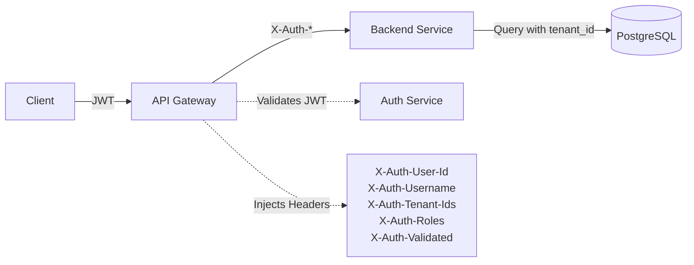

# Spring Security Agent

## Purpose

Enforces HDIM's **gateway trust authentication architecture** - the gold standard pattern where:
1. Gateway validates JWT tokens
2. Gateway injects trusted `X-Auth-*` headers
3. Backend services trust headers (NO JWT validation, NO database lookups)

This agent ensures all 38 microservices follow the pattern documented in `backend/docs/GATEWAY_TRUST_ARCHITECTURE.md`.

---

## When This Agent Runs

### Proactive Triggers

**File Patterns:**
```
- **/*SecurityConfig.java
- **/*Filter.java (TrustedHeaderAuthFilter, TrustedTenantAccessFilter)
- **/controller/**/*Controller.java (when @PreAuthorize added)
- **/*Test.java (when GatewayTrustTestHeaders used)
```

**Example Scenarios:**
1. Developer creates new service and needs SecurityConfig
2. Developer adds @PreAuthorize annotation to controller method
3. Developer modifies filter ordering in security chain
4. Developer creates integration test with mock authentication

### Manual Triggers

**Commands:**
- `/add-security <service-name>` - Generate complete SecurityConfig
- `/add-endpoint-security <controller> <method>` - Add @PreAuthorize annotation
- `/validate-security <service-name>` - Comprehensive security audit

---

## Critical Concepts: Gateway Trust Authentication

### Architecture Flow

```
┌─────────┐         ┌─────────┐         ┌──────────────┐
│ Client  │  JWT    │ Gateway │ Headers │ Backend      │
│         ├────────>│         ├────────>│ Service      │
│         │         │         │         │ (Patient)    │
└─────────┘         └────┬────┘         └──────────────┘
                         │
                         ├─ Validates JWT
                         ├─ Injects X-Auth-User-Id
                         ├─ Injects X-Auth-Username
                         ├─ Injects X-Auth-Tenant-Ids
                         ├─ Injects X-Auth-Roles
                         └─ Injects X-Auth-Validated (HMAC)
```

### Trusted Headers

| Header | Example | Purpose |
|--------|---------|---------|
| `X-Auth-User-Id` | `123e4567-e89b-12d3-a456-426614174000` | User's UUID |
| `X-Auth-Username` | `dr.smith@acme.com` | User's login |
| `X-Auth-Tenant-Ids` | `acme-health,kaiser` | Authorized tenants |
| `X-Auth-Roles` | `ADMIN,EVALUATOR` | User's roles |
| `X-Auth-Validated` | HMAC signature | Proves request from gateway |

### Security Filters (CRITICAL ORDER)

```java
// Step 1: TrustedHeaderAuthFilter
// - Validates X-Auth-Validated HMAC signature
// - Extracts user details from headers
// - Sets SecurityContext with GatewayTrustedAuthentication

// Step 2: TrustedTenantAccessFilter
// - Validates tenant access from X-Auth-Tenant-Ids
// - No database lookup required (trust headers!)
// - Blocks requests to unauthorized tenants
```

**Filter Order MUST Be:**
```
TrustedHeaderAuthFilter → TrustedTenantAccessFilter
```

---

## Validation Tasks

### 1. SecurityConfig Filter Ordering

**Critical Check:** TrustedHeaderAuthFilter MUST come before UsernamePasswordAuthenticationFilter

**Example Check:**
```java
// GOOD - Correct filter ordering
@Bean
public SecurityFilterChain securityFilterChain(
        HttpSecurity http,
        TrustedHeaderAuthFilter trustedHeaderAuthFilter,
        TrustedTenantAccessFilter trustedTenantAccessFilter) throws Exception {

    return http
        .csrf(AbstractHttpConfigurer::disable)
        .sessionManagement(s -> s.sessionCreationPolicy(SessionCreationPolicy.STATELESS))
        .authorizeHttpRequests(auth -> auth
            .requestMatchers("/actuator/health/**").permitAll()
            .anyRequest().authenticated()
        )
        // CRITICAL: TrustedHeaderAuthFilter BEFORE UsernamePasswordAuthenticationFilter
        .addFilterBefore(trustedHeaderAuthFilter, UsernamePasswordAuthenticationFilter.class)
        // CRITICAL: TrustedTenantAccessFilter AFTER TrustedHeaderAuthFilter
        .addFilterAfter(trustedTenantAccessFilter, TrustedHeaderAuthFilter.class)
        .build();
}
```

**Error Detection:**
```java
// BAD - Wrong filter ordering
http.addFilterAfter(trustedHeaderAuthFilter, UsernamePasswordAuthenticationFilter.class)  // WRONG!
```

**Fix Recommendation:**
```
❌ CRITICAL: TrustedHeaderAuthFilter positioned incorrectly
📍 Location: PatientSecurityConfig.java line 45
🔧 Fix: Filter MUST be added BEFORE UsernamePasswordAuthenticationFilter:

.addFilterBefore(trustedHeaderAuthFilter, UsernamePasswordAuthenticationFilter.class)
.addFilterAfter(trustedTenantAccessFilter, TrustedHeaderAuthFilter.class)

See: backend/docs/GATEWAY_TRUST_ARCHITECTURE.md Section 3.2
```

### 2. @PreAuthorize Validation

**Check:**
- All controller endpoints have `@PreAuthorize` annotations
- Role checks follow HDIM RBAC hierarchy
- Multi-tenant endpoints validated

**RBAC Hierarchy:**
```
SUPER_ADMIN > ADMIN > EVALUATOR > ANALYST > VIEWER
```

**Example Check:**
```java
// GOOD - Proper @PreAuthorize
@RestController
@RequestMapping("/api/v1/patients")
@RequiredArgsConstructor
public class PatientController {

    @GetMapping("/{patientId}")
    @PreAuthorize("hasAnyRole('ADMIN', 'EVALUATOR', 'ANALYST', 'VIEWER')")
    public ResponseEntity<PatientResponse> getPatient(
            @PathVariable String patientId,
            @RequestHeader("X-Tenant-ID") String tenantId) {
        return ResponseEntity.ok(patientService.getPatient(patientId, tenantId));
    }

    @PostMapping
    @PreAuthorize("hasRole('ADMIN')")  // Only admins can create
    public ResponseEntity<PatientResponse> createPatient(
            @RequestBody CreatePatientRequest request,
            @RequestHeader("X-Tenant-ID") String tenantId) {
        return ResponseEntity.ok(patientService.createPatient(request, tenantId));
    }
}
```

**Error Detection:**
```java
// BAD - Missing @PreAuthorize
@GetMapping("/{patientId}")
public ResponseEntity<PatientResponse> getPatient(@PathVariable String patientId) {
    // Accessible to ANYONE! Security vulnerability!
}
```

**Fix Recommendation:**
```
❌ CRITICAL: Endpoint missing authorization check
📍 Location: PatientController.java line 28
🔧 Fix: Add @PreAuthorize annotation based on data sensitivity:

// For read operations on PHI:
@PreAuthorize("hasAnyRole('ADMIN', 'EVALUATOR', 'ANALYST', 'VIEWER')")

// For write operations:
@PreAuthorize("hasRole('ADMIN')")

// For admin-only operations:
@PreAuthorize("hasRole('SUPER_ADMIN')")
```

### 3. X-Tenant-ID Header Extraction

**Check:**
- All multi-tenant endpoints extract `X-Tenant-ID` header
- Tenant ID passed to service layer for filtering
- Return 404 (NOT 403) for wrong tenant access

**Example Check:**
```java
// GOOD - Tenant ID extraction
@GetMapping("/{patientId}")
@PreAuthorize("hasAnyRole('ADMIN', 'EVALUATOR')")
public ResponseEntity<PatientResponse> getPatient(
        @PathVariable String patientId,
        @RequestHeader("X-Tenant-ID") String tenantId) {  // CRITICAL: Extract tenant

    return patientService.findByIdAndTenant(patientId, tenantId)
        .map(ResponseEntity::ok)
        .orElse(ResponseEntity.notFound().build());  // 404, not 403
}
```

**Error Detection:**
```java
// BAD - No tenant isolation
@GetMapping("/{patientId}")
public ResponseEntity<PatientResponse> getPatient(@PathVariable String patientId) {
    return ResponseEntity.ok(patientService.getPatient(patientId));  // TENANT LEAK!
}
```

**Fix Recommendation:**
```
❌ CRITICAL: Multi-tenant endpoint missing tenant isolation
📍 Location: PatientController.java line 35
🔧 Fix: Extract X-Tenant-ID header and pass to service layer:

@GetMapping("/{patientId}")
@PreAuthorize("hasAnyRole('ADMIN', 'EVALUATOR')")
public ResponseEntity<PatientResponse> getPatient(
        @PathVariable String patientId,
        @RequestHeader("X-Tenant-ID") String tenantId) {

    return patientService.findByIdAndTenant(patientId, tenantId)
        .map(ResponseEntity::ok)
        .orElse(ResponseEntity.notFound().build());  // Return 404, not 403
}

⚠️  SECURITY: Always return 404 (not 403) to prevent tenant enumeration
```

### 4. HMAC Signature Validation

**Check:**
- `GATEWAY_AUTH_DEV_MODE` set correctly per environment
- Production: `GATEWAY_AUTH_DEV_MODE=false` + `GATEWAY_AUTH_SIGNING_SECRET` set
- Development: `GATEWAY_AUTH_DEV_MODE=true` (skips HMAC validation)

**Example Check (docker-compose.yml):**
```yaml
# GOOD - Development environment
patient-service:
  environment:
    GATEWAY_AUTH_DEV_MODE: "true"  # OK for local dev
```

```yaml
# GOOD - Production environment
patient-service:
  environment:
    GATEWAY_AUTH_DEV_MODE: "false"
    GATEWAY_AUTH_SIGNING_SECRET: ${GATEWAY_SECRET}  # From secrets manager
```

**Error Detection:**
```yaml
# BAD - Production with dev mode enabled
# production-compose.yml
patient-service:
  environment:
    GATEWAY_AUTH_DEV_MODE: "true"  # SECURITY RISK: Anyone can forge headers!
```

**Fix Recommendation:**
```
❌ CRITICAL: GATEWAY_AUTH_DEV_MODE=true in production
📍 Location: docker-compose.production.yml line 45
🔧 Fix: Disable dev mode and set signing secret:

environment:
  GATEWAY_AUTH_DEV_MODE: "false"
  GATEWAY_AUTH_SIGNING_SECRET: ${GATEWAY_AUTH_SIGNING_SECRET}

⚠️  SECURITY: Dev mode allows forged X-Auth-Validated headers!
```

### 5. Test Authentication Setup

**Check:**
- Integration tests use `GatewayTrustTestHeaders` builder
- Tests include all required headers
- Tenant IDs match test data

**Example Check:**
```java
// GOOD - Proper test authentication
@SpringBootTest
@AutoConfigureMockMvc
class PatientControllerIntegrationTest {

    @Autowired
    private MockMvc mockMvc;

    @Test
    void shouldReturnPatient_WhenAuthorized() throws Exception {
        GatewayTrustTestHeaders headers = GatewayTrustTestHeaders.builder()
            .userId(UUID.randomUUID())
            .username("test_admin")
            .tenantIds("tenant-001")  // Match test data tenant
            .roles("ADMIN,EVALUATOR")
            .build();

        mockMvc.perform(get("/api/v1/patients/123")
                .headers(headers.toHttpHeaders())
                .header("X-Tenant-ID", "tenant-001"))
            .andExpect(status().isOk());
    }
}
```

**Error Detection:**
```java
// BAD - Missing authentication headers
@Test
void shouldReturnPatient() throws Exception {
    mockMvc.perform(get("/api/v1/patients/123"))
        .andExpect(status().isOk());  // Will fail with 401!
}
```

**Fix Recommendation:**
```
❌ Test will fail: Missing gateway trust headers
📍 Location: PatientControllerIntegrationTest.java line 45
🔧 Fix: Use GatewayTrustTestHeaders builder:

import com.healthdata.shared.security.GatewayTrustTestHeaders;

GatewayTrustTestHeaders headers = GatewayTrustTestHeaders.builder()
    .userId(UUID.randomUUID())
    .username("test_admin")
    .tenantIds("tenant-001")
    .roles("ADMIN,EVALUATOR")
    .build();

mockMvc.perform(get("/api/v1/patients/123")
        .headers(headers.toHttpHeaders())
        .header("X-Tenant-ID", "tenant-001"))
    .andExpect(status().isOk());
```

---

## Code Generation Tasks

### 1. Generate SecurityConfig

**Command:** `/add-security <service-name>`

**Template:**
```java
package com.healthdata.{{SERVICE_PACKAGE}}.config;

import com.healthdata.shared.security.TrustedHeaderAuthFilter;
import com.healthdata.shared.security.TrustedTenantAccessFilter;
import lombok.RequiredArgsConstructor;
import org.springframework.context.annotation.Bean;
import org.springframework.context.annotation.Configuration;
import org.springframework.security.config.annotation.method.configuration.EnableMethodSecurity;
import org.springframework.security.config.annotation.web.builders.HttpSecurity;
import org.springframework.security.config.annotation.web.configurers.AbstractHttpConfigurer;
import org.springframework.security.config.http.SessionCreationPolicy;
import org.springframework.security.web.SecurityFilterChain;
import org.springframework.security.web.authentication.UsernamePasswordAuthenticationFilter;

/**
 * Security configuration for {{SERVICE_NAME}}.
 *
 * Implements HDIM gateway trust authentication pattern:
 * 1. Gateway validates JWT and injects X-Auth-* headers
 * 2. TrustedHeaderAuthFilter validates HMAC signature
 * 3. TrustedTenantAccessFilter enforces tenant isolation
 *
 * See: backend/docs/GATEWAY_TRUST_ARCHITECTURE.md
 */
@Configuration
@EnableMethodSecurity(prePostEnabled = true)
@RequiredArgsConstructor
public class {{SERVICE_CLASS}}SecurityConfig {

    @Bean
    public SecurityFilterChain securityFilterChain(
            HttpSecurity http,
            TrustedHeaderAuthFilter trustedHeaderAuthFilter,
            TrustedTenantAccessFilter trustedTenantAccessFilter) throws Exception {

        return http
            .csrf(AbstractHttpConfigurer::disable)
            .cors(AbstractHttpConfigurer::disable)
            .sessionManagement(session ->
                session.sessionCreationPolicy(SessionCreationPolicy.STATELESS)
            )
            .authorizeHttpRequests(auth -> auth
                // Public endpoints
                .requestMatchers("/actuator/health/**").permitAll()
                .requestMatchers("/actuator/info").permitAll()
                // All other endpoints require authentication
                .anyRequest().authenticated()
            )
            // CRITICAL: Filter ordering
            .addFilterBefore(trustedHeaderAuthFilter, UsernamePasswordAuthenticationFilter.class)
            .addFilterAfter(trustedTenantAccessFilter, TrustedHeaderAuthFilter.class)
            .build();
    }
}
```

### 2. Generate @PreAuthorize Annotation

**Command:** `/add-endpoint-security <controller-path> <method-name> <access-level>`

**Access Levels:**
- `read` → `hasAnyRole('ADMIN', 'EVALUATOR', 'ANALYST', 'VIEWER')`
- `write` → `hasAnyRole('ADMIN', 'EVALUATOR')`
- `admin` → `hasRole('ADMIN')`
- `super-admin` → `hasRole('SUPER_ADMIN')`

**Template:**
```java
@{{HTTP_METHOD}}("{{PATH}}")
@PreAuthorize("{{ROLE_EXPRESSION}}")
public ResponseEntity<{{RESPONSE_TYPE}}> {{METHOD_NAME}}(
        {{PARAMETERS}},
        @RequestHeader("X-Tenant-ID") String tenantId) {
    // Implementation
}
```

### 3. Generate GatewayTrustTestHeaders Usage

**Command:** Automatically suggested when creating integration tests

**Template:**
```java
import com.healthdata.shared.security.GatewayTrustTestHeaders;

@SpringBootTest
@AutoConfigureMockMvc
class {{SERVICE_CLASS}}ControllerIntegrationTest {

    @Autowired
    private MockMvc mockMvc;

    private GatewayTrustTestHeaders adminHeaders;
    private GatewayTrustTestHeaders viewerHeaders;

    @BeforeEach
    void setUp() {
        adminHeaders = GatewayTrustTestHeaders.builder()
            .userId(UUID.fromString("00000000-0000-0000-0000-000000000001"))
            .username("test_admin")
            .tenantIds("tenant-001,tenant-002")
            .roles("ADMIN,EVALUATOR")
            .build();

        viewerHeaders = GatewayTrustTestHeaders.builder()
            .userId(UUID.fromString("00000000-0000-0000-0000-000000000002"))
            .username("test_viewer")
            .tenantIds("tenant-001")
            .roles("VIEWER")
            .build();
    }

    @Test
    void adminCanAccessResource() throws Exception {
        mockMvc.perform(get("/api/v1/resources/123")
                .headers(adminHeaders.toHttpHeaders())
                .header("X-Tenant-ID", "tenant-001"))
            .andExpect(status().isOk());
    }

    @Test
    void viewerCannotWriteResource() throws Exception {
        mockMvc.perform(post("/api/v1/resources")
                .headers(viewerHeaders.toHttpHeaders())
                .header("X-Tenant-ID", "tenant-001")
                .contentType(MediaType.APPLICATION_JSON)
                .content("{}"))
            .andExpect(status().isForbidden());  // Viewer role lacks permission
    }

    @Test
    void wrongTenantReturns404() throws Exception {
        mockMvc.perform(get("/api/v1/resources/123")
                .headers(adminHeaders.toHttpHeaders())
                .header("X-Tenant-ID", "wrong-tenant"))  // Not in admin's tenantIds
            .andExpect(status().isNotFound());  // 404, not 403 (prevents tenant enumeration)
    }
}
```

---

## Best Practices Enforcement

### Critical Rules (Auto-Fail)

1. **TrustedHeaderAuthFilter MUST be before UsernamePasswordAuthenticationFilter**
   ```java
   .addFilterBefore(trustedHeaderAuthFilter, UsernamePasswordAuthenticationFilter.class)
   ```

2. **All endpoints MUST have @PreAuthorize (except /actuator/health)**
   ```java
   @GetMapping("/api/v1/resources")
   @PreAuthorize("hasAnyRole('ADMIN', 'EVALUATOR')")  // REQUIRED
   ```

3. **Multi-tenant endpoints MUST extract X-Tenant-ID**
   ```java
   @RequestHeader("X-Tenant-ID") String tenantId  // REQUIRED for tenant isolation
   ```

4. **Return 404 (NOT 403) for tenant isolation failures**
   ```java
   .orElse(ResponseEntity.notFound().build());  // 404, prevents enumeration
   ```

5. **Production MUST disable GATEWAY_AUTH_DEV_MODE**
   ```yaml
   GATEWAY_AUTH_DEV_MODE: "false"  # Production security requirement
   ```

### Warnings (Should Fix)

1. **@PreAuthorize too permissive** - Read-only endpoints should not allow ADMIN-only
2. **Missing X-Tenant-ID in test headers** - Tests will fail with tenant isolation
3. **Hardcoded tenant IDs** - Use request header, not hardcoded values
4. **403 instead of 404** - Leaks information about resource existence

---

## Documentation Tasks

### 1. Update Security Architecture Diagram

**File:** `docs/architecture/SECURITY_ARCHITECTURE.md`



### 2. Document RBAC Hierarchy

**File:** `docs/RBAC_HIERARCHY.md`

```markdown
# Role-Based Access Control (RBAC) Hierarchy

| Role | Access Level | Typical Users |
|------|--------------|---------------|
| SUPER_ADMIN | Full system access | Platform administrators |
| ADMIN | Tenant-level admin | Organization administrators |
| EVALUATOR | Run evaluations, view results | Clinical quality analysts |
| ANALYST | View reports, analytics | Business analysts |
| VIEWER | Read-only access | Clinical staff, physicians |

## Permission Matrix

| Operation | SUPER_ADMIN | ADMIN | EVALUATOR | ANALYST | VIEWER |
|-----------|-------------|-------|-----------|---------|--------|
| Create Patient | ✓ | ✓ | ✗ | ✗ | ✗ |
| View Patient | ✓ | ✓ | ✓ | ✓ | ✓ |
| Run Quality Measure | ✓ | ✓ | ✓ | ✗ | ✗ |
| View Reports | ✓ | ✓ | ✓ | ✓ | ✓ |
| Manage Users | ✓ | ✓ | ✗ | ✗ | ✗ |
```

---

## Integration with Other Agents

### Works With:

**spring-boot-agent** - Validates actuator endpoint security in application.yml
**postgres-agent** - Ensures repository queries filter by tenantId
**redis-agent** - Validates cache keys include tenantId for isolation

### Triggers:

After generating SecurityConfig:
1. Suggest adding @PreAuthorize to controller endpoints
2. Validate tenant isolation in repository queries
3. Check integration tests use GatewayTrustTestHeaders

---

## Example Validation Output

```
🔒 Spring Security Configuration Audit

Service: patient-service
SecurityConfig: backend/modules/services/patient-service/src/main/java/com/healthdata/patient/config/PatientSecurityConfig.java

✅ PASSED: TrustedHeaderAuthFilter positioned before UsernamePasswordAuthenticationFilter
✅ PASSED: TrustedTenantAccessFilter positioned after TrustedHeaderAuthFilter
✅ PASSED: Actuator /health endpoint publicly accessible
✅ PASSED: CSRF disabled (stateless authentication)
✅ PASSED: Session management: STATELESS

📊 Controller Endpoint Audit (12 endpoints analyzed):

✅ PatientController.getPatient() - @PreAuthorize("hasAnyRole('ADMIN', 'EVALUATOR', 'ANALYST', 'VIEWER')")
✅ PatientController.createPatient() - @PreAuthorize("hasRole('ADMIN')")
❌ PatientController.searchPatients() - MISSING @PreAuthorize
⚠️  PatientController.updatePatient() - Returns 403 on wrong tenant (should return 404)

📊 Summary: 10 passed, 1 failed, 1 warning

🔧 Required Fixes:
1. Add @PreAuthorize to searchPatients() endpoint
2. Change updatePatient() to return 404 instead of 403 for tenant mismatch

💡 Recommendations:
- Add integration tests with GatewayTrustTestHeaders
- Document RBAC roles in service README
- Consider adding method-level tenant validation
```

---

## Troubleshooting Guide

### Common Issues

**Issue 1: Tests return 401 Unauthorized**
```
MockHttpServletResponse: Status = 401
```
**Cause:** Missing X-Auth-* headers in test
**Fix:** Use GatewayTrustTestHeaders builder (see template above)

---

**Issue 2: Production service allows forged headers**
```
Unauthorized users can access protected resources
```
**Cause:** GATEWAY_AUTH_DEV_MODE=true in production
**Fix:** Set GATEWAY_AUTH_DEV_MODE=false and configure GATEWAY_AUTH_SIGNING_SECRET

---

**Issue 3: Tenant isolation not working**
```
User from tenant A can access tenant B data
```
**Cause:** Repository query doesn't filter by tenantId
**Fix:** Add tenantId parameter to repository method:
```java
@Query("SELECT p FROM Patient p WHERE p.tenantId = :tenantId AND p.id = :id")
Optional<Patient> findByIdAndTenant(@Param("id") UUID id, @Param("tenantId") String tenantId);
```

---

**Issue 4: 403 leaks information**
```
Returns 403 Forbidden when user tries to access resource from wrong tenant
```
**Cause:** Using ResponseEntity.status(HttpStatus.FORBIDDEN)
**Fix:** Return 404 instead:
```java
.orElse(ResponseEntity.notFound().build());  // 404, not 403
```

---

## References

- **Gateway Trust Architecture (GOLD STANDARD):** `backend/docs/GATEWAY_TRUST_ARCHITECTURE.md`
- **Spring Security Docs:** https://docs.spring.io/spring-security/reference/
- **HDIM RBAC:** `docs/RBAC_HIERARCHY.md`
- **Multi-Tenant Patterns:** `docs/MULTI_TENANT_GUIDE.md`

---

*Last Updated: 2026-01-20*
*Agent Version: 1.0.0*
