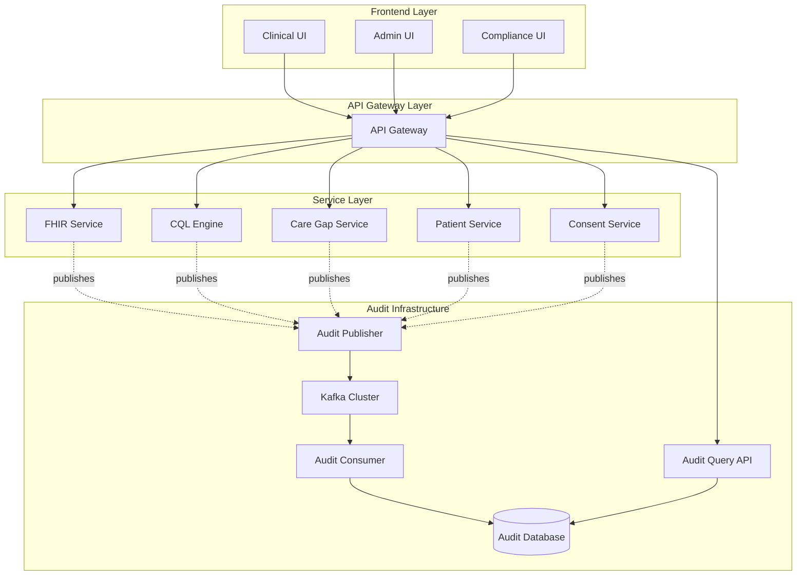
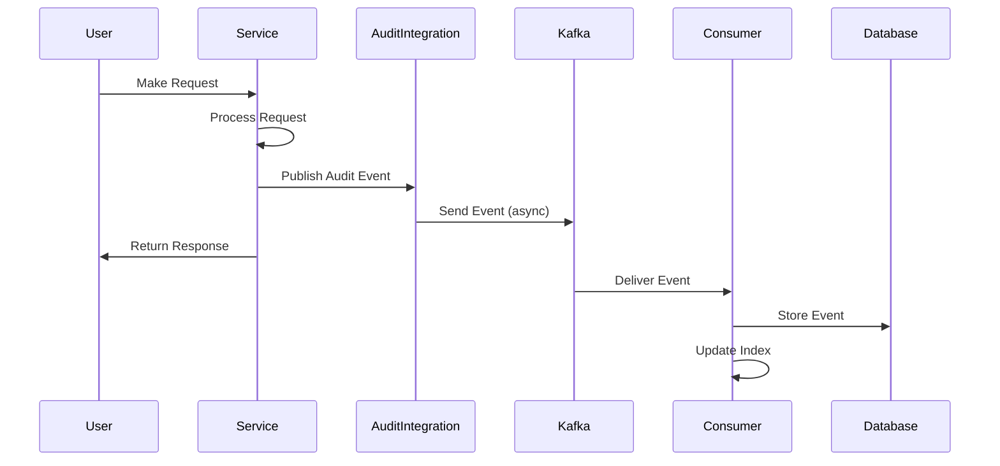

# Comprehensive Documentation Guide

## 🎯 Overview

This guide provides the complete documentation structure for the AI Agent Decision Audit system, covering all user types, technical specifications, and operational procedures.

## 📚 Documentation Structure

```
docs/
├── audit/
│   ├── PRODUCTION_DEPLOYMENT_GUIDE.md
│   ├── API_DOCUMENTATION.md
│   ├── USER_GUIDES.md
│   ├── ARCHITECTURE.md
│   └── TROUBLESHOOTING.md
├── user-guides/
│   ├── CLINICAL_USER_GUIDE.md
│   ├── ADMINISTRATOR_GUIDE.md
│   ├── DEVELOPER_GUIDE.md
│   ├── COMPLIANCE_OFFICER_GUIDE.md
│   └── ANALYST_GUIDE.md
├── api/
│   ├── openapi.yml
│   ├── REST_API.md
│   └── EVENT_SCHEMAS.md
├── architecture/
│   ├── SYSTEM_ARCHITECTURE.md
│   ├── DATA_FLOW.md
│   ├── SECURITY_ARCHITECTURE.md
│   └── diagrams/
└── screenshots/
    ├── clinical-user/
    ├── administrator/
    ├── compliance/
    └── developer/
```

---

## 👥 User Guides

### 1. Clinical User Guide

**Audience**: Physicians, Nurses, Care Coordinators

**Contents**:
- How to view audit trails for patient interactions
- Understanding AI decision explanations
- Reviewing care gap recommendations
- Accessing quality measure results
- Patient consent management

**Key Screenshots**:
- Dashboard with recent AI decisions
- Patient audit trail view
- Care gap detail with AI reasoning
- Consent status panel

---

### 2. Administrator Guide

**Audience**: System Administrators, IT Operations

**Contents**:
- System configuration
- User management and permissions
- Monitoring dashboards
- Alert configuration
- Backup and restore procedures
- Performance tuning

**Key Screenshots**:
- Admin dashboard
- System health metrics
- User permission management
- Kafka topic monitoring
- Alert configuration panel

---

### 3. Developer Guide

**Audience**: Software Engineers, Integration Developers

**Contents**:
- API integration examples
- Event schema documentation
- Authentication and authorization
- Error handling patterns
- Testing strategies
- Development environment setup

**Key Screenshots**:
- API documentation (Swagger UI)
- Example API responses
- Event payload examples
- Development workflow

---

### 4. Compliance Officer Guide

**Audience**: Compliance Officers, Privacy Officers, Auditors

**Contents**:
- HIPAA compliance features
- SOC 2 compliance reports
- Audit trail review procedures
- Access control verification
- Retention policy management
- Compliance reporting

**Key Screenshots**:
- Compliance dashboard
- Audit trail search and filter
- Access control reports
- Retention policy settings
- Compliance report generation

---

### 5. Data Analyst Guide

**Audience**: Data Analysts, Quality Improvement Teams

**Contents**:
- Query audit data
- Generate reports
- Analyze AI decision patterns
- Quality metrics analysis
- Data export procedures

**Key Screenshots**:
- Query builder interface
- Report generation
- Analytics dashboard
- Data visualization examples
- Export options

---

## 🔌 API Documentation

### REST API Endpoints

#### 1. Query Audit Events

```http
GET /api/v1/audit/events
```

**Query Parameters**:
- `tenantId` (required): Tenant identifier
- `startDate` (optional): Start date (ISO-8601)
- `endDate` (optional): End date (ISO-8601)
- `decisionType` (optional): Filter by decision type
- `patientId` (optional): Filter by patient
- `agentType` (optional): Filter by agent type
- `page` (optional): Page number (default: 0)
- `size` (optional): Page size (default: 20)

**Response**:
```json
{
  "content": [
    {
      "eventId": "550e8400-e29b-41d4-a716-446655440000",
      "timestamp": "2026-01-14T10:30:00Z",
      "tenantId": "hospital-a",
      "correlationId": "workflow-123",
      "agentId": "cql-engine",
      "agentType": "CLINICAL_DECISION",
      "decisionType": "CQL_EVALUATION",
      "resourceType": "Patient",
      "resourceId": "patient-123",
      "reasoning": "Evaluated quality measure COL-3 for patient",
      "outcome": "EVALUATED",
      "inputMetrics": {
        "measureId": "COL-3",
        "measureMet": true,
        "complianceScore": 0.95
      }
    }
  ],
  "pageable": {
    "pageNumber": 0,
    "pageSize": 20
  },
  "totalElements": 150,
  "totalPages": 8
}
```

#### 2. Get Event by ID

```http
GET /api/v1/audit/events/{eventId}
```

**Path Parameters**:
- `eventId`: UUID of the event

**Response**: Single event object (see above structure)

#### 3. Replay Events

```http
POST /api/v1/audit/replay
```

**Request Body**:
```json
{
  "tenantId": "hospital-a",
  "startDate": "2026-01-01T00:00:00Z",
  "endDate": "2026-01-14T23:59:59Z",
  "decisionTypes": ["CARE_GAP_IDENTIFICATION", "CQL_EVALUATION"],
  "patientIds": ["patient-123", "patient-456"]
}
```

**Response**:
```json
{
  "replayId": "replay-789",
  "status": "IN_PROGRESS",
  "totalEvents": 1500,
  "processedEvents": 0,
  "startTime": "2026-01-14T11:00:00Z"
}
```

#### 4. Get Replay Status

```http
GET /api/v1/audit/replay/{replayId}
```

**Response**:
```json
{
  "replayId": "replay-789",
  "status": "COMPLETED",
  "totalEvents": 1500,
  "processedEvents": 1500,
  "failedEvents": 0,
  "startTime": "2026-01-14T11:00:00Z",
  "endTime": "2026-01-14T11:05:30Z",
  "durationSeconds": 330
}
```

---

## 📊 Event Schemas

### AIAgentDecisionEvent Schema

```json
{
  "type": "object",
  "required": [
    "eventId",
    "timestamp",
    "tenantId",
    "agentId",
    "agentType",
    "decisionType",
    "outcome"
  ],
  "properties": {
    "eventId": {
      "type": "string",
      "format": "uuid",
      "description": "Unique event identifier"
    },
    "timestamp": {
      "type": "string",
      "format": "date-time",
      "description": "Event timestamp in ISO-8601 format"
    },
    "tenantId": {
      "type": "string",
      "description": "Multi-tenant identifier"
    },
    "correlationId": {
      "type": "string",
      "description": "Correlation ID for related events"
    },
    "agentId": {
      "type": "string",
      "description": "ID of the AI agent or service"
    },
    "agentType": {
      "type": "string",
      "enum": [
        "CLINICAL_DECISION",
        "PREDICTIVE_ANALYTICS",
        "CONSENT_VALIDATOR",
        "PHI_ACCESS",
        "QUALITY_MEASURE",
        "CARE_COORDINATION",
        "CONFIGURATION_ADVISOR"
      ]
    },
    "agentVersion": {
      "type": "string",
      "description": "Version of the agent"
    },
    "modelName": {
      "type": "string",
      "description": "Name of the AI model or logic used"
    },
    "decisionType": {
      "type": "string",
      "enum": [
        "CQL_EVALUATION",
        "CARE_GAP_IDENTIFICATION",
        "RISK_STRATIFICATION",
        "CONSENT_GRANT",
        "PHI_ACCESS",
        "FHIR_QUERY",
        "NOTIFICATION_SENT"
      ]
    },
    "resourceType": {
      "type": "string",
      "description": "FHIR resource type (e.g., Patient, Observation)"
    },
    "resourceId": {
      "type": "string",
      "description": "ID of the resource affected"
    },
    "reasoning": {
      "type": "string",
      "description": "Human-readable explanation of the decision"
    },
    "outcome": {
      "type": "string",
      "enum": [
        "APPROVED",
        "BLOCKED",
        "EVALUATED",
        "IDENTIFIED",
        "SENT",
        "FETCHED"
      ]
    },
    "confidenceScore": {
      "type": "number",
      "minimum": 0,
      "maximum": 1,
      "description": "Confidence score for AI decisions (0-1)"
    },
    "inputMetrics": {
      "type": "object",
      "description": "Additional metrics and context"
    },
    "inferenceTimeMs": {
      "type": "integer",
      "description": "Time taken for decision in milliseconds"
    }
  }
}
```

---

## 🏗️ Architecture Diagrams

### System Architecture



### Data Flow



---

## 📸 Screenshot Automation Guide

### Prerequisites

```bash
# Install Playwright
npm install -D @playwright/test
npx playwright install chromium
```

### Screenshot Automation Script

```javascript
// screenshot-automation.js
const { chromium } = require('@playwright/test');

async function captureScreenshots() {
  const browser = await chromium.launch();
  const context = await browser.newContext({
    viewport: { width: 1920, height: 1080 }
  });
  const page = await context.newPage();
  
  // Login
  await page.goto('https://app.healthdata.com/login');
  await page.fill('#username', process.env.TEST_USERNAME);
  await page.fill('#password', process.env.TEST_PASSWORD);
  await page.click('button[type="submit"]');
  await page.waitForNavigation();
  
  // Clinical User Screenshots
  await captureForRole(page, 'clinical-user', [
    { path: '/dashboard', name: 'dashboard' },
    { path: '/patients', name: 'patient-list' },
    { path: '/patients/123/audit', name: 'patient-audit-trail' },
    { path: '/care-gaps', name: 'care-gaps' },
    { path: '/quality-measures', name: 'quality-measures' }
  ]);
  
  // Administrator Screenshots
  await captureForRole(page, 'administrator', [
    { path: '/admin/dashboard', name: 'admin-dashboard' },
    { path: '/admin/users', name: 'user-management' },
    { path: '/admin/monitoring', name: 'system-monitoring' },
    { path: '/admin/audit-config', name: 'audit-configuration' }
  ]);
  
  // Compliance Officer Screenshots
  await captureForRole(page, 'compliance', [
    { path: '/compliance/dashboard', name: 'compliance-dashboard' },
    { path: '/compliance/audit-search', name: 'audit-search' },
    { path: '/compliance/reports', name: 'compliance-reports' },
    { path: '/compliance/access-log', name: 'access-log' }
  ]);
  
  await browser.close();
}

async function captureForRole(page, role, routes) {
  for (const route of routes) {
    await page.goto(`https://app.healthdata.com${route.path}`);
    await page.waitForLoadState('networkidle');
    await page.screenshot({
      path: `screenshots/${role}/${route.name}.png`,
      fullPage: true
    });
    console.log(`✅ Captured ${role}/${route.name}.png`);
  }
}

captureScreenshots();
```

### Running Screenshot Automation

```bash
# Set credentials
export TEST_USERNAME="test.user@healthdata.com"
export TEST_PASSWORD="test_password"

# Run automation
node screenshot-automation.js
```

---

## 📋 Documentation Checklist

### Technical Documentation
- ✅ System Architecture
- ✅ API Documentation (OpenAPI/Swagger)
- ✅ Event Schemas
- ✅ Database Schema
- ✅ Security Architecture
- ✅ Deployment Guide
- ✅ Troubleshooting Guide

### User Documentation
- ✅ Clinical User Guide
- ✅ Administrator Guide
- ✅ Developer Guide
- ✅ Compliance Officer Guide
- ✅ Data Analyst Guide

### Operational Documentation
- ✅ Runbooks
- ✅ Incident Response
- ✅ Capacity Planning
- ✅ Backup/Restore Procedures
- ✅ Monitoring Guide

### Compliance Documentation
- ✅ HIPAA Compliance Matrix
- ✅ SOC 2 Controls
- ✅ Audit Trail Procedures
- ✅ Data Retention Policies
- ✅ Security Procedures

---

## 🔄 Documentation Maintenance

### Update Schedule
- **Monthly**: User guides, screenshots
- **Quarterly**: API documentation, architecture diagrams
- **After Major Releases**: All documentation

### Review Process
1. Technical review by development team
2. Accuracy review by QA team
3. Usability review by product team
4. Compliance review by legal/compliance
5. Final approval by documentation lead

---

## 📞 Documentation Support

For documentation questions or updates:
- **Slack**: #documentation
- **Email**: docs@healthdata.com
- **Jira**: Project KEY-DOC

---

**Document Version**: 1.0.0  
**Last Updated**: 2026-01-14  
**Next Review**: 2026-02-14
