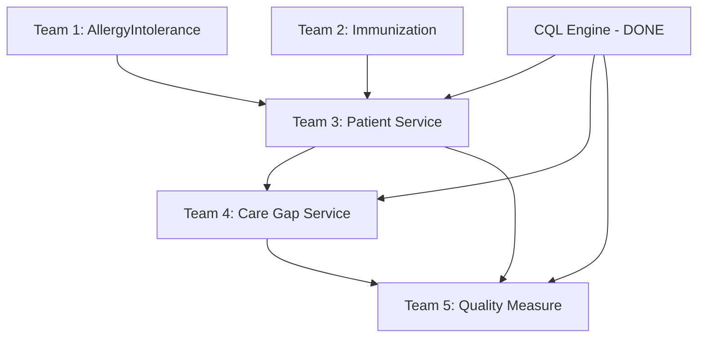

# TDD Swarm - Team Coordination Dashboard
**Health Data In Motion - Phase 2 Completion**

**Date**: October 30, 2025
**Status**: 🟢 **READY FOR PARALLEL DEVELOPMENT**
**Teams Active**: 5
**Methodology**: TDD Swarm with Git Worktrees

---

## 🎯 Mission Control

All 5 teams are now set up with isolated worktrees. Each team has:
- ✅ Dedicated git worktree
- ✅ Feature branch created
- ✅ Comprehensive TEAM_README with TDD plan
- ✅ 50-100+ test cases specified
- ✅ Complete implementation roadmap
- ✅ Definition of Done criteria

---

## 👥 Team Roster

### Team 1: AllergyIntolerance FHIR Resource
**Priority**: 🔴 HIGH (Patient Safety Critical)
**Branch**: `feature/allergy-intolerance`
**Worktree**: `/home/webemo-aaron/projects/healthdata-feature-allergy-intolerance`
**Estimated**: 3-4 days
**Dependencies**: None
**Status**: 🟡 READY TO START

**README**: `/healthdata-feature-allergy-intolerance/TEAM_README.md`
**Slack**: `#tdd-swarm-team1-allergy`

**Deliverables**:
- AllergyIntoleranceEntity (JPA)
- AllergyIntoleranceRepository (15+ queries)
- AllergyIntoleranceService (HAPI FHIR R4)
- AllergyIntoleranceController (9+ REST endpoints)
- Database migration with 5 indexes
- 50+ tests (≥80% coverage)

---

### Team 2: Immunization FHIR Resource
**Priority**: 🔴 HIGH (Quality Measures)
**Branch**: `feature/immunization`
**Worktree**: `/home/webemo-aaron/projects/healthdata-feature-immunization`
**Estimated**: 3-4 days
**Dependencies**: None
**Status**: 🟡 READY TO START

**README**: `/healthdata-feature-immunization/TEAM_README.md`
**Slack**: `#tdd-swarm-team2-immunization`

**Deliverables**:
- ImmunizationEntity (JPA)
- ImmunizationRepository (15+ queries)
- ImmunizationService (HAPI FHIR R4 + CVX codes)
- ImmunizationController (10+ REST endpoints)
- Database migration with 6 indexes
- 50+ tests (≥80% coverage)

---

### Team 3: Patient Service (Aggregation Layer)
**Priority**: 🔴 HIGH (Core Service)
**Branch**: `feature/patient-service`
**Worktree**: `/home/webemo-aaron/projects/healthdata-feature-patient-service`
**Estimated**: 5-7 days
**Dependencies**: ⚠️ ALL FHIR resources must be complete
**Status**: 🔴 BLOCKED (Waiting for Teams 1 & 2)

**README**: `/healthdata-feature-patient-service/TEAM_README.md`
**Slack**: `#tdd-swarm-team3-patient-svc`

**Deliverables**:
- Patient Aggregation Service
- Timeline Service
- Health Status Service
- Consent Filter Service
- FHIR Service Client (Feign)
- Consent Service Client
- 10+ REST endpoints
- 80+ tests (≥80% coverage)

---

### Team 4: Care Gap Service
**Priority**: 🟡 MEDIUM (Quality Measures)
**Branch**: `feature/care-gap-service`
**Worktree**: `/home/webemo-aaron/projects/healthdata-feature-care-gap-service`
**Estimated**: 6-8 days
**Dependencies**: ⚠️ Patient Service, CQL Engine
**Status**: 🔴 BLOCKED (Waiting for Team 3)

**README**: `/healthdata-feature-care-gap-service/TEAM_README.md`
**Slack**: `#tdd-swarm-team4-care-gap`

**Deliverables**:
- Gap Identification Engine
- Gap Closure Workflow
- Outreach List Generation
- Analytics Engine
- CQL Engine Client
- 12+ REST endpoints
- 90+ tests (≥80% coverage)

---

### Team 5: Quality Measure Service
**Priority**: 🟡 MEDIUM (Analytics)
**Branch**: `feature/quality-measure-service`
**Worktree**: `/home/webemo-aaron/projects/healthdata-feature-quality-measure-service`
**Estimated**: 8-10 days
**Dependencies**: ⚠️ CQL Engine, Patient Service, Care Gap Service
**Status**: 🔴 BLOCKED (Waiting for Teams 3 & 4)

**README**: `/healthdata-feature-quality-measure-service/TEAM_README.md`
**Slack**: `#tdd-swarm-team5-quality-measure`

**Deliverables**:
- Measure Calculation Engine
- 5+ HEDIS measures (CDC-HbA1c, CBP, BCS, CCS, COL)
- Report Generation Service
- Performance Tracking
- 15+ REST endpoints
- 100+ tests (≥80% coverage)

---

## 📊 Progress Tracker

**Update Daily at Standup** (9:00 AM)

| Team | Feature | Day | Tests | Coverage | Status | Blockers |
|------|---------|-----|-------|----------|--------|----------|
| 1 | AllergyIntolerance | 0 | 0/50 | 0% | 🟡 Ready | None |
| 2 | Immunization | 0 | 0/50 | 0% | 🟡 Ready | None |
| 3 | Patient Service | 0 | 0/80 | 0% | 🔴 Blocked | Needs Teams 1&2 |
| 4 | Care Gap Service | 0 | 0/90 | 0% | 🔴 Blocked | Needs Team 3 |
| 5 | Quality Measure | 0 | 0/100 | 0% | 🔴 Blocked | Needs Teams 3&4 |

**Status Legend**: 🟢 Complete | 🟡 In Progress | 🔴 Blocked | 🟠 Needs Review

---

## 🔄 Dependency Flow



**Critical Path**: Teams 1 & 2 → Team 3 → Team 4 → Team 5

**Recommendation**: Start Teams 1 & 2 immediately in parallel

---

## 🚀 Getting Started (For Each Team)

### 1. Navigate to Your Worktree
```bash
# Team 1
cd /home/webemo-aaron/projects/healthdata-feature-allergy-intolerance

# Team 2
cd /home/webemo-aaron/projects/healthdata-feature-immunization

# Team 3
cd /home/webemo-aaron/projects/healthdata-feature-patient-service

# Team 4
cd /home/webemo-aaron/projects/healthdata-feature-care-gap-service

# Team 5
cd /home/webemo-aaron/projects/healthdata-feature-quality-measure-service
```

### 2. Verify Branch
```bash
git branch
# Should show: feature/[your-feature-name] with asterisk
```

### 3. Read Your TEAM_README
```bash
cat TEAM_README.md
```

### 4. Start TDD Cycle
```bash
cd backend

# Create first test file (follow TEAM_README)
# Write test → See it fail (🔴 Red)
# Implement minimum code → See it pass (🟢 Green)
# Improve code → Keep tests passing (🔵 Refactor)

# Run tests
./gradlew test

# Check coverage
./gradlew jacocoTestReport
```

---

## ✅ Definition of Done (All Teams)

### Code Quality
- [ ] All tests passing
- [ ] Code coverage ≥80%
- [ ] No compiler warnings
- [ ] Build successful: `./gradlew build`
- [ ] No SonarQube critical issues

### Testing
- [ ] Unit tests for all public methods
- [ ] Integration tests for API endpoints
- [ ] Database migrations tested (if applicable)
- [ ] Cache behavior verified
- [ ] Error scenarios covered

### Documentation
- [ ] API documentation updated
- [ ] Code comments for complex logic
- [ ] README updated with endpoints

### Review
- [ ] PR created with description
- [ ] ≥2 team members reviewed
- [ ] All comments addressed
- [ ] CI/CD pipeline passing

---

## 🔄 Merge Process

### When Your Feature is Complete:

```bash
# 1. Ensure all tests pass
./gradlew clean test integrationTest

# 2. Ensure build succeeds
./gradlew build

# 3. Update feature branch from master
git fetch origin
git rebase origin/master

# 4. Resolve any conflicts
# ... resolve conflicts if any ...
git rebase --continue

# 5. Push feature branch
git push origin feature/[your-feature-name]

# 6. Create Pull Request
# - Title: "[TDD] Add [Feature Name]"
# - Description: Include test counts, coverage, and key features
# - Reviewers: Assign ≥2 team members

# 7. After PR approval, merge to master
git checkout master
git merge --no-ff feature/[your-feature-name]
git push origin master

# 8. Notify dependent teams
# Post in #tdd-swarm-general: "Team X feature complete and merged!"

# 9. Clean up worktree (from main repo)
cd /home/webemo-aaron/projects/healthdata-in-motion
git worktree remove ../healthdata-feature-[your-feature-name]
git branch -d feature/[your-feature-name]
```

---

## 📞 Communication Protocol

### Daily Standup (9:00 AM)
**Format**: Update Progress Tracker above

**Template**:
```markdown
## Team [X] - [Date]

Yesterday:
- Completed: [specific accomplishments]
- Tests passing: X/Y

Today:
- Plan: [specific goals]
- Expected tests: +Z

Blockers:
- [Any issues]
```

### Code Reviews
- **Response time**: <4 hours
- **Required reviewers**: ≥2
- **Focus**: Test quality + code clarity

### Unblocking
- **Team 3 blocked**: Check with Teams 1 & 2 on completion ETA
- **Team 4 blocked**: Check with Team 3 on completion ETA
- **Team 5 blocked**: Check with Teams 3 & 4 on completion ETA

### Slack Channels
- `#tdd-swarm-general`: Cross-team coordination
- `#tdd-swarm-team[X]-[feature]`: Team-specific discussions

---

## 📚 Reference Materials

### Project Documentation
- `/docs/TDD_SWARM_PLAN.md` - Comprehensive methodology guide
- `/docs/SESSION_UPDATE_OCT_30_2025.md` - Current project status
- Each worktree's `TEAM_README.md` - Team-specific instructions

### Existing Code Patterns
Study these for consistency:
- `MedicationRequestEntity.java`
- `MedicationRequestRepository.java`
- `MedicationRequestService.java`
- `MedicationRequestController.java`
- `EncounterEntity.java`
- `ProcedureEntity.java`

### FHIR Resources
- FHIR R4 Spec: https://www.hl7.org/fhir/
- HAPI FHIR Docs: https://hapifhir.io/hapi-fhir/docs/

### Testing
- JUnit 5: https://junit.org/junit5/docs/current/user-guide/
- Mockito: https://javadoc.io/doc/org.mockito/mockito-core/latest/org/mockito/Mockito.html
- Spring Boot Test: https://docs.spring.io/spring-boot/docs/current/reference/html/features.html#features.testing

---

## 🎯 Success Metrics

### Team-Level
- All tests passing: ✅
- Code coverage ≥80%: ✅
- Build successful: ✅
- PR approved: ✅
- Merged to master: ✅

### Project-Level
- Phase 2 complete: All 5 teams done
- 10 FHIR resources operational
- 7 microservices operational
- Full integration test suite passing
- Performance benchmarks met

---

## 🏁 Sprint Timeline

### Week 1 (Current)
- **Day 1-4**: Teams 1 & 2 (AllergyIntolerance, Immunization)
- **Day 5-7**: Team 3 starts (Patient Service)

### Week 2
- **Day 8-10**: Team 3 completes
- **Day 10-14**: Team 4 starts/completes (Care Gap Service)

### Week 3
- **Day 15-22**: Team 5 (Quality Measure Service)
- **Day 23-25**: Integration testing
- **Day 26-28**: Performance testing & optimization

---

## 🎉 Celebration Plan

When Phase 2 is complete:
- [ ] All-hands demo
- [ ] Performance metrics review
- [ ] Lessons learned retrospective
- [ ] Team appreciation
- [ ] Sprint to Phase 3!

---

**Status**: 🟢 INFRASTRUCTURE READY - TEAMS CAN START!

**Last Updated**: October 30, 2025
**Next Update**: Daily at 9:00 AM Standup
