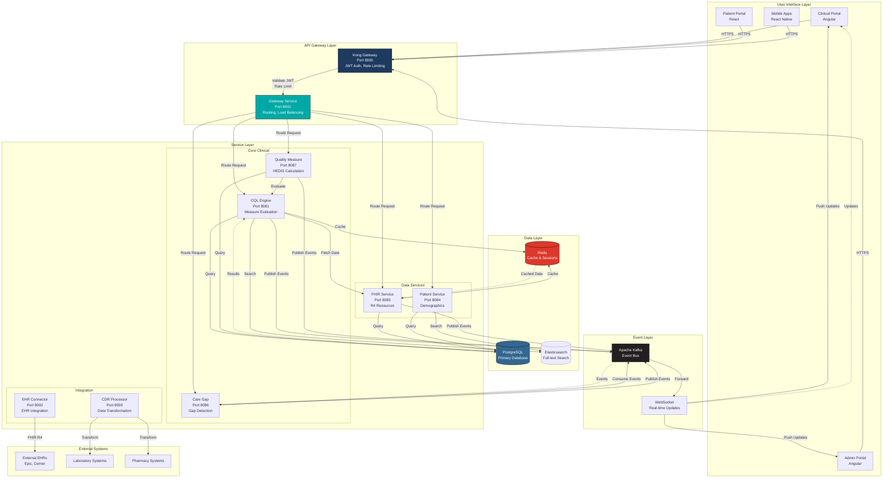
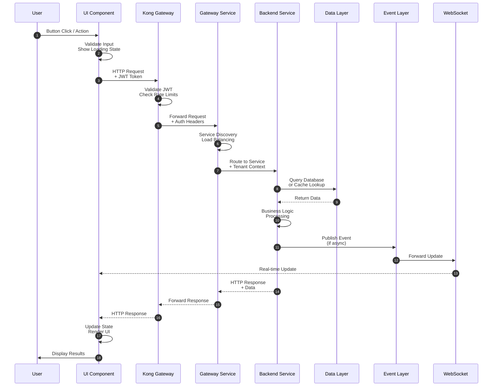
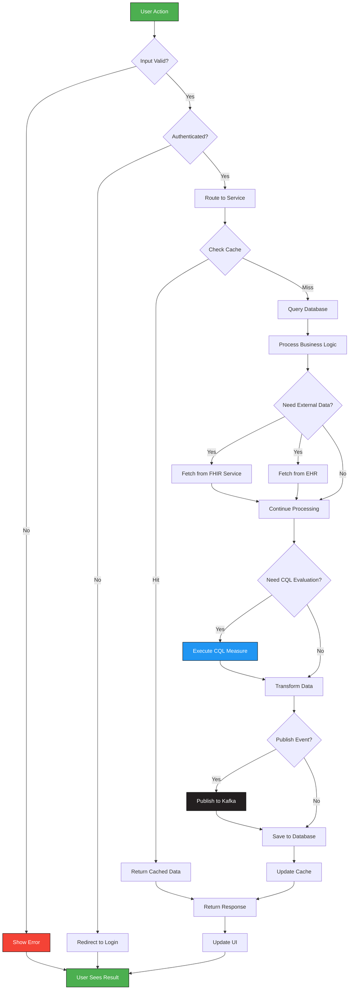
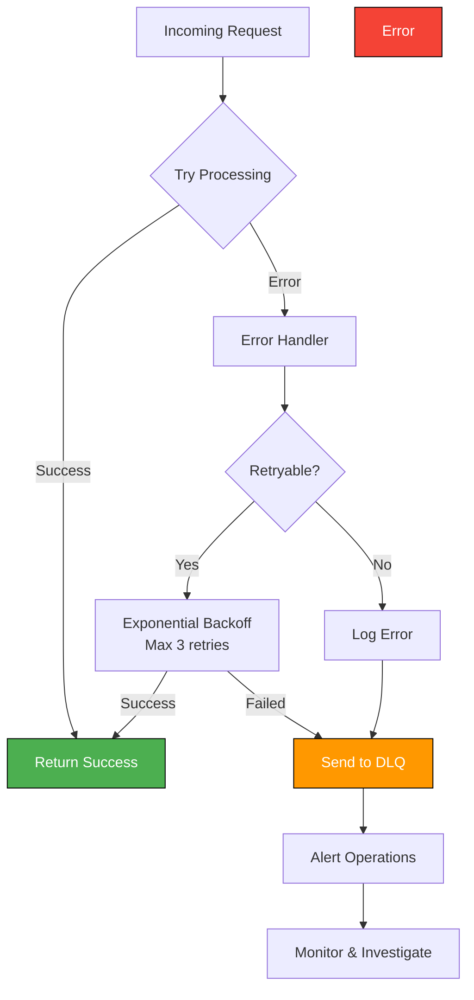

# HDIM Platform Flow Overview

**Purpose:** High-level visual overview of platform flows from button press to data processing  
**Version:** 1.0  
**Last Updated:** January 2025

---

## Complete Round-Trip Flow Architecture

---

## Request Flow Pattern

---

## Data Processing Workflow

---

## Component Interaction Matrix

| User Action | Primary Service | Data Sources | Events Published | Response Time |
|------------|----------------|--------------|------------------|---------------|
| Run Evaluation | CQL Engine | FHIR, PostgreSQL, Redis | evaluation.completed | 500-2000ms |
| Search Patient | Patient Service | PostgreSQL, Elasticsearch, Redis | - | 100-500ms |
| Calculate Measure | Quality Measure | CQL Engine, PostgreSQL | measure.calculated | 200-800ms |
| View Care Gaps | Care Gap Service | PostgreSQL, Kafka (events) | gap.viewed | 100-300ms |
| Batch Evaluate | CQL Engine | FHIR, PostgreSQL, Redis | batch.progress, batch.completed | 5-15 min |
| Fetch FHIR Resource | FHIR Service | PostgreSQL, Redis | resource.accessed | 20-200ms |

---

## Key Flow Characteristics

### 1. **Synchronous Flows** (User waits for response)
- Patient search
- Single evaluation
- FHIR resource retrieval
- Authentication

### 2. **Asynchronous Flows** (Background processing)
- Batch evaluations
- Care gap detection
- Event processing
- Data enrichment

### 3. **Real-time Flows** (WebSocket updates)
- Evaluation progress
- Data flow visualization
- Care gap alerts
- Notification delivery

### 4. **Hybrid Flows** (Sync + Async)
- Evaluation with real-time progress
- Batch operations with progress updates
- Long-running queries with status updates

---

## Performance Optimization Strategies

1. **Caching Layers**
   - Redis: Templates (24h), FHIR resources (5min), search results (5min)
   - Application: In-memory caches for frequently accessed data

2. **Database Optimization**
   - Indexed queries by tenant_id
   - Connection pooling
   - Read replicas for analytics

3. **Async Processing**
   - Kafka for non-blocking operations
   - Thread pools for concurrent evaluations
   - Background jobs for heavy processing

4. **Real-time Updates**
   - WebSocket for progress tracking
   - Server-Sent Events (SSE) for notifications
   - Polling fallback for WebSocket failures

---

## Error Handling Patterns

---

## Related Documentation

- **[Round-Trip Flows](./ROUND_TRIP_FLOWS.md)**: Detailed sequence diagrams for each workflow
- **[Architecture Diagrams](./diagrams/ARCHITECTURE_DIAGRAMS.md)**: C4 models and system diagrams
- **[System Architecture](./SYSTEM_ARCHITECTURE.md)**: High-level system overview
- **[Service Documentation](../services/)**: Individual service specifications

---

**Last Updated:** January 2025  
**Maintained By:** Platform Architecture Team
