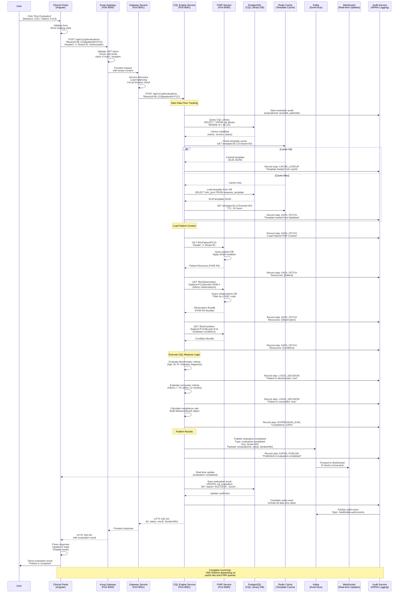
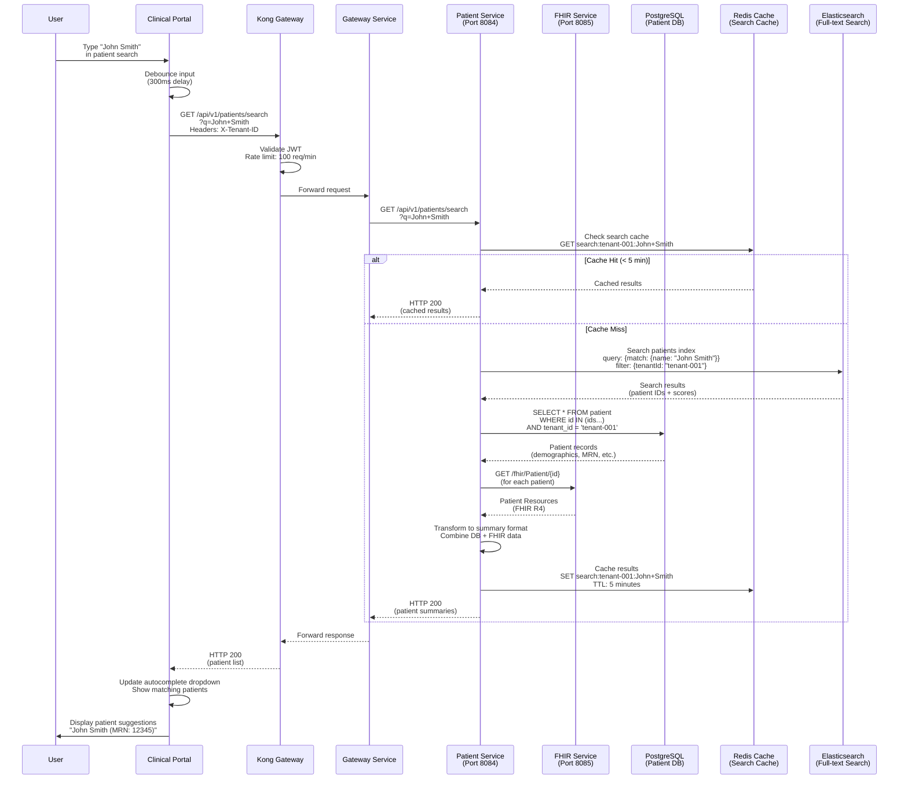
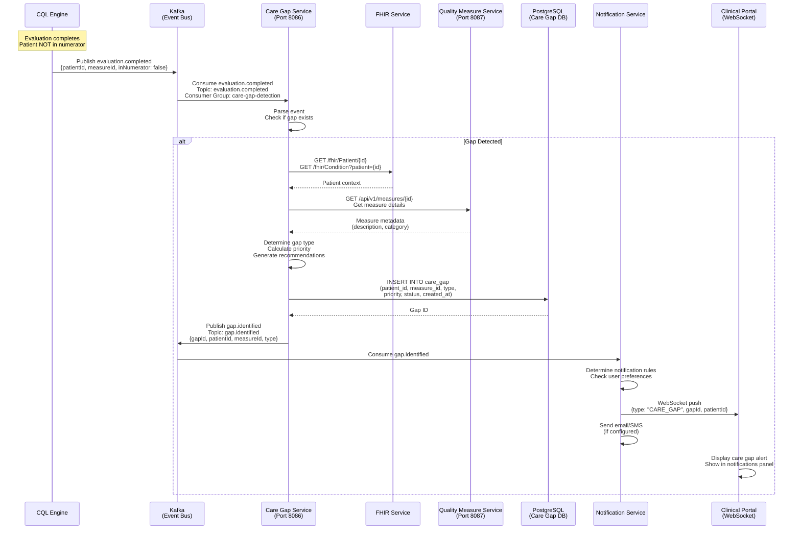
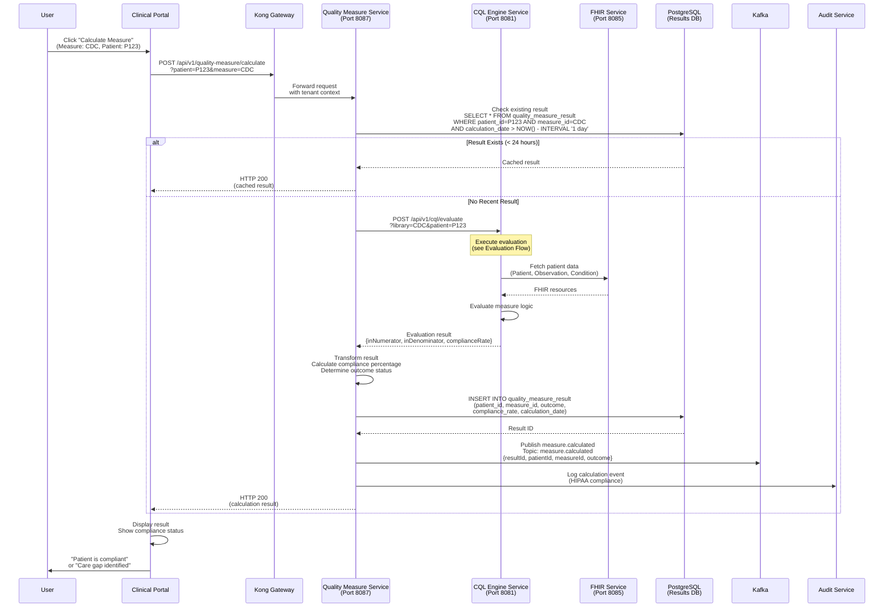
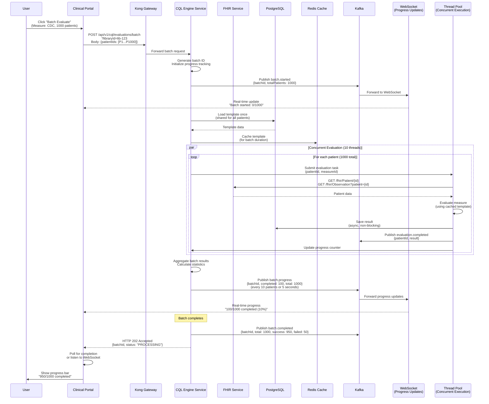
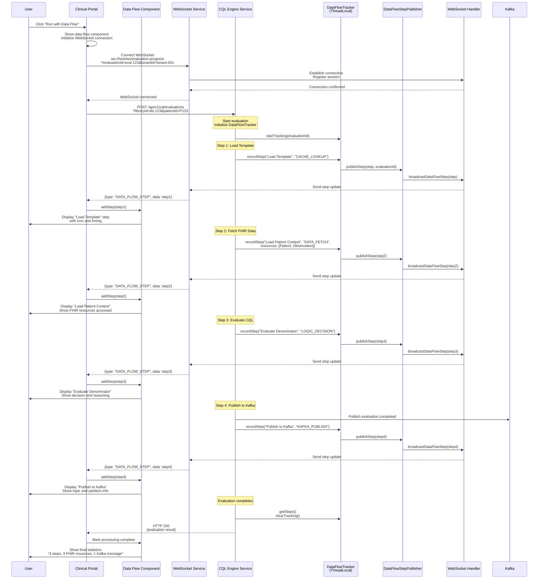
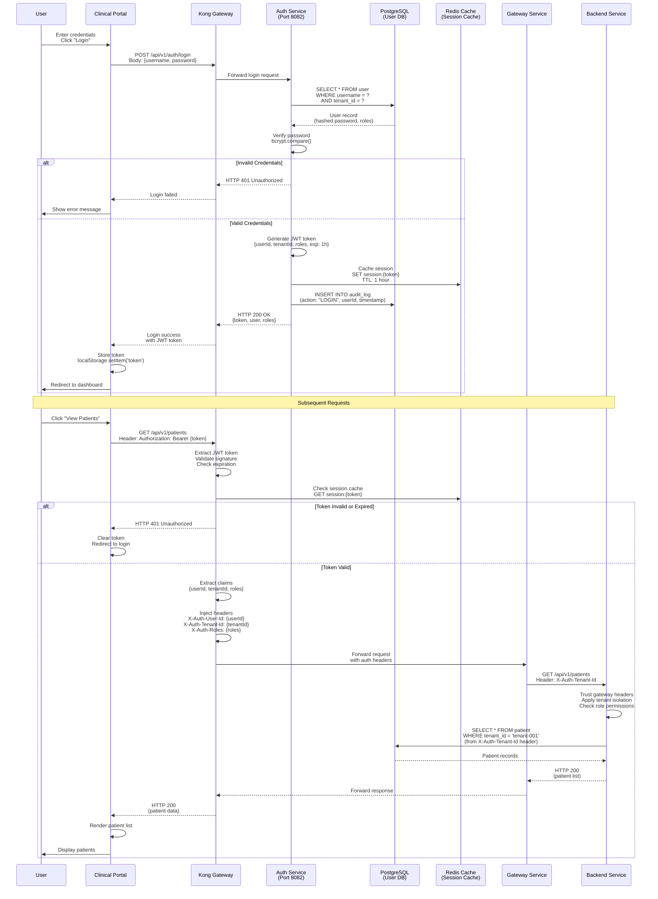
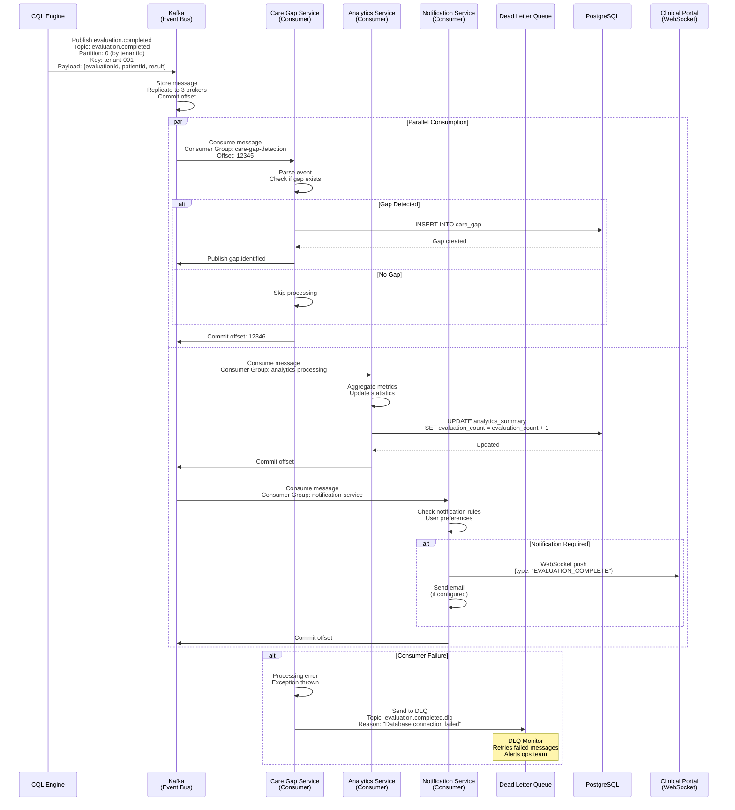
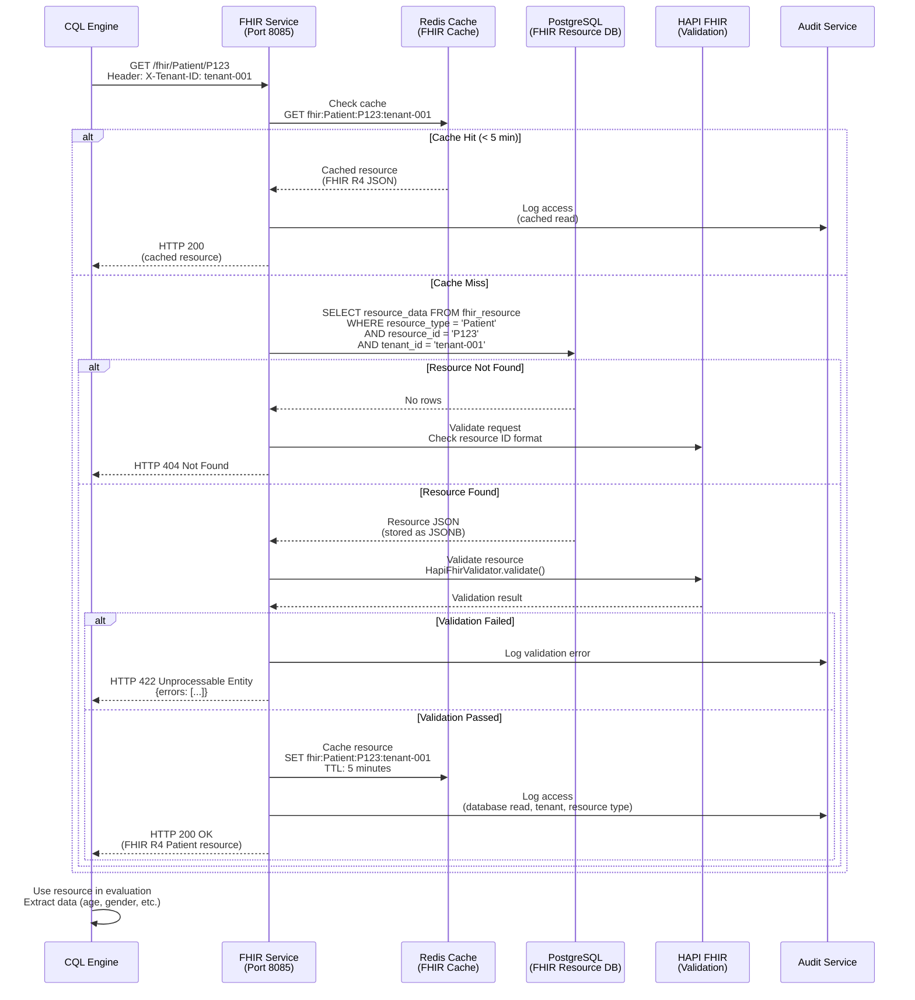

# HDIM Platform Round-Trip Flow Diagrams

**Purpose:** Systematic documentation of complete round-trip flows from UI button press through data sources, processing, and response  
**Version:** 1.0  
**Last Updated:** January 2025

---

## Table of Contents

1. [Overview](#overview)
2. [Evaluation Flow (CQL + FHIR)](#1-evaluation-flow-cql--fhir)
3. [Patient Search Flow](#2-patient-search-flow)
4. [Care Gap Detection Flow](#3-care-gap-detection-flow)
5. [Quality Measure Calculation Flow](#4-quality-measure-calculation-flow)
6. [Batch Evaluation Flow](#5-batch-evaluation-flow)
7. [Data Flow Visualization Flow](#6-data-flow-visualization-flow)
8. [Authentication & Authorization Flow](#7-authentication--authorization-flow)
9. [Event Processing Flow (Kafka)](#8-event-processing-flow-kafka)
10. [FHIR Resource Retrieval Flow](#9-fhir-resource-retrieval-flow)

---

## Overview

This document provides **complete round-trip flow diagrams** showing how user actions in the UI trigger backend processing, data retrieval, and responses. Each diagram shows:

- **UI Layer**: Button clicks, form submissions, user interactions
- **API Gateway**: Request routing, authentication, rate limiting
- **Service Layer**: Business logic, orchestration
- **Data Layer**: Database queries, FHIR requests, cache lookups
- **Event Layer**: Kafka message publishing/consumption
- **Response Path**: Data transformation, aggregation, UI updates

---

## 1. Evaluation Flow (CQL + FHIR)

**Scenario:** User clicks "Run Evaluation" button for a quality measure



**Key Data Points:**
- **Total Steps**: 15-20 steps depending on cache hits
- **FHIR Queries**: 3-5 resource types (Patient, Observation, Condition, Procedure, MedicationRequest)
- **Database Queries**: 2-3 (library lookup, template load, result save)
- **Cache Lookups**: 1-2 (template cache, patient context cache)
- **Kafka Messages**: 2-3 (evaluation events, audit events)
- **WebSocket Updates**: Real-time step-by-step progress

---

## 2. Patient Search Flow

**Scenario:** User searches for a patient by name or MRN



**Key Data Points:**
- **Cache Strategy**: 5-minute TTL for search results
- **Search Backend**: Elasticsearch for full-text search
- **Data Sources**: PostgreSQL (demographics) + FHIR (clinical data)
- **Response Time**: <100ms (cached) or 200-500ms (uncached)

---

## 3. Care Gap Detection Flow

**Scenario:** System automatically detects care gaps after evaluation



**Key Data Points:**
- **Trigger**: Evaluation result (patient not in numerator)
- **Processing**: Asynchronous via Kafka
- **Latency**: 100-500ms from evaluation to gap creation
- **Notifications**: Real-time WebSocket + email/SMS

---

## 4. Quality Measure Calculation Flow

**Scenario:** User triggers quality measure calculation for a patient



**Key Data Points:**
- **Caching**: 24-hour result cache
- **Dependencies**: CQL Engine + FHIR Service
- **Audit**: All calculations logged for HIPAA
- **Response Time**: 200-800ms (cached) or 1-3s (uncached)

---

## 5. Batch Evaluation Flow

**Scenario:** User runs evaluation for 1000 patients



**Key Data Points:**
- **Concurrency**: 10-40 threads (2x CPU cores)
- **Template Caching**: Loaded once, reused for all patients
- **Progress Updates**: Every 10 patients or 5 seconds
- **Total Time**: ~5-15 minutes for 1000 patients
- **Throughput**: 100-200 evaluations/second

---

## 6. Data Flow Visualization Flow

**Scenario:** User clicks "Run with Data Flow" to see real-time processing



**Key Data Points:**
- **Real-time Updates**: Steps published as they occur
- **WebSocket Latency**: <50ms from step to UI
- **Step Types**: DATA_FETCH, CQL_EXECUTION, LOGIC_DECISION, KAFKA_PUBLISH
- **Visualization**: Grouped by type (FHIR, Kafka, CQL)

---

## 7. Authentication & Authorization Flow

**Scenario:** User logs in and accesses protected resource



**Key Data Points:**
- **JWT Expiration**: 1 hour (configurable)
- **Session Cache**: Redis with 1-hour TTL
- **Gateway Trust**: Services trust X-Auth-* headers
- **Tenant Isolation**: Enforced at database query level

---

## 8. Event Processing Flow (Kafka)

**Scenario:** Evaluation event triggers downstream processing



**Key Data Points:**
- **Partitioning**: By tenantId for ordering
- **Consumer Groups**: Independent processing per service
- **At-Least-Once Delivery**: Messages may be processed multiple times
- **DLQ**: Failed messages go to dead letter queue
- **Parallelism**: Multiple consumers process same message

---

## 9. FHIR Resource Retrieval Flow

**Scenario:** Service needs to fetch FHIR resources for evaluation



**Key Data Points:**
- **Cache TTL**: 5 minutes (HIPAA compliance)
- **Validation**: HAPI FHIR validates all resources
- **Storage**: JSONB in PostgreSQL
- **Tenant Isolation**: Enforced at query level
- **Audit**: All reads logged (cached and uncached)

---

## Summary

### Common Patterns Across All Flows

1. **Request Path**: UI → Kong → Gateway → Service
2. **Authentication**: JWT validation at Kong, header injection
3. **Caching**: Redis for templates, search results, FHIR resources
4. **Database**: PostgreSQL for persistent data
5. **Events**: Kafka for async processing and notifications
6. **Real-time**: WebSocket for progress updates
7. **Audit**: All operations logged for HIPAA compliance
8. **Tenant Isolation**: Enforced at every layer

### Performance Characteristics

| Flow Type | Typical Latency | Cache Hit Latency | Throughput |
|-----------|----------------|-------------------|------------|
| Evaluation | 500-2000ms | 200-500ms | 10-50/sec |
| Patient Search | 200-500ms | <100ms | 100/sec |
| Batch Evaluation | 5-15 min (1000 patients) | N/A | 100-200/sec |
| Care Gap Detection | 100-500ms (async) | N/A | 1000/sec |
| FHIR Retrieval | 50-200ms | <20ms | 500/sec |

### Data Flow Summary

```
User Action
    ↓
UI Component (Angular/React)
    ↓
Kong Gateway (Auth, Rate Limit)
    ↓
Gateway Service (Routing, Load Balancing)
    ↓
Backend Service (Business Logic)
    ↓
├─→ PostgreSQL (Persistent Data)
├─→ Redis (Cache)
├─→ FHIR Service (Clinical Data)
├─→ Kafka (Events)
└─→ WebSocket (Real-time Updates)
    ↓
Response Path (Reverse)
    ↓
UI Update
```

---

**Next Steps:**
- Add more flow diagrams for specific scenarios
- Create interactive diagrams (using Mermaid Live Editor)
- Generate sequence diagrams for error scenarios
- Document retry and failure handling flows
