# HDIM Architecture Diagrams

## HealthData-in-Motion (HDIM) Visual Architecture Documentation

**Generated:** December 5, 2025
**Platform Version:** Production-Ready
**Diagram Format:** Mermaid (GitHub/GitLab compatible)

---

## Table of Contents

1. [C4 Level 1: System Context Diagram](#1-c4-level-1-system-context-diagram)
2. [C4 Level 2: Container Diagram](#2-c4-level-2-container-diagram)
3. [C4 Level 3: Component Diagrams](#3-c4-level-3-component-diagrams)
4. [Sequence Diagrams](#4-sequence-diagrams)
5. [Database ERD](#5-database-erd)
6. [Deployment Architecture](#6-deployment-architecture)
7. [Security Architecture](#7-security-architecture)
8. [Data Flow Diagrams](#8-data-flow-diagrams)

## Related Flow Documentation

- **[Platform Flow Overview](../PLATFORM_FLOW_OVERVIEW.md)**: High-level flow architecture and patterns
- **[Round-Trip Flows](../ROUND_TRIP_FLOWS.md)**: Complete sequence diagrams from button press to response

---

## 1. C4 Level 1: System Context Diagram

**Purpose:** Shows HDIM in the context of its users and external systems
**Audience:** All stakeholders (technical and non-technical)

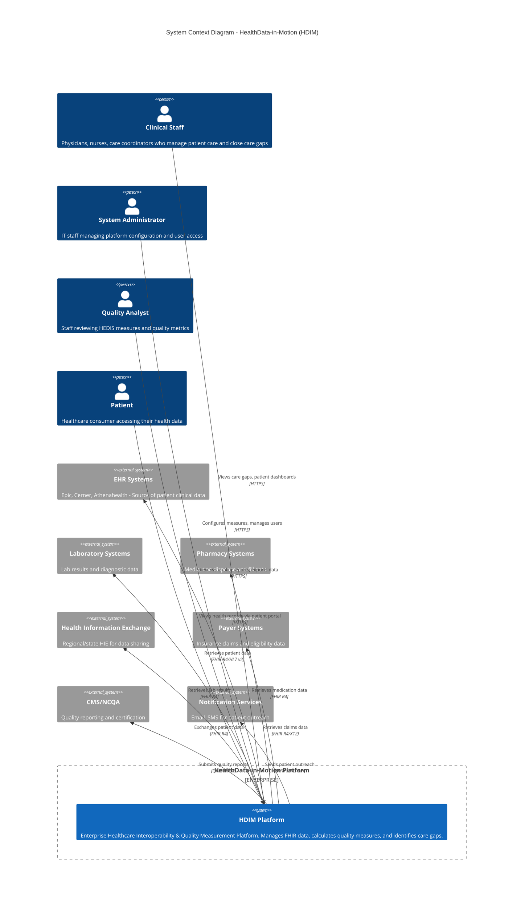

### Context Diagram - Simplified View

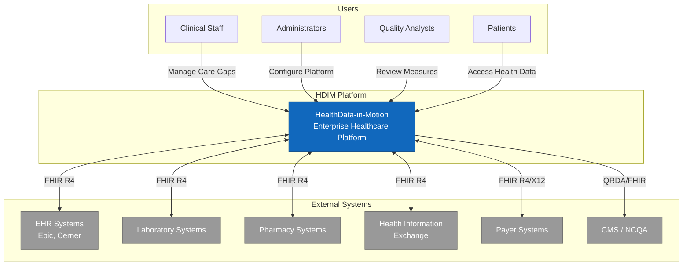

---

## 2. C4 Level 2: Container Diagram

**Purpose:** Shows the high-level technology choices and how containers interact
**Audience:** Technical stakeholders, architects, developers

```mermaid
C4Container
    title Container Diagram - HealthData-in-Motion (HDIM)

    Person(clinician, "Clinical Staff", "Manages patient care")
    Person(admin, "Administrator", "Manages platform")

    Container_Boundary(frontend, "Frontend Applications") {
        Container(clinical_portal, "Clinical Portal", "Angular 20, Material UI", "Primary web application for clinical staff")
        Container(admin_portal, "Admin Portal", "Angular 20", "Administrative configuration interface")
        Container(patient_portal, "Patient Portal", "React 19, Vite", "Patient-facing health dashboard")
    }

    Container_Boundary(gateway, "API Gateway Layer") {
        Container(api_gateway, "API Gateway", "Spring Boot, Spring Cloud Gateway", "Authentication, rate limiting, routing")
        Container(kong, "Kong Gateway", "Kong", "External API management, OAuth2")
    }

    Container_Boundary(services, "Microservices") {
        Container(fhir_service, "FHIR Service", "Java 21, HAPI FHIR", "FHIR R4 resource management, Bulk Data API")
        Container(cql_engine, "CQL Engine Service", "Java 21, CQL Engine", "Clinical Quality Language evaluation")
        Container(quality_measure, "Quality Measure Service", "Java 21, Spring Boot", "HEDIS measure calculation, orchestration")
        Container(care_gap, "Care Gap Service", "Java 21, Spring Boot", "Gap identification and prioritization")
        Container(patient_service, "Patient Service", "Java 21, Spring Boot", "Patient data management, 360 view")
        Container(consent_service, "Consent Service", "Java 21, Spring Boot", "Patient consent management")
        Container(event_processing, "Event Processing Service", "Java 21, Kafka", "Real-time event handling, DLQ")
        Container(analytics, "Analytics Service", "Java 21, Spring Boot", "Real-time dashboards, population health")
        Container(ai_assistant, "AI Assistant Service", "Java 21, LLM Integration", "AI-powered clinical assistance")
    }

    Container_Boundary(data, "Data Layer") {
        ContainerDb(postgres, "PostgreSQL", "PostgreSQL 16", "Primary data store for all services")
        ContainerDb(redis, "Redis Cache", "Redis 7", "Session cache, query cache, measure results")
        ContainerQueue(kafka, "Kafka", "Apache Kafka 3.x", "Event streaming, async processing")
    }

    Rel(clinician, clinical_portal, "Uses", "HTTPS")
    Rel(admin, admin_portal, "Uses", "HTTPS")

    Rel(clinical_portal, api_gateway, "API calls", "HTTPS/JSON")
    Rel(admin_portal, api_gateway, "API calls", "HTTPS/JSON")
    Rel(patient_portal, kong, "API calls", "HTTPS/JSON")

    Rel(api_gateway, fhir_service, "Routes", "HTTP")
    Rel(api_gateway, quality_measure, "Routes", "HTTP")
    Rel(api_gateway, care_gap, "Routes", "HTTP")
    Rel(api_gateway, patient_service, "Routes", "HTTP")

    Rel(quality_measure, cql_engine, "Evaluates measures", "HTTP")
    Rel(quality_measure, fhir_service, "Fetches patient data", "HTTP")
    Rel(care_gap, quality_measure, "Gets measure results", "HTTP")

    Rel(fhir_service, postgres, "Reads/Writes", "JDBC")
    Rel(patient_service, postgres, "Reads/Writes", "JDBC")
    Rel(quality_measure, postgres, "Reads/Writes", "JDBC")

    Rel(cql_engine, redis, "Caches templates", "TCP")
    Rel(quality_measure, redis, "Caches results", "TCP")

    Rel(event_processing, kafka, "Consumes/Produces", "TCP")
    Rel(analytics, kafka, "Consumes", "TCP")

    UpdateLayoutConfig($c4ShapeInRow="4", $c4BoundaryInRow="1")
```

### Container Diagram - Simplified Microservices View

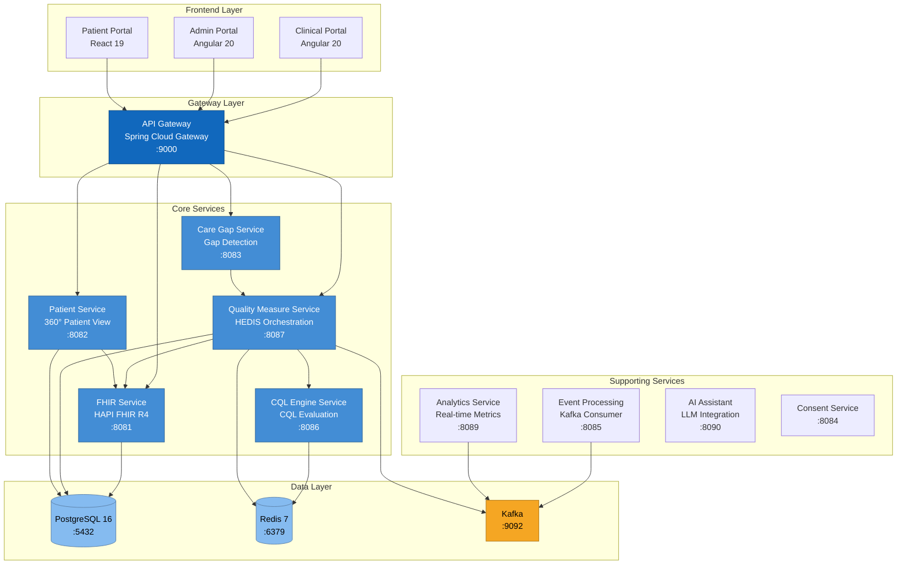

---

## 3. C4 Level 3: Component Diagrams

### 3.1 Quality Measure Service - Component Diagram

**Purpose:** Internal structure of the Quality Measure Service
**Audience:** Developers working on quality measurement features

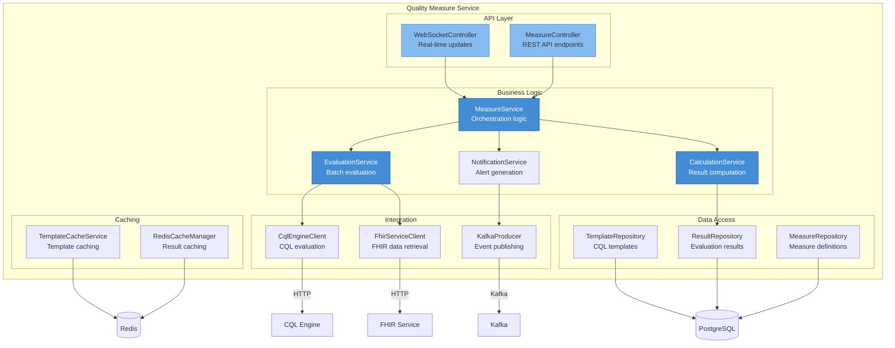

### 3.2 CQL Engine Service - Component Diagram

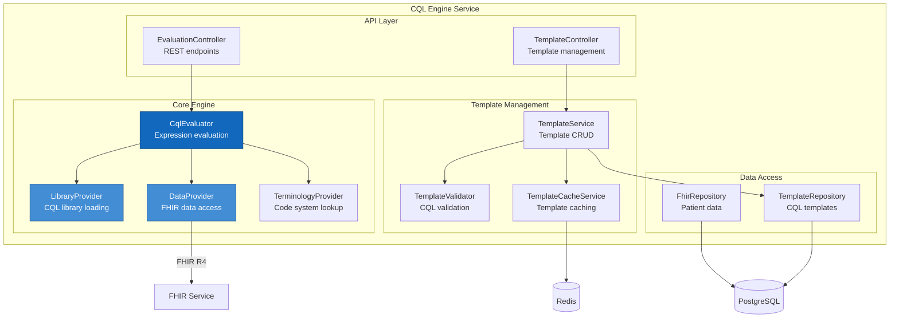

---

## 4. Sequence Diagrams

### 4.1 Quality Measure Evaluation Flow

**Purpose:** Shows the complete flow of evaluating a HEDIS measure for a patient
**Use Case:** Understanding measure calculation process

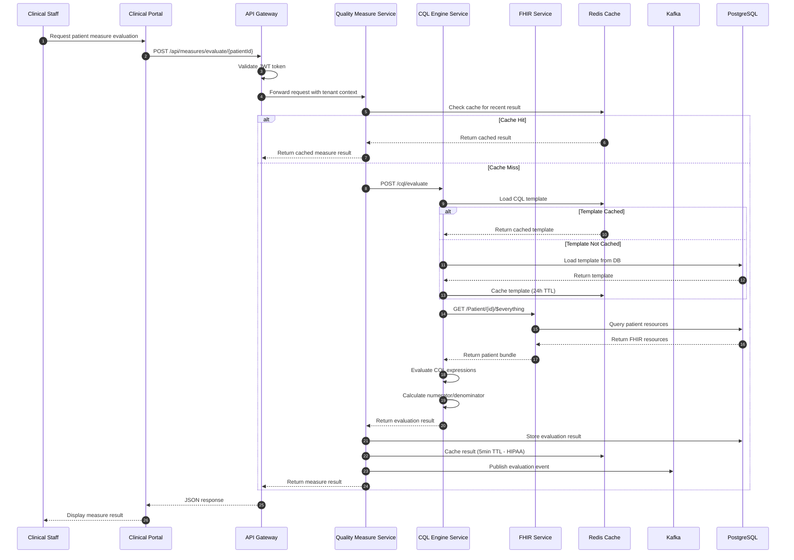

### 4.2 Care Gap Identification Flow

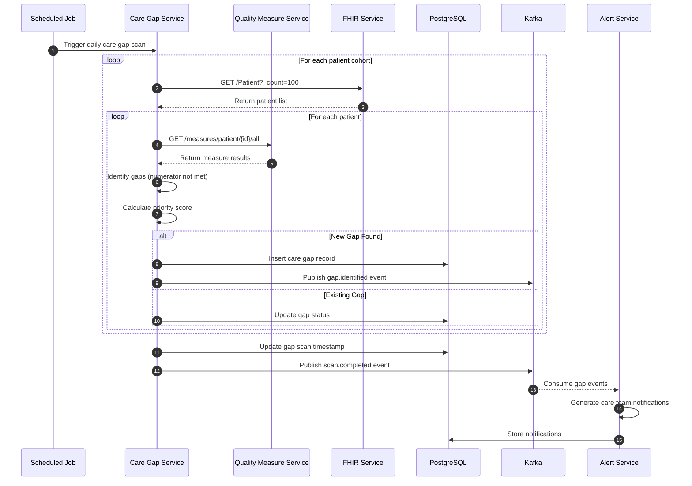

### 4.3 Authentication Flow

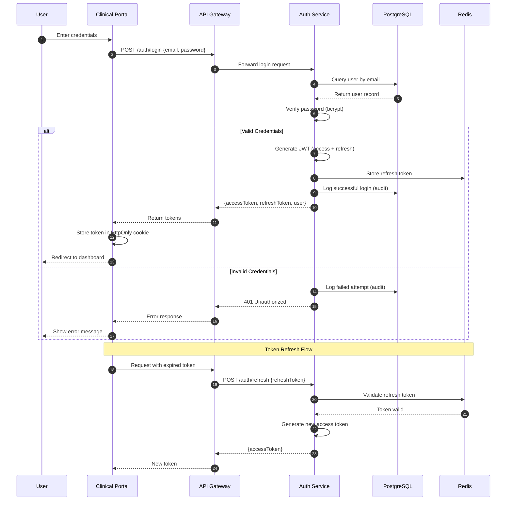

### 4.4 FHIR Bulk Data Export Flow

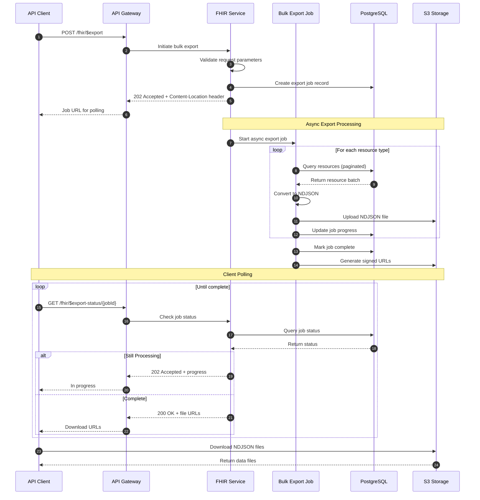

---

## 5. Database ERD

### 5.1 Core Domain Model

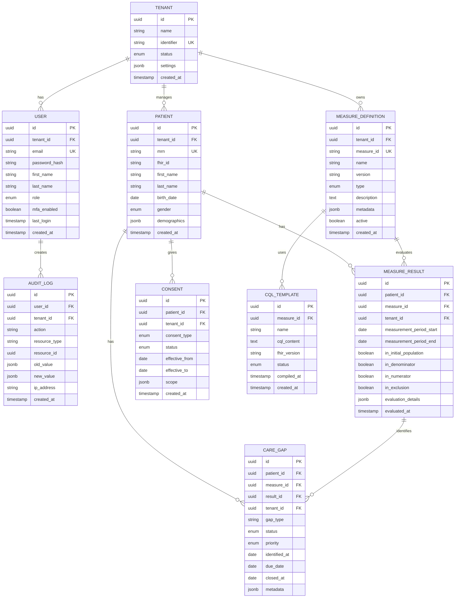

### 5.2 Event Processing Domain

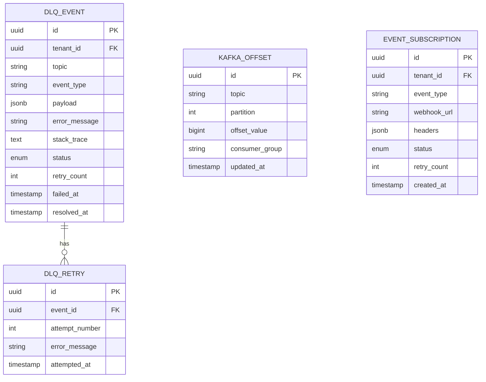

---

## 6. Deployment Architecture

### 6.1 Kubernetes Deployment

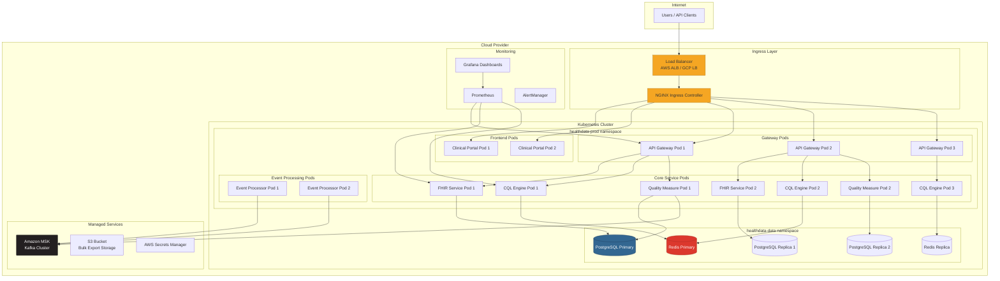

### 6.2 Docker Compose Local Development

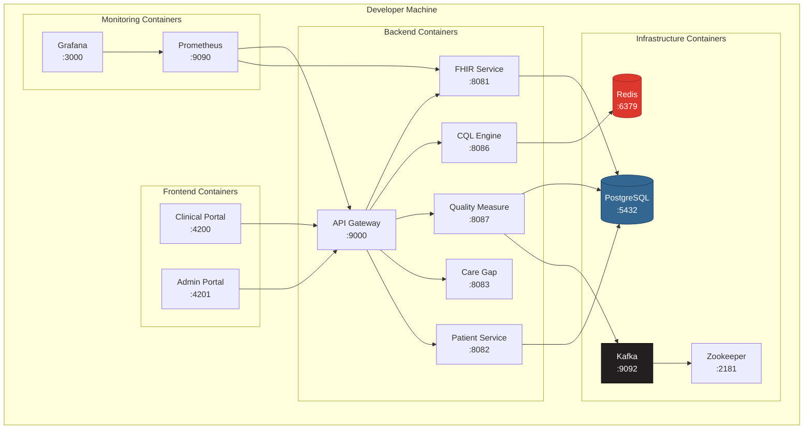

---

## 7. Security Architecture

### 7.1 Authentication & Authorization Flow

```mermaid
flowchart TB
    subgraph "Client Layer"
        Browser[Browser / Mobile App]
        API_Client[API Client]
    end

    subgraph "Edge Security"
        WAF[WAF<br/>AWS WAF / Cloudflare]
        CDN[CDN<br/>CloudFront]
        Rate[Rate Limiter]
    end

    subgraph "Authentication"
        OAuth[OAuth2 / OIDC Provider]
        JWT[JWT Validation]
        MFA[MFA Service]
        Session[Session Manager<br/>Redis]
    end

    subgraph "Authorization"
        RBAC[Role-Based Access Control]
        ABAC[Attribute-Based Access Control]
        Tenant[Tenant Isolation Filter]
    end

    subgraph "API Gateway"
        GW[Spring Cloud Gateway]
    end

    subgraph "Services"
        Service1[Microservice 1]
        Service2[Microservice 2]
    end

    subgraph "Audit"
        Audit[Audit Service]
        AuditDB[(Audit DB<br/>Encrypted)]
    end

    Browser --> WAF
    API_Client --> WAF
    WAF --> CDN
    CDN --> Rate
    Rate --> OAuth

    OAuth --> JWT
    OAuth --> MFA
    JWT --> Session
    JWT --> GW

    GW --> RBAC
    RBAC --> ABAC
    ABAC --> Tenant
    Tenant --> Service1
    Tenant --> Service2

    Service1 --> Audit
    Service2 --> Audit
    Audit --> AuditDB

    style WAF fill:#ff6b6b,stroke:#c92a2a
    style OAuth fill:#51cf66,stroke:#2f9e44
    style JWT fill:#51cf66,stroke:#2f9e44
    style Audit fill:#339af0,stroke:#1864ab
```

### 7.2 Data Protection Layers

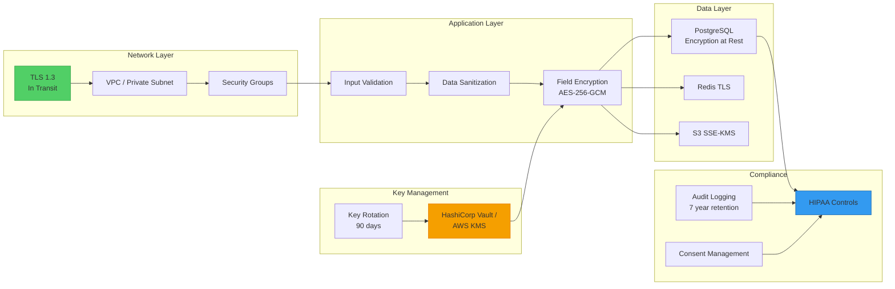

---

## 8. Data Flow Diagrams

### 8.1 Patient Data Flow

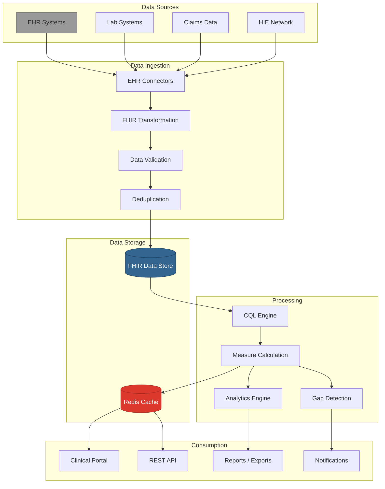

### 8.2 Event-Driven Architecture Flow

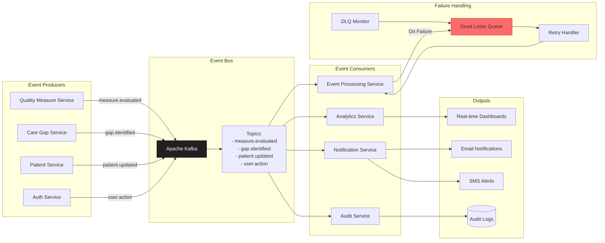

---

## Diagram Index

| Diagram | Type | Level | Purpose |
|---------|------|-------|---------|
| System Context | C4 | 1 | HDIM in the world |
| Container | C4 | 2 | Technology architecture |
| Quality Measure Components | C4 | 3 | Internal structure |
| CQL Engine Components | C4 | 3 | Internal structure |
| Measure Evaluation | Sequence | - | Request flow |
| Care Gap Identification | Sequence | - | Batch processing |
| Authentication | Sequence | - | Login flow |
| Bulk Export | Sequence | - | Async export |
| Core Domain ERD | ERD | - | Data model |
| Event Processing ERD | ERD | - | DLQ model |
| Kubernetes Deployment | Deployment | - | Production infra |
| Docker Compose | Deployment | - | Local dev |
| Security Flow | Security | - | Auth/authz |
| Data Protection | Security | - | Encryption layers |
| Patient Data Flow | Data Flow | - | E2E data journey |
| Event Architecture | Data Flow | - | Kafka events |

---

## Rendering Instructions

### GitHub / GitLab
Mermaid diagrams render natively in markdown files.

### Local Rendering
```bash
# Install mermaid-cli
npm install -g @mermaid-js/mermaid-cli

# Render to PNG
mmdc -i ARCHITECTURE_DIAGRAMS.md -o architecture.png

# Render to SVG
mmdc -i ARCHITECTURE_DIAGRAMS.md -o architecture.svg

# Render to PDF
mmdc -i ARCHITECTURE_DIAGRAMS.md -o architecture.pdf
```

### Online Editors
- **Mermaid Live Editor:** https://mermaid.live
- **Draw.io:** https://app.diagrams.net (import mermaid)

---

**Generated by:** Architecture Review Team
**Last Updated:** December 5, 2025
**Version:** 1.0
