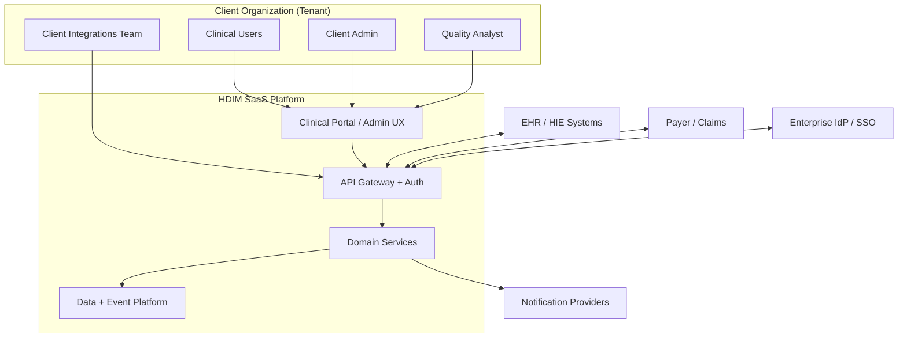
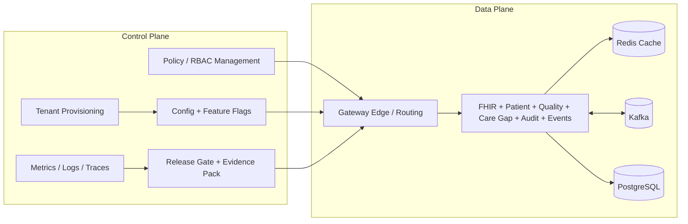
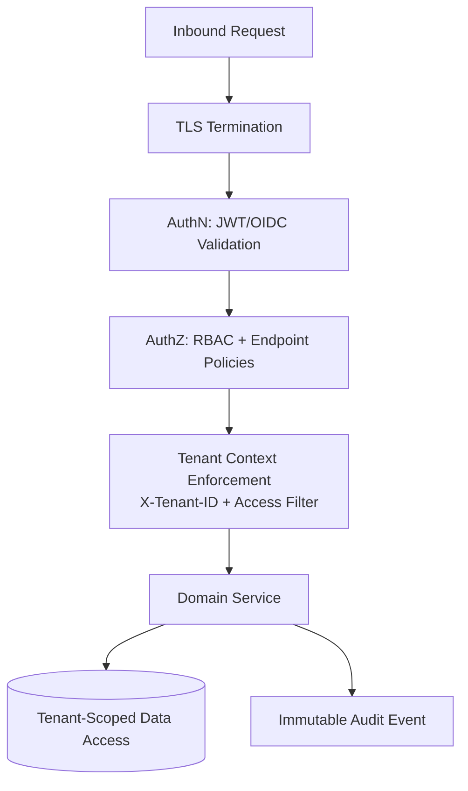
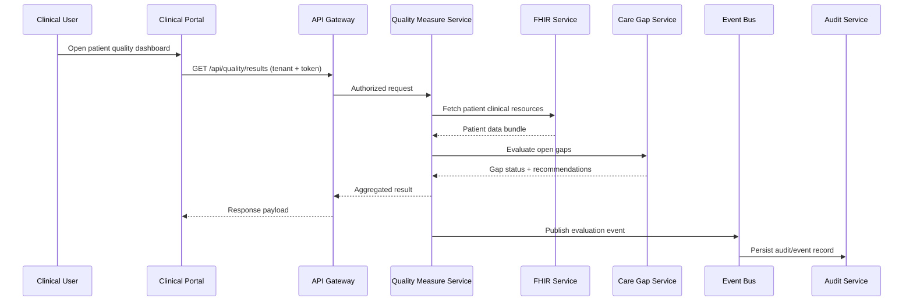
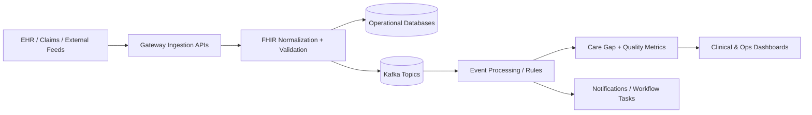
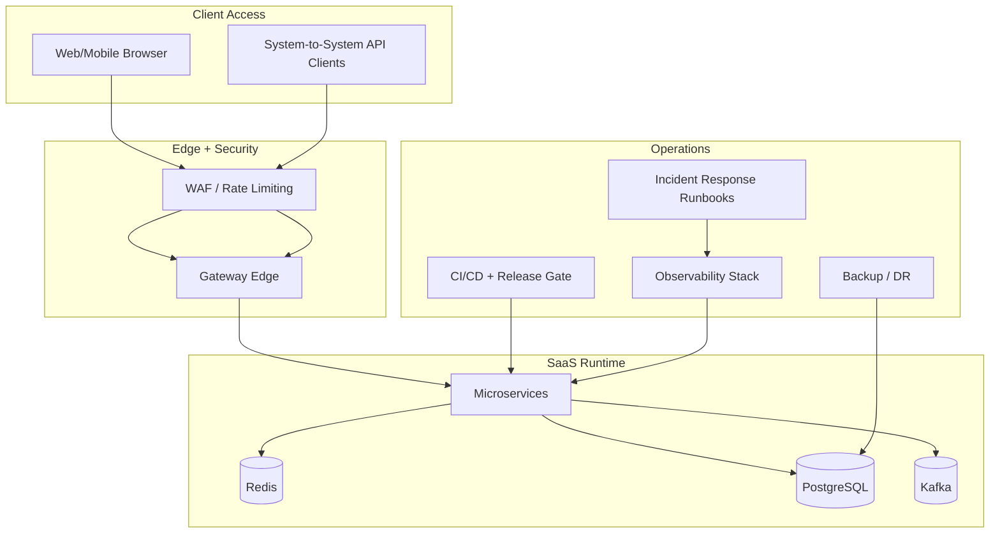

# Enterprise SaaS Implementation Architecture (Client + Product)

**Platform:** HealthData-in-Motion (HDIM)  
**Audience:** Client solution architects, platform engineering, security/compliance reviewers  
**Format:** Mermaid diagrams (Draw.io compatible via Mermaid import)

---

## 1. Goals and Scope

This document defines an enterprise SaaS architecture for HDIM across:
- Client-facing implementation surfaces (clinical operations, admin, analytics, API consumers)
- Product implementation layers (gateway, domain services, data/event platform, control plane)
- Cross-cutting concerns (tenant isolation, security, observability, release governance, DR)

---

## 2. System Context (Client + External Ecosystem)

---

## 3. Product Architecture (Control Plane and Data Plane)

---

## 4. Tenant Isolation and Security Boundaries

**Best-practice controls**
- Authentication at gateway and service trust boundaries.
- Authorization at endpoint and method level (least privilege).
- Tenant context validated before data access.
- Audit trail for read/write and privileged operations.
- Encryption in transit and at rest.

---

## 5. Client Workflow Data Flow (Clinical Gap Closure)

---

## 6. Ingestion to Analytics Flow (Operational Intelligence)

---

## 7. Enterprise SaaS Deployment Pattern

---

## 8. Operational Best-Practice Checklist

- Define separate control-plane and data-plane ownership.
- Enforce tenant isolation before every data access path.
- Use policy-as-code for authZ and release gating.
- Require artifact-backed go/no-go decisions per release.
- Track SLOs (availability, latency, error budget) per client-facing capability.
- Run periodic DR, security, and compliance validation drills.
- Keep architecture docs aligned with executable validation scripts.

---

## 9. Draw.io Usage Notes

If your team prefers Draw.io:
1. Open Draw.io.
2. Use **Arrange → Insert → Advanced → Mermaid**.
3. Paste any Mermaid block from this file.
4. Save `.drawio` source for governance-controlled diagram versions.
