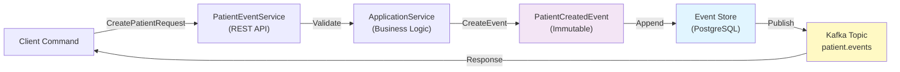
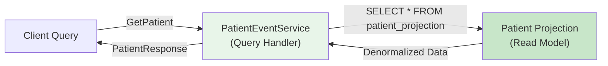
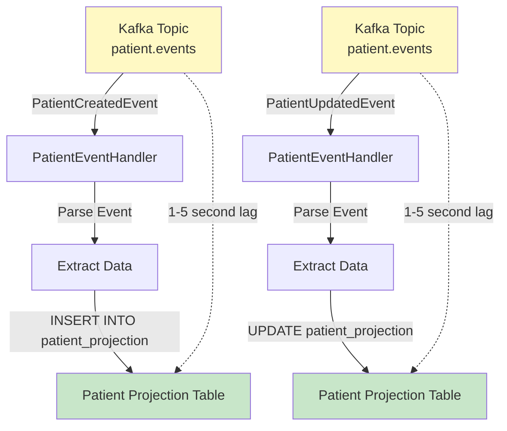
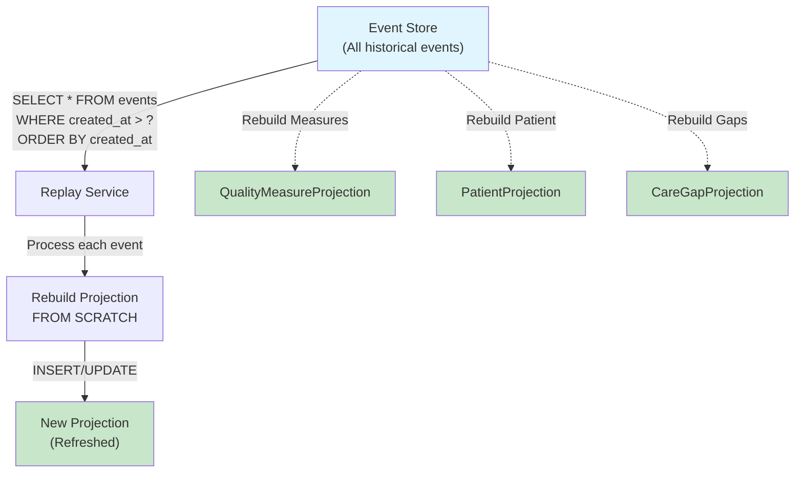
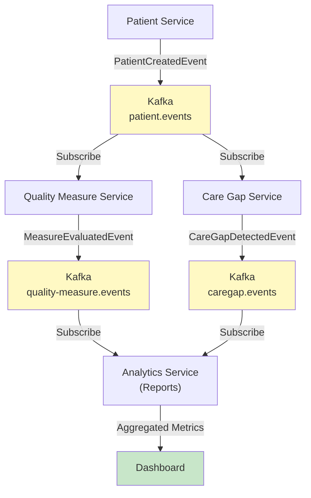
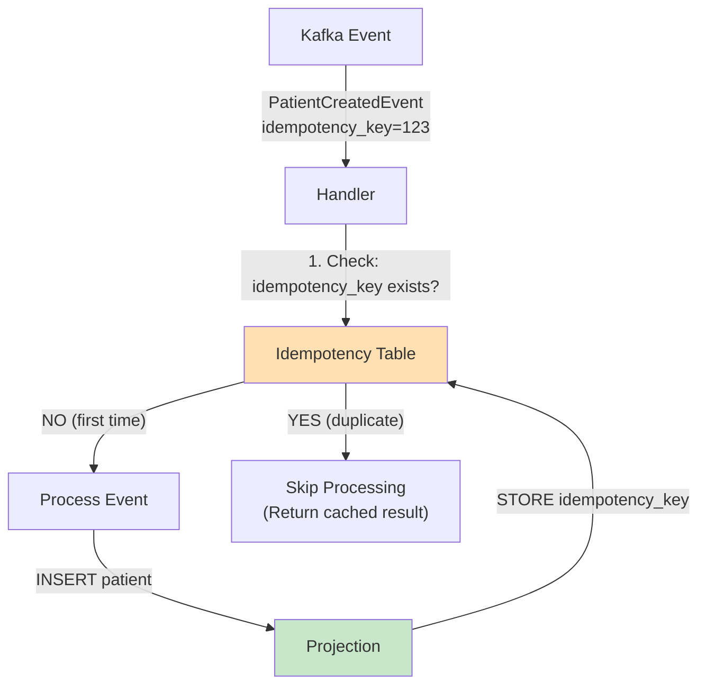
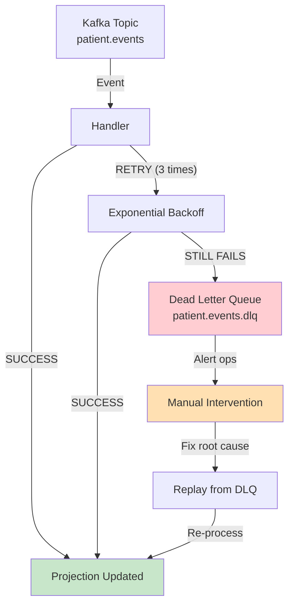
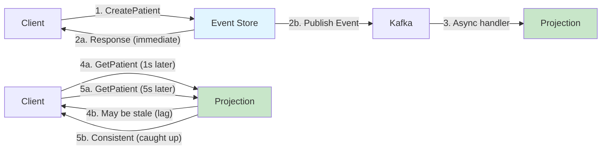

# Event Sourcing Data Flow Architecture

Complete visual reference for Event Sourcing + CQRS pattern used in Phase 5 event services.

---

## Write Path: Command to Event Store

**Process**:
1. **Client** sends CreatePatient command
2. **Service** validates command
3. **Event** created (immutable record of what happened)
4. **Event Store** persists event to PostgreSQL
5. **Kafka** publishes event to topic (asynchronously)
6. **Response** sent back to client

---

## Read Path: Query Models from Projections

**Process**:
1. **Client** queries for patient data
2. **Service** queries projection (not event store)
3. **Projection** is pre-built denormalized read model
4. **Response** returned instantly (no computation needed)

**Key Point**: Queries hit projection, NOT event store. Projections are optimized for reading.

---

## Event Handler: Building Projections (Eventual Consistency)

**Process**:
1. **Events published** to Kafka topic
2. **Handler** consumes events asynchronously
3. **Projection updated** based on event data
4. **Lag**: Usually 1-5 seconds (eventual consistency)

**Note**: Projections update asynchronously, not in real-time. This is acceptable trade-off for scalability.

---

## Event Replay: Recalculating Historical State

**Use Cases**:
- **Data Correction**: Measure calculation logic changed → replay to recalculate
- **Projection Rebuild**: Projection got corrupted → replay from event store
- **Historical Analysis**: Calculate metrics at specific past date → replay to that point
- **Audit Trail**: Reconstruct exactly what happened on specific date

**Timeline**:
- 1M events: ~1.5 minutes to replay
- 10M events: ~15 minutes to replay
- Replay runs in background (doesn't block reads)

---

## Multi-Service Event Flow (Clinical Workflow)

**Event Flow**:
1. **Patient** created in patient-service
2. **Event published** to patient.events topic
3. **Quality Measure** service consumes event, evaluates measures
4. **Measure evaluation** event published
5. **Care Gap** service consumes event, detects gaps
6. **Gap detection** event published
7. **Analytics** service consumes both measurement and gap events
8. **Dashboard** shows aggregated results

**Benefits**: Services loosely coupled (communicate via events, not REST)

---

## Idempotency: Handling Duplicate Events

**Why Idempotency Matters**:
- Kafka may deliver same event twice (network retries)
- Without idempotency: Duplicate patient records, double-counted measures
- With idempotency: Duplicate events safely ignored

---

## Error Handling: Dead Letter Queues

**Error Handling Strategy**:
1. **First attempt** → Process event
2. **Failure** → Retry with exponential backoff (3 times)
3. **Still failing** → Send to Dead Letter Queue
4. **Alert** → Operations team notified
5. **Fix** → Root cause fixed, replay from DLQ

---

## Consistency Model: Strong Write, Eventual Read

**Consistency Guarantees**:
- **Write**: Immediate (event written to event store before response)
- **Read**: Eventual (projection updated 1-5 seconds later)
- **Acceptable**? Yes, for healthcare (delays are expected, consistency is eventual)

---

## References

- **[Event Sourcing Architecture Guide](../EVENT_SOURCING_ARCHITECTURE.md)** - Complete implementation guide
- **[ADR-001: Event Sourcing Decision](../decisions/ADR-001-event-sourcing-for-clinical-services.md)**
- **[Service Catalog - Event Services](../../services/SERVICE_CATALOG.md)**

---

_Last Updated: January 19, 2026_
_Version: 1.0_
_Diagrams created for Phase 5 Event Sourcing Implementation_
