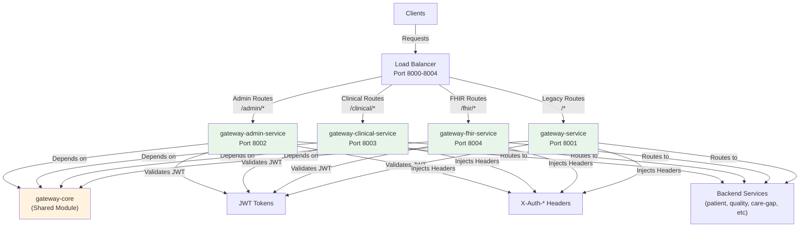
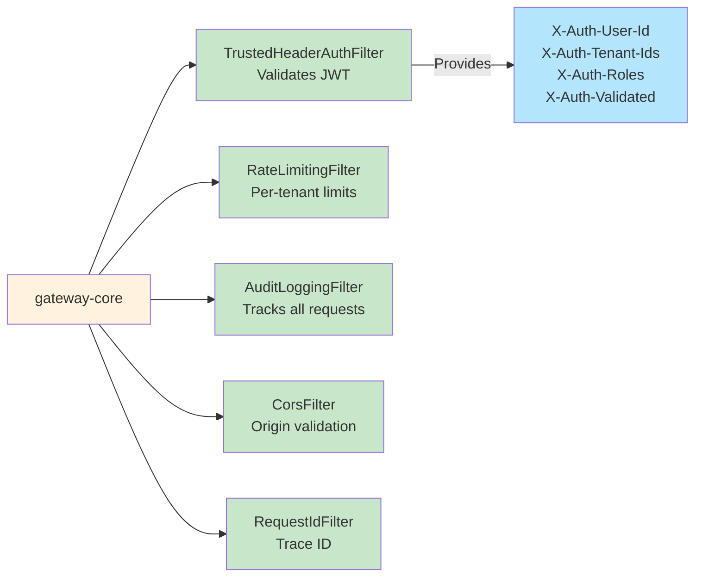
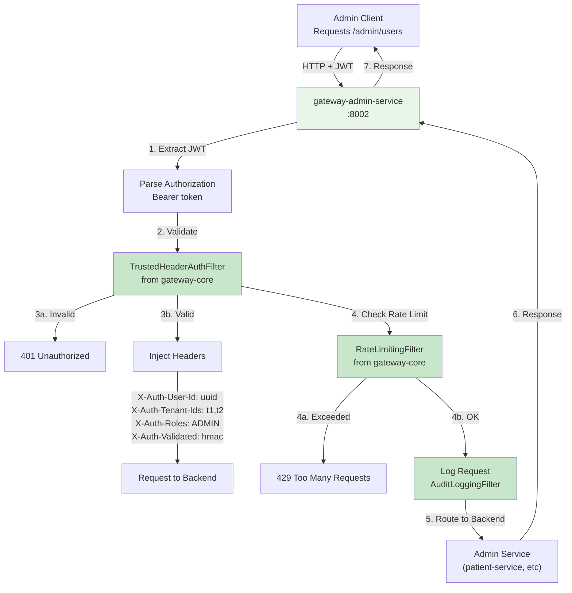
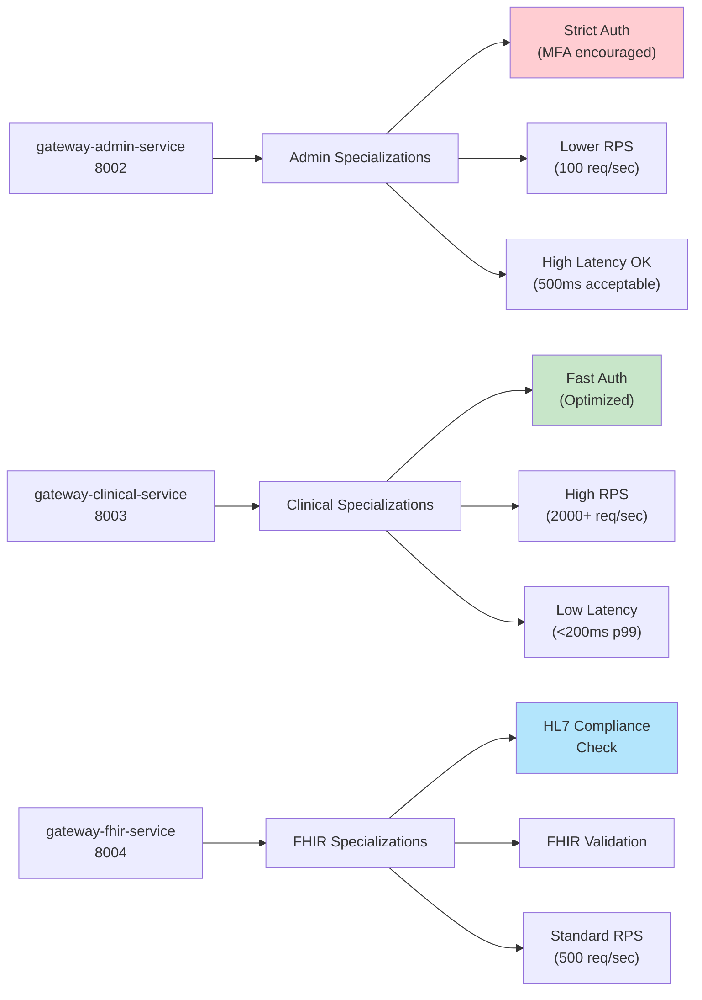
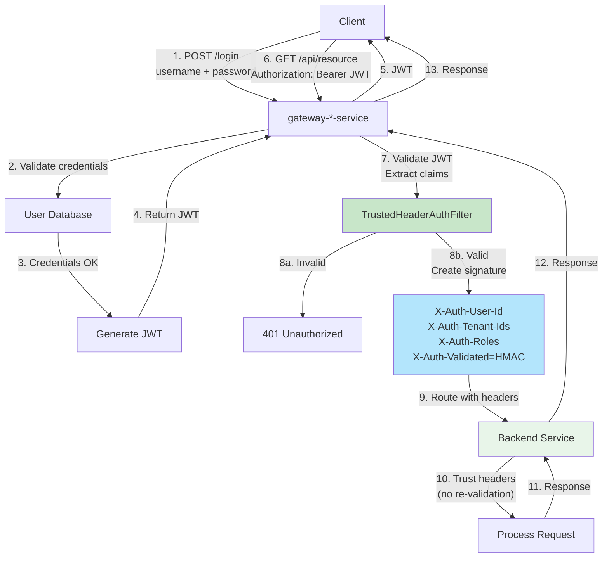
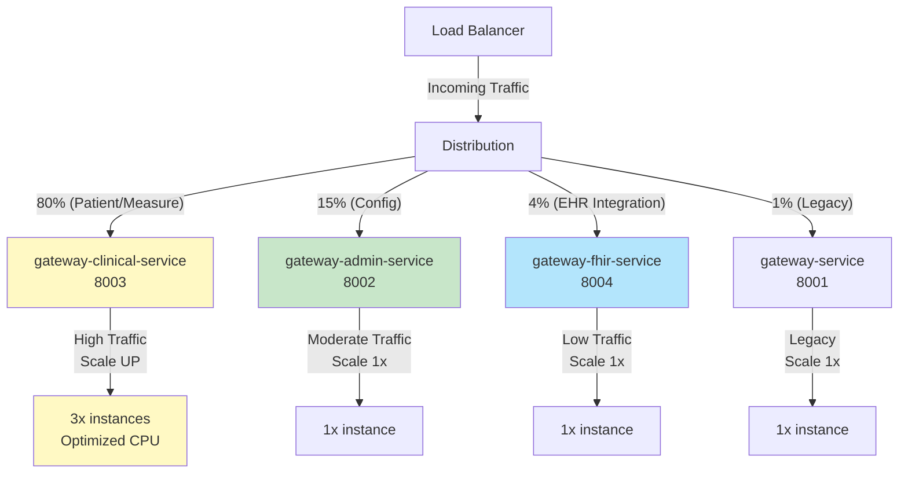
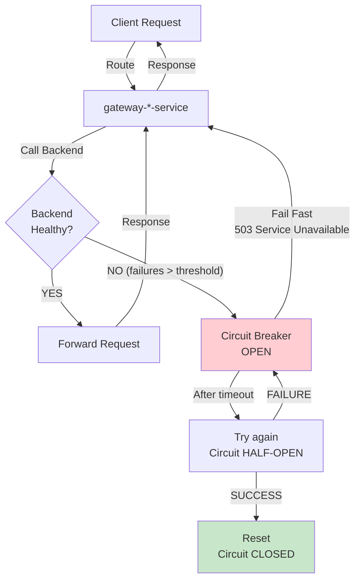
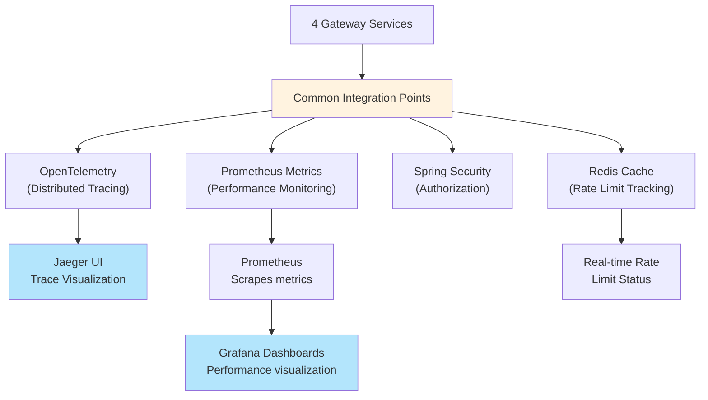

# Gateway Modularization Architecture

Complete visual reference for 4-Gateway Architecture with shared gateway-core module.

---

## Overall Gateway Architecture



**Key Components**:
- **Load Balancer**: Routes incoming requests to appropriate gateway
- **4 Specialized Gateways**: Each handles specific domain
- **gateway-core**: Shared authentication, rate limiting, logging
- **Backend Services**: Receive authenticated requests from gateways

---

## Gateway-Core Shared Module



**Shared Functionality**:
1. **JWT Validation**: Validates JWT token once at gateway entry
2. **Header Injection**: Injects X-Auth-* headers for backend services
3. **Rate Limiting**: Enforces per-tenant request limits
4. **Audit Logging**: Tracks all API requests
5. **CORS**: Manages cross-origin requests
6. **Request Tracing**: Generates trace IDs for distributed tracing

---

## Request Flow: Admin Gateway Example



**Sequence**:
1. Admin client sends request with JWT
2. Admin gateway extracts and validates JWT
3. If valid, injects X-Auth-* headers
4. If invalid, returns 401
5. Checks rate limit (per tenant)
6. If exceeded, returns 429
7. Logs request for audit trail
8. Routes to appropriate backend service
9. Returns response

---

## Domain-Specific Optimizations



**Specialization Benefits**:
- **Admin**: Stricter security (MFA), lower throughput
- **Clinical**: High throughput optimization, fast response times
- **FHIR**: HL7 standards compliance, FHIR-specific validation

---

## Authentication Flow: Gateway-Trust Pattern



**Key Points**:
1. Gateway validates JWT once
2. Gateway injects X-Auth-* headers (+ HMAC signature)
3. Backend services trust headers (no re-validation)
4. HMAC signature prevents header spoofing
5. Reduces per-service auth overhead

---

## Traffic Patterns and Independent Scaling



**Independent Scaling Benefits**:
- **Clinical**: Experiences traffic spike → scale to 3x instances
- **Admin**: Remains at 1x (no unnecessary scaling)
- **FHIR**: Independent of clinical traffic
- **Cost savings**: Scale only what's needed

---

## Error Handling and Circuit Breaker



**Resilience Pattern**:
1. Gateway detects backend failures
2. Opens circuit (stops sending requests)
3. Returns 503 (fail fast, don't timeout)
4. After timeout, tries again (HALF-OPEN)
5. If backend recovered, closes circuit
6. If still failing, reopens circuit

---

## Integration Points



---

## Code Organization

```
gateway-core/  (Shared)
├── filters/
│   ├── TrustedHeaderAuthFilter.java
│   ├── RateLimitingFilter.java
│   ├── AuditLoggingFilter.java
│   └── CorsFilter.java
├── config/
│   └── GatewayCoreConfiguration.java
└── pom.xml

gateway-admin-service/
├── config/
│   ├── AdminSecurityConfig.java (Strict auth)
│   └── AdminRateLimitConfig.java
└── pom.xml → depends on gateway-core

gateway-clinical-service/
├── config/
│   ├── ClinicalSecurityConfig.java (Fast auth)
│   └── ClinicalRateLimitConfig.java (High throughput)
└── pom.xml → depends on gateway-core

gateway-fhir-service/
├── config/
│   ├── FhirSecurityConfig.java
│   └── FhirValidationConfig.java
└── pom.xml → depends on gateway-core

gateway-service/
├── config/
│   └── GeneralGatewayConfig.java (Legacy/fallback)
└── pom.xml → depends on gateway-core
```

---

## References

- **[Gateway Architecture Guide](../GATEWAY_ARCHITECTURE.md)** - Implementation details
- **[ADR-002: Gateway Modularization](../decisions/ADR-002-gateway-modularization.md)** - Decision rationale
- **[Gateway Trust Architecture](../../backend/docs/GATEWAY_TRUST_ARCHITECTURE.md)** - Auth pattern details
- **[Service Catalog](../../services/SERVICE_CATALOG.md)** - Gateway services info

---

_Last Updated: January 19, 2026_
_Version: 1.0_
_Diagrams for 4-Gateway Modularization (January 2026)_
