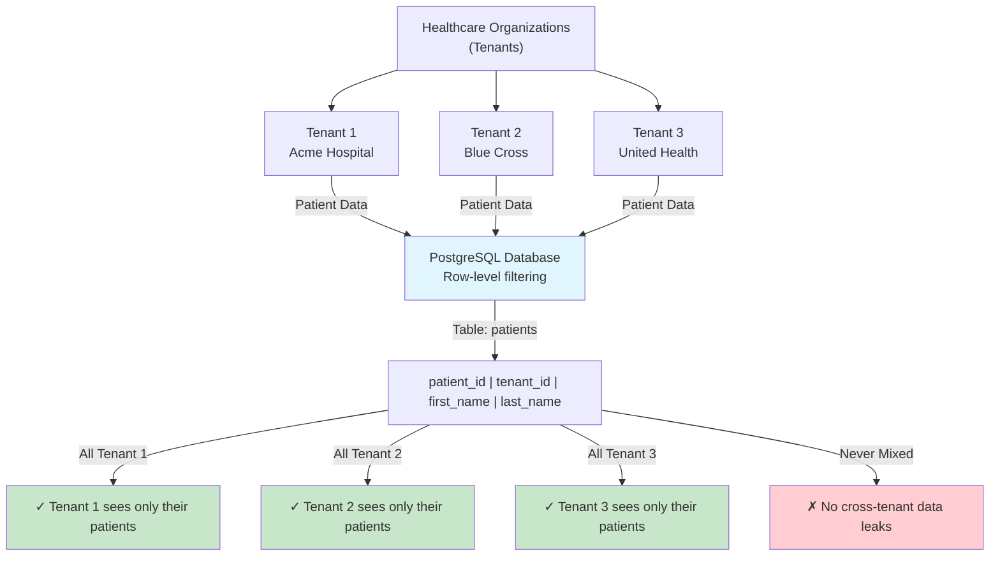
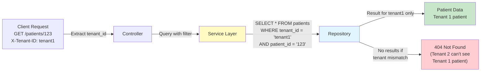
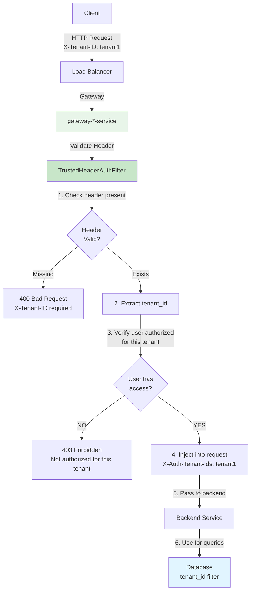
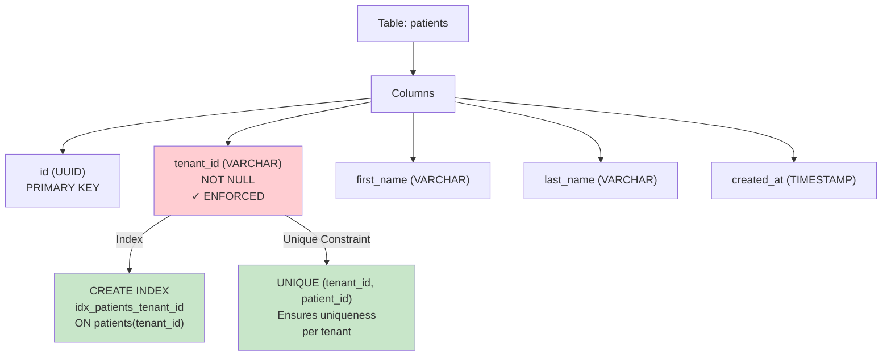
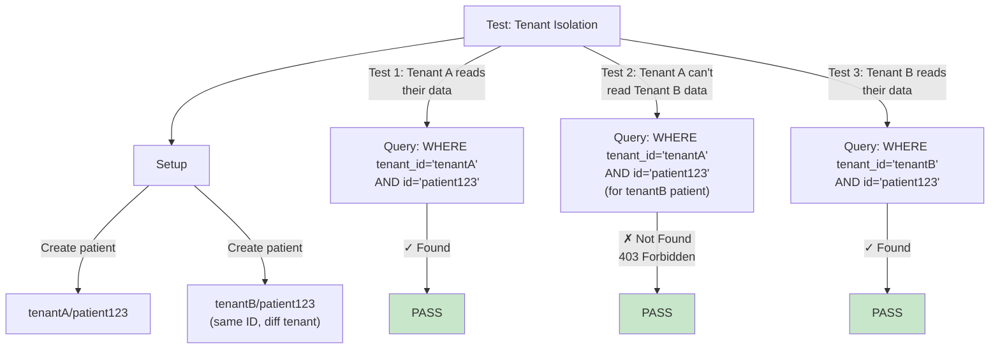
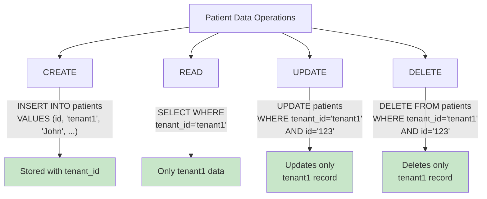
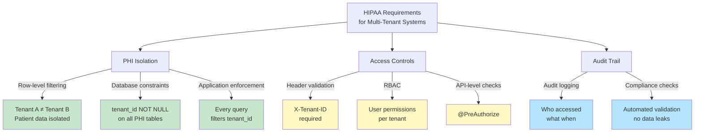
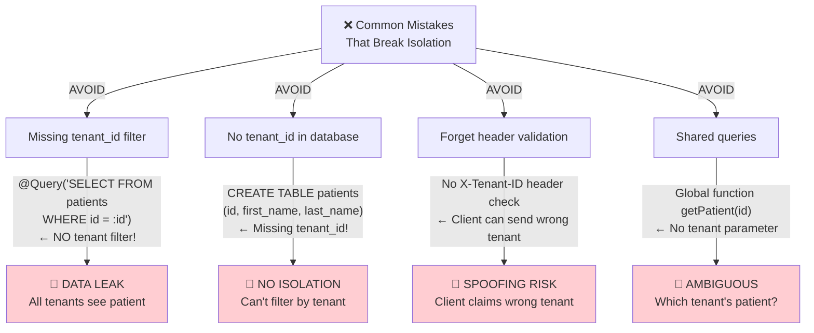
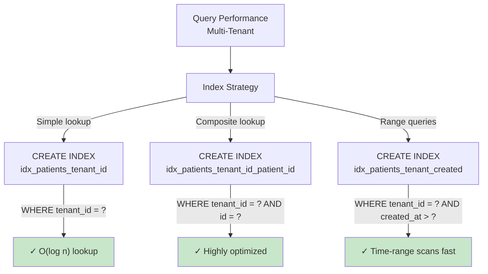
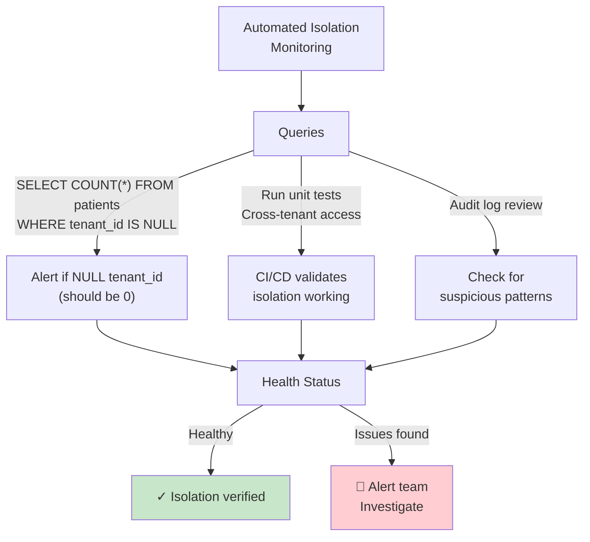

# Multi-Tenant Isolation Architecture

Row-level isolation strategy for ensuring patient data from one organization never leaks to another.

---

## Tenant Isolation Model



---

## Query Filtering Pattern



**Critical Pattern**:
```java
// REQUIRED - Every query must filter by tenant
@Query("SELECT p FROM Patient p WHERE p.tenantId = :tenantId AND p.id = :id")
Optional<Patient> findByIdAndTenant(@Param("id") String id,
                                     @Param("tenantId") String tenantId);

// FORBIDDEN - Would leak data across tenants
@Query("SELECT p FROM Patient p WHERE p.id = :id")  // ❌ NO TENANT FILTER!
Optional<Patient> findById(@Param("id") String id);
```

---

## Tenant Identification: X-Tenant-ID Header



---

## Database Schema Enforcement



**Liquibase Enforcement**:

```xml
<changeSet id="0001-create-patients-table">
    <createTable tableName="patients">
        <column name="tenant_id" type="VARCHAR(100)">
            <constraints nullable="false"/>
        </column>
        <column name="patient_id" type="UUID" primaryKey="true"/>
        <!-- more columns -->
    </createTable>

    <!-- Enforce tenant isolation -->
    <createIndex indexName="idx_patients_tenant" tableName="patients">
        <column name="tenant_id"/>
    </createIndex>

    <addUniqueConstraint
        tableName="patients"
        columnNames="tenant_id,patient_id"/>
</changeSet>
```

---

## Testing: Verifying Tenant Isolation



**Test Code**:

```java
@Test
void testTenantIsolation() {
    // Create same patient ID in two tenants
    Patient p1 = patientService.create("John", "tenant1");
    Patient p2 = patientService.create("John", "tenant2");

    // Tenant 1 should only see their patient
    Optional<Patient> result1 = service.getPatient(p1.getId(), "tenant1");
    assertThat(result1).isPresent();

    // Tenant 2 should NOT see Tenant 1's patient (even with same ID)
    assertThatThrownBy(() ->
        service.getPatient(p1.getId(), "tenant2")
    ).isInstanceOf(TenantAccessDeniedException.class);

    // Tenant 2 should see their own patient
    Optional<Patient> result2 = service.getPatient(p2.getId(), "tenant2");
    assertThat(result2).isPresent();
}
```

---

## Data Lifecycle: Multi-Tenant Operations



---

## Compliance: HIPAA PHI Protection



---

## Anti-Patterns: What NOT to Do



---

## Performance: Tenant Indexing



---

## Monitoring: Isolation Validation



---

## References

- **[HIPAA Compliance Guide](../../backend/HIPAA-CACHE-COMPLIANCE.md)** - PHI protection details
- **[ADR-009: Multi-Tenant Isolation](../decisions/ADR-009-multi-tenant-isolation.md)** - Decision rationale
- **[Coding Standards](../../backend/docs/CODING_STANDARDS.md)** - Implementation patterns
- **[Entity-Migration Guide](../../backend/docs/ENTITY_MIGRATION_GUIDE.md)** - Database schema

---

_Last Updated: January 19, 2026_
_Version: 1.0_
_Compliance: HIPAA PHI Protection_
_Pattern: Row-Level Tenant Isolation_
