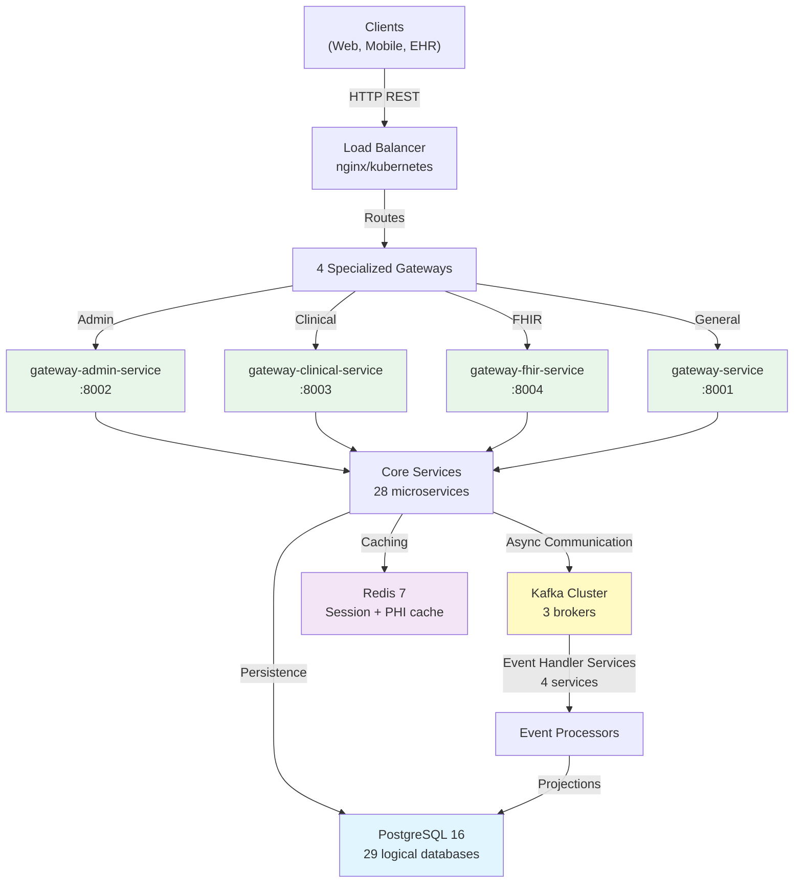
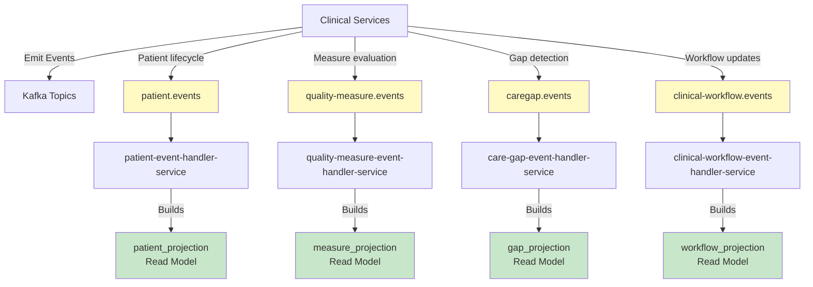
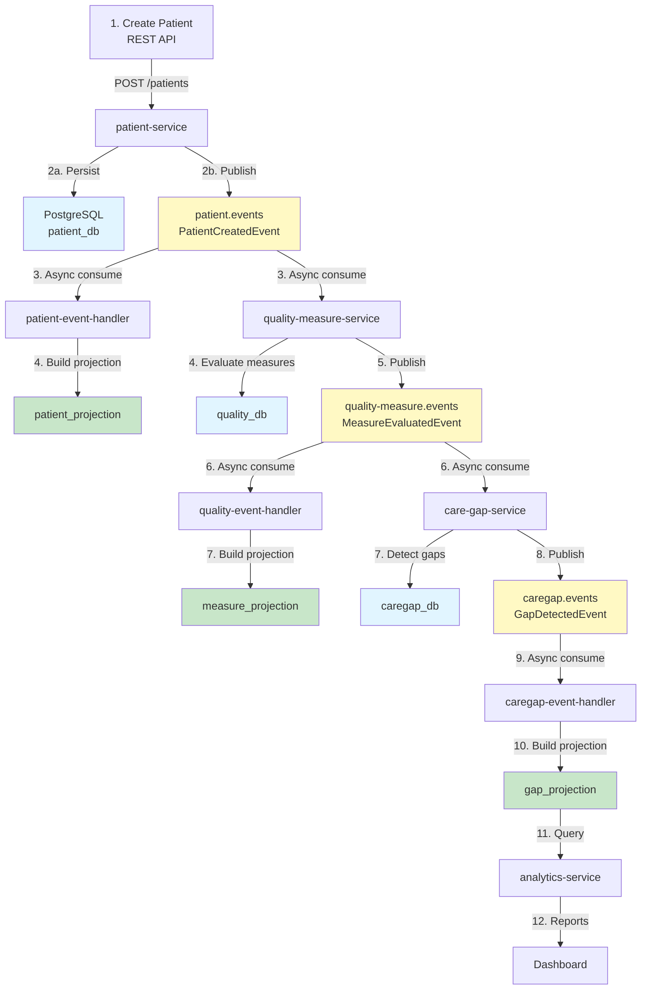
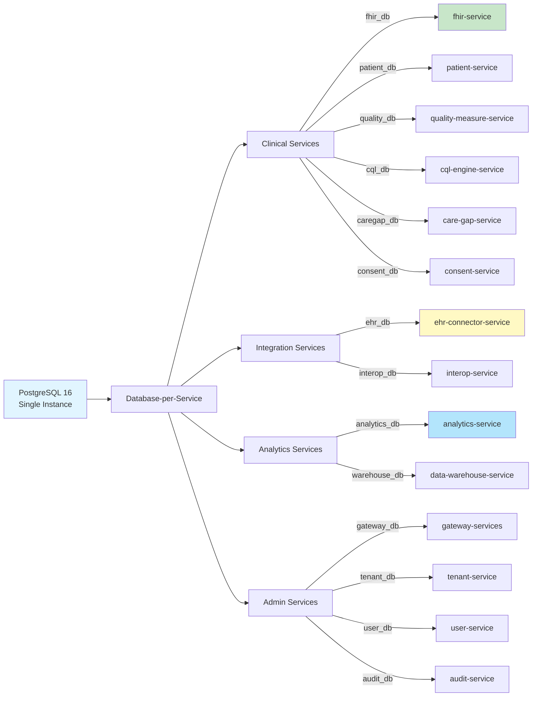
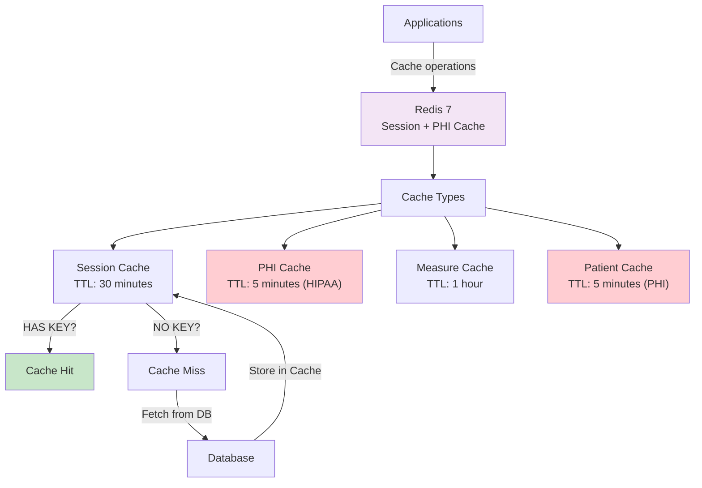
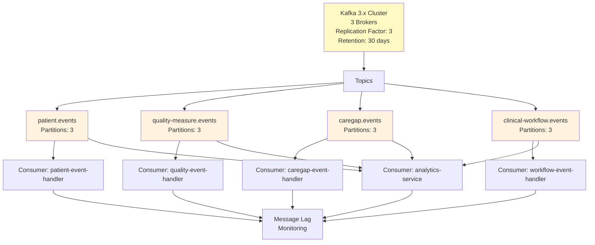
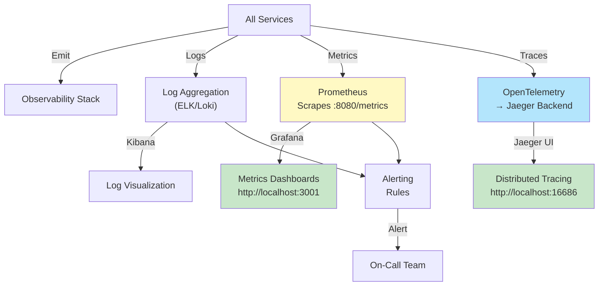

# HDIM System Architecture Overview

High-level view of all 51 microservices, 4 gateways, 29 databases, and message flows.

---

## Core System Architecture

---

## Core Microservices (28 Services)

```mermaid
graph TB
    A["API Layer<br/>(4 Gateways)"] -->|"Routes to"| B["Core Microservices"]

    B --> B1["Clinical Services"]
    B1 --> B1a["quality-measure-service:8087<br/>HEDIS evaluation"]
    B1 --> B1b["cql-engine-service:8081<br/>CQL execution"]
    B1 --> B1c["patient-service:8084<br/>Patient demographics"]
    B1 --> B1d["care-gap-service:8086<br/>Gap detection"]
    B1 --> B1e["consent-service<br/>Patient consent"]
    B1 --> B1f["encounter-service<br/>Visit records"]

    B --> B2["Integration Services"]
    B2 --> B2a["fhir-service:8085<br/>FHIR R4 API"]
    B2 --> B2b["ehr-connector-service<br/>EHR integration"]
    B2 --> B2c["interop-service<br/>External APIs"]

    B --> B3["Analytics Services"]
    B3 --> B3a["analytics-service:8089<br/>Reporting engine"]
    B3 --> B3b["predictive-analytics-service<br/>Risk stratification"]
    B3 --> B3c["data-warehouse-service<br/>Historical data"]

    B --> B4["Admin Services"]
    B4 --> B4a["tenant-service<br/>Org management"]
    B4 --> B4b["user-service<br/>User accounts"]
    B4 --> B4c["audit-service<br/>Compliance logging"]
    B4 --> B4d["config-service<br/>System config"]

    B --> B5["Support Services"]
    B5 --> B5a["notification-service<br/>Email/SMS"]
    B5 --> B5b["cache-service<br/>Redis management"]
    B5 --> B5c["logging-service<br/>Log aggregation"]
    B5 --> B5d["metrics-service<br/>Prometheus integration"]

    style B1a fill:#c8e6c9
    style B1b fill:#c8e6c9
    style B1c fill:#c8e6c9
    style B1d fill:#c8e6c9
    style B1e fill:#fff9c4
    style B1f fill:#fff9c4
```

---

## Event Services (Phase 5 - Event Sourcing Pattern)

---

## Data Flow: Patient Creation to Care Gap Detection

---

## Data Persistence: 29 Databases

**Benefits**:
- Service isolation (no shared tables)
- Independent schema evolution
- Performance isolation (one slow service doesn't affect others)
- Compliance (per-database backups)

---

## Caching Layer (Redis)

**PHI Cache Policy**:
- ✅ 5-minute TTL for all PHI (HIPAA requirement)
- ✅ Automatic expiration
- ✅ Cache-Control headers on responses
- ✅ Audit logging of cache access

---

## Messaging (Kafka) Topology

**Kafka Configuration**:
- 3-broker cluster (no single point of failure)
- Replication factor 3 (safe from disk failures)
- 30-day retention (event replay capability)
- Partitioned by patient/entity ID (ordered processing)

---

## Monitoring and Observability

---

## References

- **[System Architecture Guide](../SYSTEM_ARCHITECTURE.md)** - Detailed architecture
- **[Service Catalog](../../services/SERVICE_CATALOG.md)** - Complete service list
- **[Dependency Map](../../services/DEPENDENCY_MAP.md)** - Service interactions
- **[Round Trip Flows](../ROUND_TRIP_FLOWS.md)** - Request tracing

---

_Last Updated: January 19, 2026_
_Version: 1.0_
_Total Services: 51 microservices_
_Total Databases: 29 logical databases_
_Event Topics: 4 (+ error topics)_
