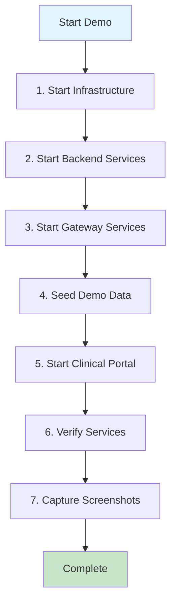
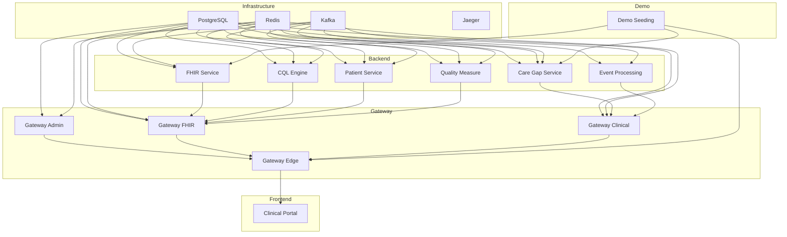

# HDIM Platform Demo Startup and Screenshot Capture Guide

## High-Level Overview

This guide provides comprehensive instructions for starting the HDIM platform in demo mode and capturing high-quality screenshots for marketing and documentation purposes.

### Process Flow



### Quick Start Summary

1. **Infrastructure** (PostgreSQL, Redis, Kafka, Jaeger) - ~30 seconds
2. **Backend Services** (FHIR, CQL, Patient, Quality, Care Gap, Events) - ~60 seconds
3. **Gateway Services** (Admin, FHIR, Clinical, Edge) - ~60 seconds
4. **Demo Seeding** - ~30 seconds
5. **Clinical Portal** - ~45 seconds
6. **Verification** - ~30 seconds
7. **Screenshot Capture** - ~5-10 minutes

**Total Time:** ~10-15 minutes

---

## Detailed Step-by-Step Instructions

### Phase 1: Infrastructure Services Startup

#### Step 1.1: Start Core Infrastructure

**Objective:** Start the foundational services that all other services depend on.

**Command:**
```bash
cd /home/webemo-aaron/projects/hdim-master
docker compose -f docker-compose.demo.yml up -d postgres redis kafka jaeger
```

**What This Does:**
- Starts PostgreSQL database (port 5435)
- Starts Redis cache (port 6380)
- Starts Kafka message broker (port 9094)
- Starts Jaeger tracing (port 16686)

**Expected Output:**
```
Network hdim-demo-network Creating
Container hdim-demo-postgres Recreated
Container hdim-demo-redis Recreated
Container hdim-demo-jaeger Recreated
Container hdim-demo-kafka Recreated
Container hdim-demo-kafka Started
Container hdim-demo-postgres Started
Container hdim-demo-redis Started
Container hdim-demo-jaeger Started
```

**Wait Time:** 15-30 seconds for services to become healthy

#### Step 1.2: Verify Infrastructure Health

**Objective:** Ensure all infrastructure services are ready before starting dependent services.

**PostgreSQL Health Check:**
```bash
docker exec hdim-demo-postgres pg_isready -U healthdata
```

**Expected Output:**
```
/var/run/postgresql:5432 - accepting connections
```

**Redis Health Check:**
```bash
docker exec hdim-demo-redis redis-cli ping
```

**Expected Output:**
```
PONG
```

**Kafka Health Check:**
```bash
docker exec hdim-demo-kafka kafka-broker-api-versions --bootstrap-server localhost:29092
```

**Expected Output:**
```
[No errors - command completes successfully]
```

**Jaeger Health Check:**
```bash
curl -s http://localhost:16686/ | head -n 1
```

**Expected Output:**
```
<!DOCTYPE html>
```

**Verification Script:**
```bash
echo "Waiting for infrastructure services..."
sleep 15
docker exec hdim-demo-postgres pg_isready -U healthdata && \
docker exec hdim-demo-redis redis-cli ping && \
echo "Infrastructure services are ready"
```

---

### Phase 2: Backend Services Startup

#### Step 2.1: Start Backend Services

**Objective:** Start the core business logic services that handle healthcare data processing.

**Command:**
```bash
docker compose -f docker-compose.demo.yml up -d \
  fhir-service \
  cql-engine-service \
  patient-service \
  quality-measure-service \
  care-gap-service \
  event-processing-service
```

**What This Does:**
- **FHIR Service** (port 8085): FHIR R4 compliant data storage and retrieval
- **CQL Engine Service** (port 8081): Clinical Quality Language evaluation engine
- **Patient Service** (port 8084): Patient data aggregation and management
- **Quality Measure Service** (port 8087): HEDIS/CMS quality measure evaluation
- **Care Gap Service** (port 8086): Care gap identification and closure tracking
- **Event Processing Service** (port 8083): Event stream processing and routing

**Expected Output:**
```
Container hdim-demo-fhir Starting
Container hdim-demo-cql-engine Starting
Container hdim-demo-patient Starting
Container hdim-demo-quality-measure Starting
Container hdim-demo-care-gap Starting
Container hdim-demo-events Starting
[All containers show "Started" status]
```

**Wait Time:** 60-90 seconds for services to initialize and become healthy

#### Step 2.2: Verify Backend Services Health

**Health Check Endpoints:**
```bash
# FHIR Service
curl -s http://localhost:8085/fhir/actuator/health | jq .

# CQL Engine Service
curl -s http://localhost:8081/cql-engine/actuator/health | jq .

# Patient Service
curl -s http://localhost:8084/patient/actuator/health | jq .

# Quality Measure Service
curl -s http://localhost:8087/quality-measure/actuator/health | jq .

# Care Gap Service
curl -s http://localhost:8086/care-gap/actuator/health | jq .

# Event Processing Service
curl -s http://localhost:8083/events/actuator/health | jq .
```

**Expected Response:**
```json
{
  "status": "UP",
  "components": {
    "db": { "status": "UP" },
    "kafka": { "status": "UP" }
  }
}
```

**Verification Script:**
```bash
echo "Waiting for backend services to initialize (60 seconds)..."
sleep 60
echo "Backend services should be ready"
```

---

### Phase 3: Gateway Services Startup

#### Step 3.1: Start Gateway Services

**Objective:** Start the API gateway services that route requests to backend services.

**Command:**
```bash
docker compose -f docker-compose.demo.yml up -d \
  gateway-admin-service \
  gateway-fhir-service \
  gateway-clinical-service \
  gateway-edge
```

**What This Does:**
- **Gateway Admin Service** (port 8080): Administrative API gateway
- **Gateway FHIR Service** (port 8080): FHIR-specific API gateway
- **Gateway Clinical Service** (port 8080): Clinical workflow API gateway
- **Gateway Edge** (port 18080): Nginx reverse proxy routing to all gateways

**Expected Output:**
```
Container hdim-demo-gateway-admin Starting
Container hdim-demo-gateway-fhir Starting
Container hdim-demo-gateway-clinical Starting
Container hdim-demo-gateway-edge Starting
[All containers show "Started" and then "Healthy" status]
```

**Wait Time:** 60-90 seconds for services to initialize and become healthy

#### Step 3.2: Verify Gateway Services Health

**Health Check Endpoints:**
```bash
# Gateway Admin Service
curl -s http://localhost:8080/actuator/health | jq .

# Gateway Edge (routes to all gateways)
curl -s http://localhost:18080/actuator/health | jq .
```

**Expected Response:**
```json
{
  "status": "UP"
}
```

---

### Phase 4: Demo Data Seeding

#### Step 4.1: Start Demo Seeding Service

**Objective:** Start the service that generates synthetic demo data for the platform.

**Command:**
```bash
docker compose -f docker-compose.demo.yml up -d demo-seeding-service
```

**What This Does:**
- Starts the demo seeding service (port 8098)
- Service will be ready to accept seeding requests
- Generates synthetic patients, care gaps, quality measures, and clinical data

**Expected Output:**
```
Container hdim-demo-seeding Starting
Container hdim-demo-seeding Started
```

**Wait Time:** 30-60 seconds for service to become healthy

#### Step 4.2: Verify Demo Seeding Service Health

**Health Check:**
```bash
curl -s http://localhost:8098/demo/actuator/health | jq .
```

**Expected Response:**
```json
{
  "status": "UP"
}
```

#### Step 4.3: Load Demo Scenario

**Objective:** Load a pre-configured demo scenario with HEDIS evaluation data.

**Command:**
```bash
curl -X POST http://localhost:8098/demo/api/v1/demo/scenarios/hedis-evaluation
```

**Expected Response:**
```json
{
  "status": "success",
  "message": "Demo scenario loaded successfully",
  "scenario": "hedis-evaluation",
  "patientsCreated": 100,
  "careGapsCreated": 250,
  "qualityMeasuresEvaluated": 15
}
```

**Alternative: Use Start Script**
```bash
./start-demo.sh
```

This script automatically:
1. Starts all services
2. Waits for services to be healthy
3. Loads demo scenarios
4. Provides service URLs and login credentials

---

### Phase 5: Clinical Portal Startup

#### Step 5.1: Start Clinical Portal

**Objective:** Start the frontend application that users interact with.

**Command:**
```bash
docker compose -f docker-compose.demo.yml up -d clinical-portal
```

**What This Does:**
- Starts the Clinical Portal frontend (port 4200)
- Serves the React/Angular application
- Connects to gateway-edge for API access

**Expected Output:**
```
Container hdim-demo-clinical-portal Starting
Container hdim-demo-clinical-portal Started
```

**Wait Time:** 45-60 seconds for portal to be ready

#### Step 5.2: Verify Clinical Portal

**Health Check:**
```bash
curl -s http://localhost:4200 | head -n 5
```

**Expected Output:**
```
<!DOCTYPE html>
<html lang="en">
<head>
  <meta charset="UTF-8">
  <title>HDIM Clinical Portal</title>
```

**Access Portal:**
Open browser to: `http://localhost:4200`

---

### Phase 6: Service Verification

#### Step 6.1: Comprehensive Health Check

**Objective:** Verify all services are running and healthy before capturing screenshots.

**Verification Script:**
```bash
#!/bin/bash

echo "=== HDIM Demo Platform Health Check ==="
echo ""

# Infrastructure
echo "Infrastructure Services:"
docker exec hdim-demo-postgres pg_isready -U healthdata > /dev/null 2>&1 && echo "  ✓ PostgreSQL" || echo "  ✗ PostgreSQL"
docker exec hdim-demo-redis redis-cli ping > /dev/null 2>&1 && echo "  ✓ Redis" || echo "  ✗ Redis"
docker exec hdim-demo-kafka kafka-broker-api-versions --bootstrap-server localhost:29092 > /dev/null 2>&1 && echo "  ✓ Kafka" || echo "  ✗ Kafka"
curl -s http://localhost:16686 > /dev/null 2>&1 && echo "  ✓ Jaeger" || echo "  ✗ Jaeger"

echo ""
echo "Backend Services:"
curl -s http://localhost:8085/fhir/actuator/health | jq -r '.status' | grep -q "UP" && echo "  ✓ FHIR Service" || echo "  ✗ FHIR Service"
curl -s http://localhost:8081/cql-engine/actuator/health | jq -r '.status' | grep -q "UP" && echo "  ✓ CQL Engine" || echo "  ✗ CQL Engine"
curl -s http://localhost:8084/patient/actuator/health | jq -r '.status' | grep -q "UP" && echo "  ✓ Patient Service" || echo "  ✗ Patient Service"
curl -s http://localhost:8087/quality-measure/actuator/health | jq -r '.status' | grep -q "UP" && echo "  ✓ Quality Measure" || echo "  ✗ Quality Measure"
curl -s http://localhost:8086/care-gap/actuator/health | jq -r '.status' | grep -q "UP" && echo "  ✓ Care Gap Service" || echo "  ✗ Care Gap Service"
curl -s http://localhost:8083/events/actuator/health | jq -r '.status' | grep -q "UP" && echo "  ✓ Event Processing" || echo "  ✗ Event Processing"

echo ""
echo "Gateway Services:"
curl -s http://localhost:18080/actuator/health | jq -r '.status' | grep -q "UP" && echo "  ✓ Gateway Edge" || echo "  ✗ Gateway Edge"

echo ""
echo "Frontend:"
curl -s http://localhost:4200 > /dev/null 2>&1 && echo "  ✓ Clinical Portal" || echo "  ✗ Clinical Portal"

echo ""
echo "Demo Services:"
curl -s http://localhost:8098/demo/actuator/health | jq -r '.status' | grep -q "UP" && echo "  ✓ Demo Seeding" || echo "  ✗ Demo Seeding"

echo ""
echo "=== Health Check Complete ==="
```

**Expected Output:**
```
=== HDIM Demo Platform Health Check ===

Infrastructure Services:
  ✓ PostgreSQL
  ✓ Redis
  ✓ Kafka
  ✓ Jaeger

Backend Services:
  ✓ FHIR Service
  ✓ CQL Engine
  ✓ Patient Service
  ✓ Quality Measure
  ✓ Care Gap Service
  ✓ Event Processing

Gateway Services:
  ✓ Gateway Edge

Frontend:
  ✓ Clinical Portal

Demo Services:
  ✓ Demo Seeding

=== Health Check Complete ===
```

#### Step 6.2: Service URLs Summary

**Access Points:**
- **Clinical Portal:** http://localhost:4200
- **API Gateway:** http://localhost:18080
- **Jaeger Tracing:** http://localhost:16686
- **Demo Seeding API:** http://localhost:8098/demo

**Demo User Credentials:**
- **Admin:** `demo_admin@hdim.ai` / `demo123`
- **Analyst:** `demo_analyst@hdim.ai` / `demo123`
- **Viewer:** `demo_viewer@hdim.ai` / `demo123`

---

### Phase 7: Screenshot Capture

#### Step 7.1: Install Playwright (if needed)

**Objective:** Ensure Playwright is installed for screenshot capture.

**Command:**
```bash
cd /home/webemo-aaron/projects/hdim-master
npm install playwright
npx playwright install chromium
```

#### Step 7.2: Review Screenshot Configuration

**File:** `scripts/capture-screenshots.js`

**User Scenarios Configured:**
1. **Care Manager** - Patient management, care gaps, quality measures
2. **Physician** - Clinical dashboard, patient details, AI assistant
3. **Admin** - User management, audit logs, system health
4. **AI User** - AI chat interface, agent selection, decision audit
5. **Patient** - Patient portal, health summary, appointments
6. **Quality Manager** - Quality dashboards, HEDIS measures, reports
7. **Data Analyst** - Analytics overview, population health, reports

**Screenshot Configuration:**
- **Viewport:** 1920x1080 (Full HD)
- **Format:** PNG
- **Full Page:** Yes (captures entire page, not just viewport)
- **Output Directory:** `docs/screenshots/{userType}/`

#### Step 7.3: Run Screenshot Capture

**Command:**
```bash
cd /home/webemo-aaron/projects/hdim-master
node scripts/capture-screenshots.js
```

**What This Does:**
1. Launches headless Chromium browser
2. For each user type:
   - Navigates to login page
   - Captures login page screenshot
   - Logs in with demo credentials
   - Navigates to each configured page
   - Captures full-page screenshots
   - Saves to organized directory structure
3. Generates `INDEX.md` with all captured screenshots

**Expected Output:**
```
========================================
Automated Screenshot Capture
========================================
[INFO] Capturing screenshots for: care-manager
[SUCCESS] Logged in as care.manager@demo.com
[SUCCESS] Captured: care-manager-login.png
[SUCCESS] Captured: care-manager-dashboard-overview.png
[SUCCESS] Captured: care-manager-patient-list.png
...
[SUCCESS] Completed care-manager: 10 captured, 0 failed

[INFO] Capturing screenshots for: physician
...
========================================
Screenshot Capture Complete
========================================
Total Captured: 45
Total Failed: 0
Output Directory: docs/screenshots
```

#### Step 7.4: Verify Screenshots

**Check Output Directory:**
```bash
ls -la docs/screenshots/
```

**Expected Structure:**
```
docs/screenshots/
├── INDEX.md
├── care-manager/
│   ├── care-manager-login.png
│   ├── care-manager-dashboard-overview.png
│   ├── care-manager-patient-list.png
│   └── ...
├── physician/
│   ├── physician-login.png
│   ├── physician-clinical-dashboard.png
│   └── ...
├── admin/
│   └── ...
└── ...
```

**View Index:**
```bash
cat docs/screenshots/INDEX.md
```

---

## Architecture Overview

### Service Dependencies



### Port Mapping

| Service | Internal Port | External Port | Purpose |
|---------|--------------|---------------|---------|
| PostgreSQL | 5432 | 5435 | Database |
| Redis | 6379 | 6380 | Cache |
| Kafka | 9092 | 9094 | Message Broker |
| Jaeger | 16686 | 16686 | Tracing UI |
| FHIR Service | 8085 | 8085 | FHIR API |
| CQL Engine | 8081 | 8081 | CQL Evaluation |
| Patient Service | 8084 | 8084 | Patient API |
| Quality Measure | 8087 | 8087 | Quality API |
| Care Gap Service | 8086 | 8086 | Care Gap API |
| Event Processing | 8083 | 8083 | Events API |
| Gateway Admin | 8080 | 8080 | Admin Gateway |
| Gateway FHIR | 8080 | 8080 | FHIR Gateway |
| Gateway Clinical | 8080 | 8080 | Clinical Gateway |
| Gateway Edge | 8080 | 18080 | Main Gateway |
| Demo Seeding | 8098 | 8098 | Demo API |
| Clinical Portal | 80 | 4200 | Frontend |

---

## Troubleshooting

### Common Issues

#### Issue 1: Services Not Starting

**Symptoms:**
- Containers show "Starting" but never become "Healthy"
- Health checks fail

**Solutions:**
1. Check container logs:
   ```bash
   docker logs hdim-demo-postgres
   docker logs hdim-demo-fhir
   ```

2. Verify infrastructure is ready:
   ```bash
   docker exec hdim-demo-postgres pg_isready -U healthdata
   ```

3. Increase wait times in startup script

4. Check for port conflicts:
   ```bash
   netstat -tulpn | grep -E '5435|6380|9094|4200'
   ```

#### Issue 2: Gateway Services Failing

**Symptoms:**
- Gateway services show "Unhealthy"
- Cannot access API endpoints

**Solutions:**
1. Verify backend services are healthy first
2. Check gateway logs:
   ```bash
   docker logs hdim-demo-gateway-admin
   ```

3. Verify database connectivity:
   ```bash
   docker exec hdim-demo-gateway-admin wget -qO- http://localhost:8080/actuator/health
   ```

#### Issue 3: Demo Data Not Loading

**Symptoms:**
- Portal shows empty data
- No patients or care gaps visible

**Solutions:**
1. Verify demo seeding service is healthy:
   ```bash
   curl http://localhost:8098/demo/actuator/health
   ```

2. Manually trigger scenario load:
   ```bash
   curl -X POST http://localhost:8098/demo/api/v1/demo/scenarios/hedis-evaluation
   ```

3. Check seeding service logs:
   ```bash
   docker logs hdim-demo-seeding
   ```

#### Issue 4: Screenshot Capture Fails

**Symptoms:**
- Playwright cannot connect to portal
- Login fails
- Pages timeout

**Solutions:**
1. Verify portal is accessible:
   ```bash
   curl http://localhost:4200
   ```

2. Check if services are fully started:
   ```bash
   ./health-check.sh
   ```

3. Increase timeout in `capture-screenshots.js`:
   ```javascript
   timeout: 60000  // Increase from 30000
   ```

4. Verify demo credentials are correct

---

## Cleanup

### Stop All Services

**Command:**
```bash
docker compose -f docker-compose.demo.yml down
```

**Remove Volumes (Clean Slate):**
```bash
docker compose -f docker-compose.demo.yml down -v
```

**Remove All Containers and Networks:**
```bash
docker compose -f docker-compose.demo.yml down --remove-orphans
```

---

## Quick Reference

### One-Line Startup

```bash
cd /home/webemo-aaron/projects/hdim-master && \
docker compose -f docker-compose.demo.yml up -d && \
sleep 120 && \
curl -X POST http://localhost:8098/demo/api/v1/demo/scenarios/hedis-evaluation && \
node scripts/capture-screenshots.js
```

### Service Status Check

```bash
docker compose -f docker-compose.demo.yml ps
```

### View Logs

```bash
# All services
docker compose -f docker-compose.demo.yml logs -f

# Specific service
docker logs -f hdim-demo-fhir
```

### Restart Service

```bash
docker compose -f docker-compose.demo.yml restart fhir-service
```

---

## Next Steps

After successfully starting the demo and capturing screenshots:

1. **Review Screenshots:** Check `docs/screenshots/INDEX.md` for all captured images
2. **Select Best Shots:** Choose highest quality screenshots for marketing
3. **Update Marketing Materials:** Use screenshots in presentations and documentation
4. **Archive:** Store screenshots in version control or asset management system

---

## Support

For issues or questions:
1. Check service logs: `docker logs <container-name>`
2. Review health checks: Run verification script
3. Check documentation: `docs/architecture/` and `docs/technical.md`
4. Review plan: `.cursor/plans/platform_demo_and_screenshot_capture_cf032a9c.plan.md`
