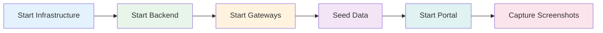

# HDIM Demo Quick Start Guide

## High-Level Process



## 5-Minute Quick Start

### Step 1: Start Everything (2 minutes)

```bash
cd /home/webemo-aaron/projects/hdim-master
docker compose -f docker-compose.demo.yml up -d
```

### Step 2: Wait for Services (2 minutes)

```bash
sleep 120
```

### Step 3: Load Demo Data (30 seconds)

```bash
curl -X POST http://localhost:8098/demo/api/v1/demo/scenarios/hedis-evaluation
```

### Step 4: Capture Screenshots (5-10 minutes)

```bash
node scripts/capture-screenshots.js
```

## Service URLs

- **Clinical Portal:** http://localhost:4200
- **API Gateway:** http://localhost:18080
- **Jaeger Tracing:** http://localhost:16686

## Demo Credentials

- **Admin:** `demo_admin@hdim.ai` / `demo123`
- **Analyst:** `demo_analyst@hdim.ai` / `demo123`
- **Viewer:** `demo_viewer@hdim.ai` / `demo123`

## Verify Services

```bash
# Quick health check
curl -s http://localhost:4200 > /dev/null && echo "✓ Portal" || echo "✗ Portal"
curl -s http://localhost:18080/actuator/health | jq -r '.status' && echo "✓ Gateway" || echo "✗ Gateway"
curl -s http://localhost:8098/demo/actuator/health | jq -r '.status' && echo "✓ Seeding" || echo "✗ Seeding"
```

## Stop Services

```bash
docker compose -f docker-compose.demo.yml down
```

## Full Documentation

See [DEMO_STARTUP_GUIDE.md](./DEMO_STARTUP_GUIDE.md) for detailed step-by-step instructions.
