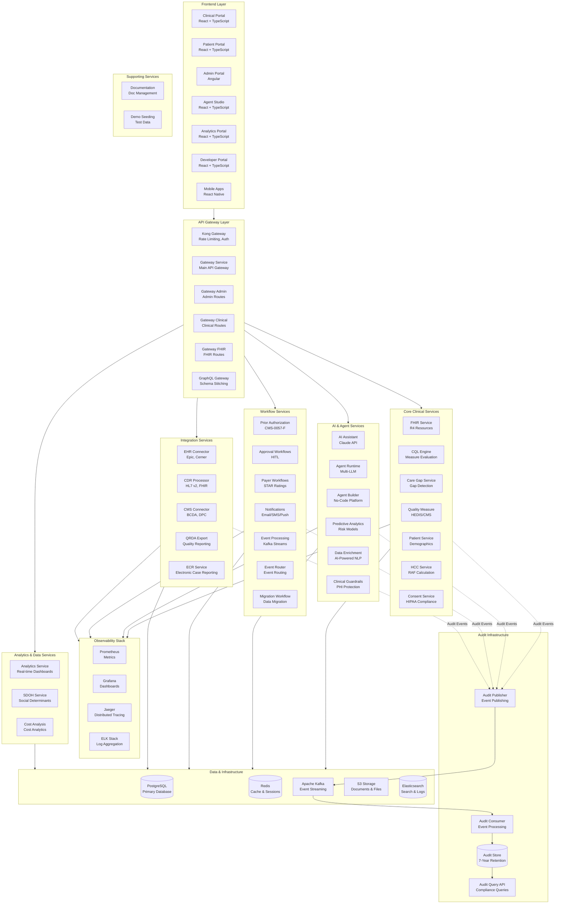
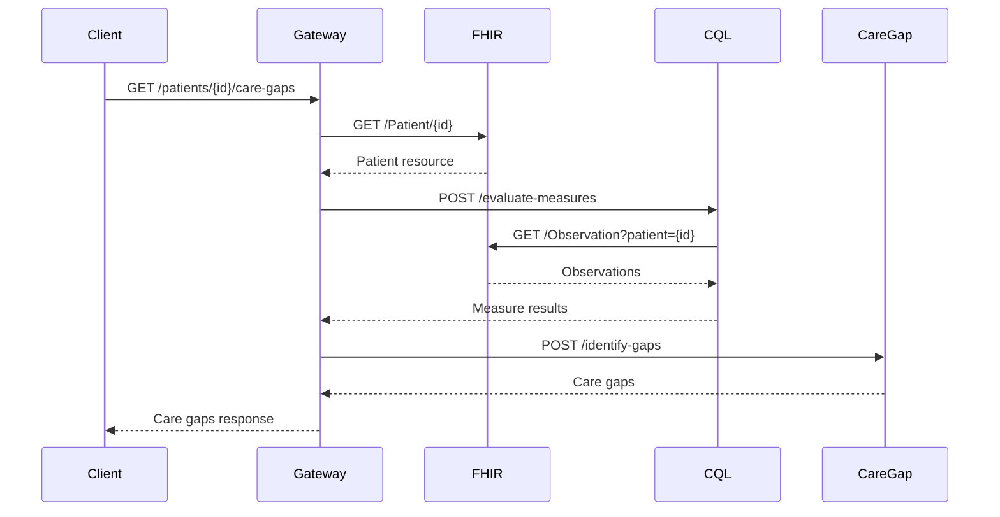
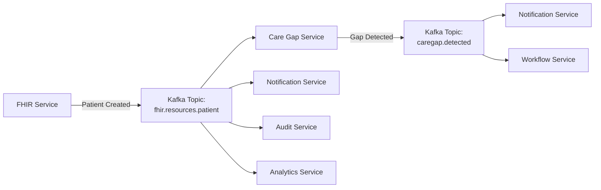
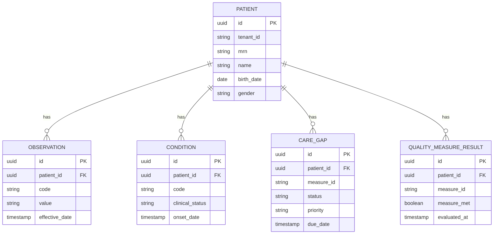
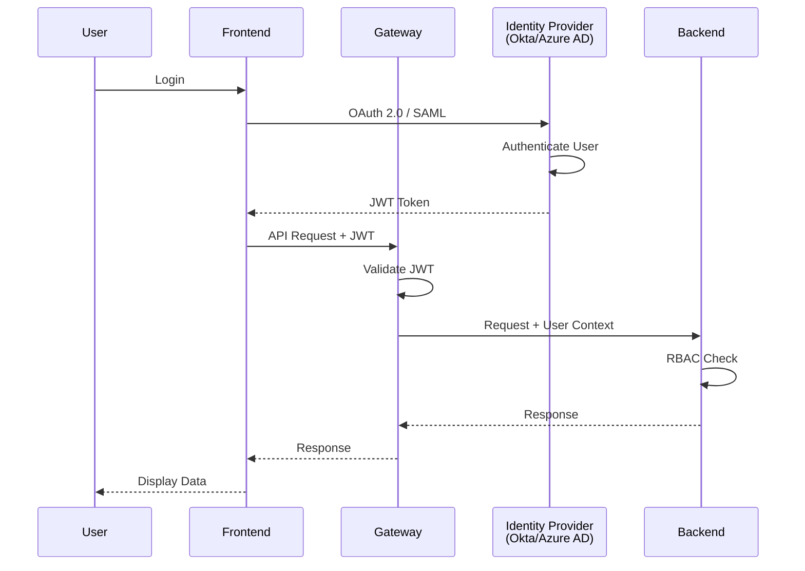
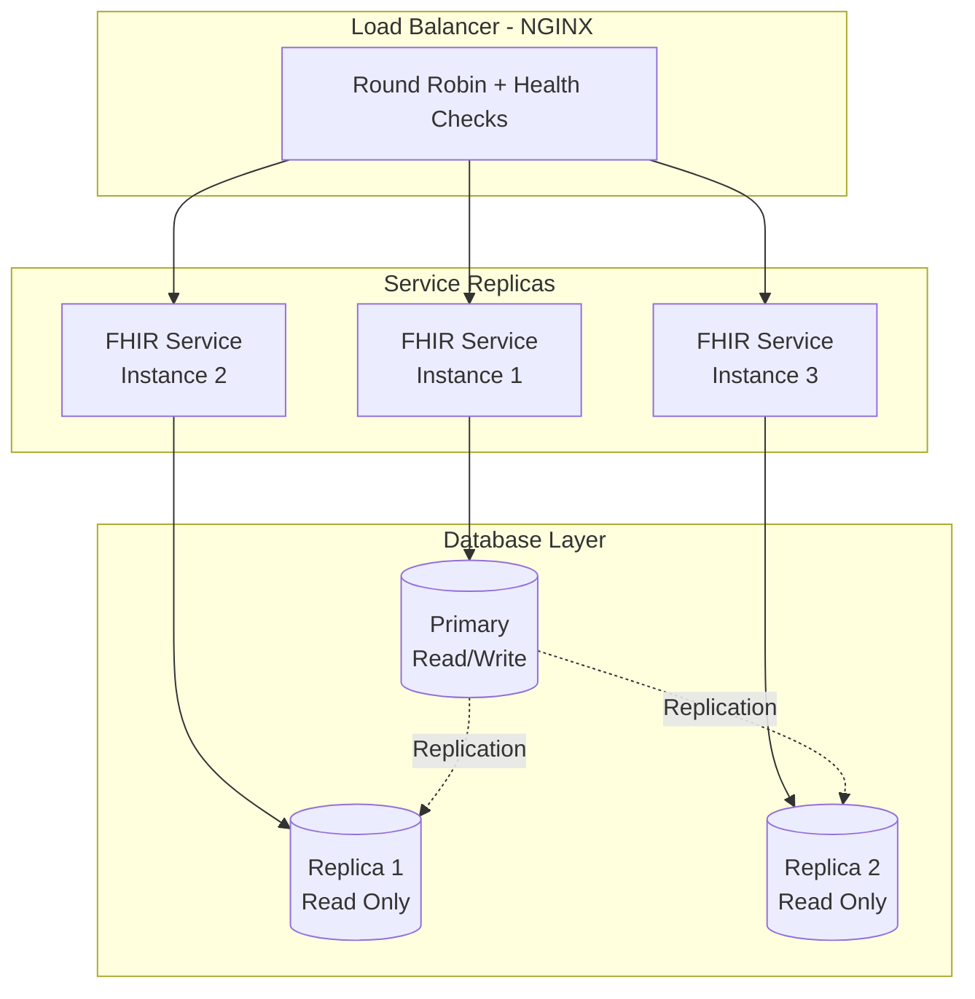

# Platform Architecture Overview

**Health Data In Motion (HDIM)** - Enterprise Healthcare Interoperability Platform

---

## System Architecture



---

## Technology Stack

### Frontend Technologies

| Technology | Version | Purpose |
|------------|---------|---------|
| **React** | 18.x | Clinical, Patient, Agent Studio portals |
| **Angular** | 17.x | Admin portal (existing) |
| **React Native** | 0.73.x | iOS & Android mobile apps |
| **TypeScript** | 5.x | Type safety across all frontends |
| **Material-UI (MUI)** | 5.x | React component library |
| **Recharts** | 2.x | Data visualization |
| **Zustand** | 4.x | State management |
| **React Query** | 5.x | Server state management |
| **Vite** | 5.x | Build tool for React apps |

### Backend Technologies

| Technology | Version | Purpose |
|------------|---------|---------|
| **Java** | 21 LTS | Primary backend language |
| **Spring Boot** | 3.3.x | Microservices framework |
| **Spring Cloud** | 2023.x | Service discovery, config |
| **HAPI FHIR** | 7.6.0 | FHIR R4 implementation |
| **OpenCDS CQL Engine** | Latest | Clinical Quality Language |
| **Kafka** | 3.6.x | Event streaming |
| **PostgreSQL** | 16.x | Primary database |
| **Redis** | 7.x | Caching & sessions |
| **Gradle** | 8.x | Build automation |

### AI & ML Technologies

| Technology | Purpose |
|------------|---------|
| **Anthropic Claude** | Primary LLM (Claude 3.5 Sonnet) |
| **Azure OpenAI** | Secondary LLM (GPT-4 Turbo) |
| **AWS Bedrock** | Tertiary LLM provider |
| **Scikit-learn** | Predictive analytics models |
| **TensorFlow** | Deep learning models (future) |

### Infrastructure & DevOps

| Technology | Purpose |
|------------|---------|
| **Docker** | Containerization |
| **Kubernetes** | Container orchestration |
| **Helm** | Kubernetes package manager |
| **Terraform** | Infrastructure as Code |
| **GitHub Actions** | CI/CD pipelines |
| **Prometheus** | Metrics collection |
| **Grafana** | Monitoring dashboards |
| **Jaeger** | Distributed tracing |
| **ELK Stack** | Log aggregation |

---

## Service Communication Patterns

### Synchronous Communication (REST)



### Asynchronous Communication (Kafka)



---

## Data Architecture

### Database Schema Organization



### Kafka Topic Structure

| Topic | Partitions | Retention | Purpose |
|-------|------------|-----------|---------|
| `fhir.resources.patient` | 3 | 7 days | Patient resource changes |
| `fhir.resources.observation` | 3 | 7 days | Observation changes |
| `caregap.detected` | 3 | 30 days | Care gaps detected |
| `quality.measure.result` | 3 | 30 days | Measure evaluation results |
| `audit.events` | 5 | 7 years | Audit trail (HIPAA) |
| `ai.agent.decisions` | 3 | 7 years | AI agent decisions |
| `priorauth.status.changed` | 3 | 30 days | Prior auth status updates |
| `notification.outbound` | 2 | 7 days | Outbound notifications |

---

## Security Architecture

### Authentication Flow



### Authorization (RBAC)

| Role | Permissions | Use Case |
|------|-------------|----------|
| **SUPER_ADMIN** | All permissions | Platform administrators |
| **TENANT_ADMIN** | Tenant-wide admin | Organization IT admins |
| **CLINICIAN** | Read/write clinical data | Physicians, NPs |
| **NURSE** | Read clinical data, update vitals | Nurses, MAs |
| **CARE_MANAGER** | Manage care gaps, outreach | Care coordinators |
| **QUALITY_ANALYST** | Read quality measures | Quality teams |
| **BILLING_ADMIN** | Manage prior auth, claims | Billing staff |
| **DEVELOPER** | API access, webhooks | Integration partners |
| **PATIENT** | Read own data, message providers | Patients |
| **VIEWER** | Read-only access | Auditors, compliance |

### Data Encryption

| Layer | Encryption | Standard |
|-------|------------|----------|
| **At Rest** | AES-256 | PostgreSQL TDE, S3 encryption |
| **In Transit** | TLS 1.3 | All HTTP traffic |
| **PHI Fields** | AES-256-GCM | Additional field-level encryption |
| **Agent Memory** | AES-256-GCM | Conversation history in Redis |

---

## Scalability & Performance

### Horizontal Scaling Strategy



### Caching Strategy

| Cache Layer | Technology | TTL | Purpose |
|-------------|------------|-----|---------|
| **L1 Cache** | Caffeine (in-memory) | 5 min | JVM-level caching |
| **L2 Cache** | Redis | 15 min | Distributed caching |
| **CDN Cache** | CloudFront | 24 hours | Static assets |
| **Query Cache** | Redis | 5 min | Database query results |

### Performance Targets

| Metric | Target | Current | Status |
|--------|--------|---------|--------|
| **API Latency (p95)** | <100ms | ~150ms | 🟡 In Progress |
| **API Latency (p99)** | <250ms | ~400ms | 🟡 In Progress |
| **Database Query (p95)** | <50ms | ~75ms | 🟡 In Progress |
| **Cache Hit Rate** | >80% | 67% | 🟡 In Progress |
| **Uptime SLA** | 99.9% | 99.5% | 🟡 In Progress |
| **Clinical Query Time** | <5sec | ~8sec | 🟡 In Progress |
| **Concurrent Users** | 10,000+ | ~500 | 🔴 Planned |

---

## Deployment Architecture

### Development Environment

```
Developer Machine
├── Docker Compose (local)
│   ├── PostgreSQL (5432)
│   ├── Redis (6379)
│   ├── Kafka (9092)
│   └── Kafka UI (8080)
├── Backend Services (Gradle bootRun)
│   └── All 30+ services on localhost
└── Frontend (npm run dev)
    └── All portals on localhost:3000-5173
```

### Staging Environment

```
Kubernetes Cluster (AWS EKS)
├── Namespace: hdim-staging
├── Services: 3 replicas each
├── PostgreSQL: RDS Multi-AZ
├── Redis: ElastiCache Cluster
├── Kafka: MSK (Managed Streaming for Kafka)
└── Load Balancer: Application Load Balancer
```

### Production Environment

```
Kubernetes Cluster (AWS EKS)
├── Namespace: hdim-production
├── Services: 5-10 replicas (auto-scaling)
├── PostgreSQL: RDS Multi-AZ + Read Replicas
├── Redis: ElastiCache Multi-AZ Cluster
├── Kafka: MSK Multi-AZ
├── Load Balancer: ALB + WAF
├── CDN: CloudFront
└── Monitoring: Prometheus + Grafana + Jaeger
```

---

## Disaster Recovery

### Backup Strategy

| Component | Backup Frequency | Retention | RTO | RPO |
|-----------|------------------|-----------|-----|-----|
| **PostgreSQL** | Continuous WAL + Daily Full | 30 days | 1 hour | 15 min |
| **Redis** | RDB snapshots | 6 hours | 30 min | 6 hours |
| **Kafka** | Topic replication (RF=3) | 7 days | Immediate | 0 |
| **S3 Documents** | Cross-region replication | Indefinite | 15 min | 0 |
| **Configuration** | Git + Terraform state | Indefinite | 5 min | 0 |

### High Availability SLA

- **Target Uptime**: 99.9% (8.76 hours downtime/year)
- **Recovery Time Objective (RTO)**: 1 hour
- **Recovery Point Objective (RPO)**: 15 minutes

---

## Compliance & Audit

### HIPAA Compliance

| Requirement | Implementation |
|-------------|----------------|
| **Access Control** | JWT + RBAC + MFA |
| **Audit Trail** | Kafka audit events (7-year retention) |
| **Encryption** | AES-256 at rest, TLS 1.3 in transit |
| **Minimum Necessary** | Field-level consent enforcement |
| **Breach Notification** | Automated detection + notification workflow |
| **Business Associate Agreements** | BAA with all subprocessors |

### SOC 2 Type II Controls

- **Security**: Firewall, IDS/IPS, vulnerability scanning
- **Availability**: HA infrastructure, monitoring, incident response
- **Processing Integrity**: Data validation, error handling
- **Confidentiality**: Encryption, access controls
- **Privacy**: Consent management, data retention policies

---

## Next Steps

1. Review [Frontend Architecture](./frontend-architecture.md)
2. Review [Backend Microservices](./backend-services.md)
3. Review [AI & Agent Architecture](./ai-agents.md)
4. Check [Security & Compliance](./security-compliance.md)

---

**Document Version**: 1.0.0  
**Last Updated**: January 14, 2026  
**Maintained By**: HDIM Architecture Team
