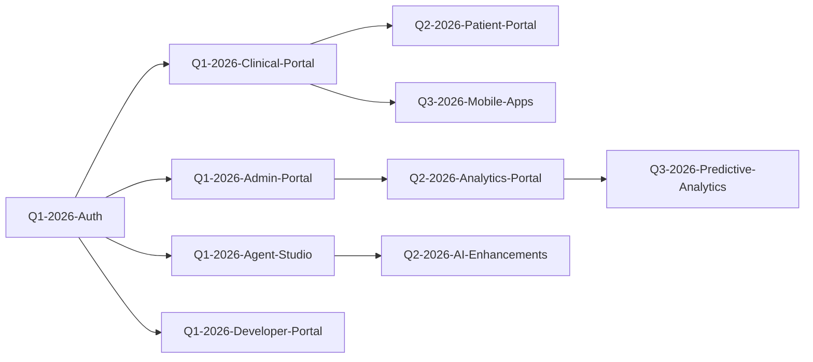

# GitHub Milestones Structure

This document defines the GitHub milestone structure for the 18-month HDIM roadmap (Q1 2026 - Q2 2027).

---

## Milestone Hierarchy

### Q1 2026 Milestones (Jan-Mar 2026)

#### 1. `Q1-2026-Clinical-Portal` (Due: Mar 15, 2026)
**Description**: Complete Clinical User Portal with patient search, care gaps, quality measures, and AI assistant  
**Epic**: Clinical Portal MVP  
**Issues**: ~25 issues  
**Story Points**: 120 points

**Key Deliverables**:
- Patient search with 360° view
- Care gap dashboard
- Quality measure viewer
- AI clinical assistant chat
- Document upload & OCR

---

#### 2. `Q1-2026-Admin-Portal` (Due: Mar 20, 2026)
**Description**: Enhanced Admin Portal with service monitoring, audit logs, and user/tenant management  
**Epic**: Admin Portal Enhancements  
**Issues**: ~20 issues  
**Story Points**: 80 points

**Key Deliverables**:
- Unified service dashboard
- Real-time monitoring
- Audit log viewer
- User management
- Tenant management
- Configuration editor

---

#### 3. `Q1-2026-Agent-Studio` (Due: Mar 25, 2026)
**Description**: AI Agent Studio for no-code agent creation and testing  
**Epic**: Agent Builder UI  
**Issues**: ~18 issues  
**Story Points**: 90 points

**Key Deliverables**:
- Visual agent designer
- Prompt template library
- Interactive testing sandbox
- Version control UI
- Performance metrics dashboard

---

#### 4. `Q1-2026-Developer-Portal` (Due: Mar 28, 2026)
**Description**: Developer Portal with API docs, sandbox, and webhook configuration  
**Epic**: Developer Experience  
**Issues**: ~15 issues  
**Story Points**: 70 points

**Key Deliverables**:
- Interactive API documentation
- Postman collections
- Code examples (Python, Java, JS)
- Sandbox environment
- Webhook configuration UI

---

#### 5. `Q1-2026-Auth` (Due: Mar 10, 2026)
**Description**: SSO, MFA, RBAC, and session management  
**Epic**: Authentication & Authorization  
**Issues**: ~12 issues  
**Story Points**: 60 points

**Key Deliverables**:
- SSO integration (Okta, Azure AD, Auth0)
- MFA support (TOTP, SMS)
- 13 roles + 31 permissions
- Session management

---

### Q2 2026 Milestones (Apr-Jun 2026)

#### 6. `Q2-2026-Patient-Portal` (Due: May 31, 2026)
**Description**: Patient-facing portal for health record access and secure messaging  
**Epic**: Patient Portal  
**Issues**: ~25 issues  
**Story Points**: 100 points

**Key Deliverables**:
- Patient registration with identity verification
- Health record access
- Appointment scheduling
- Secure messaging
- Care gap notifications
- Medication reminders

---

#### 7. `Q2-2026-Analytics-Portal` (Due: Jun 15, 2026)
**Description**: Executive dashboard with KPIs, cohort analysis, and custom reports  
**Epic**: Analytics & Reporting  
**Issues**: ~20 issues  
**Story Points**: 90 points

**Key Deliverables**:
- KPI dashboard (STAR ratings, HEDIS, RAF)
- Drill-down analytics
- Cohort analysis
- Custom report builder
- Scheduled reports
- Benchmarking

---

#### 8. `Q2-2026-HA-Infrastructure` (Due: May 15, 2026)
**Description**: High availability infrastructure with database replication, Kafka clustering, and disaster recovery  
**Epic**: Enterprise Readiness  
**Issues**: ~15 issues  
**Story Points**: 70 points

**Key Deliverables**:
- PostgreSQL primary-replica with auto-failover
- Kafka 3-node cluster (RF=3)
- Redis Sentinel
- Load balancing
- Automated backups with 30-day retention
- Cross-region DR

---

#### 9. `Q2-2026-Observability` (Due: Jun 1, 2026)
**Description**: Complete observability stack with Prometheus, Grafana, Jaeger, and ELK  
**Epic**: Monitoring & Observability  
**Issues**: ~18 issues  
**Story Points**: 80 points

**Key Deliverables**:
- Prometheus metrics for all services
- Grafana dashboards (pre-built)
- Jaeger distributed tracing
- ELK stack for log aggregation
- PagerDuty/Slack alerting
- Performance testing with K6

---

#### 10. `Q2-2026-AI-Enhancements` (Due: Jun 30, 2026)
**Description**: Advanced AI features including multi-modal support, voice interface, and agent chaining  
**Epic**: AI Innovation  
**Issues**: ~20 issues  
**Story Points**: 100 points

**Key Deliverables**:
- Multi-modal AI (images, X-rays)
- Voice-to-text for clinical documentation
- Agent chaining for complex workflows
- Fine-tuned models (AWS Bedrock)
- Explainable AI

---

#### 11. `Q2-2026-Interoperability` (Due: Jun 25, 2026)
**Description**: HL7 v2, X12, and major EHR integrations  
**Epic**: Interoperability Expansion  
**Issues**: ~22 issues  
**Story Points**: 110 points

**Key Deliverables**:
- HL7 v2 support (ADT, ORM, ORU)
- X12 837/835 support
- Epic MyChart integration
- Cerner integration
- CommonWell/Carequality participation

---

### Q3 2026 Milestones (Jul-Sep 2026)

#### 12. `Q3-2026-Mobile-Apps` (Due: Sep 15, 2026)
**Description**: iOS & Android mobile apps built with React Native  
**Epic**: Mobile-First Strategy  
**Issues**: ~30 issues  
**Story Points**: 150 points

**Key Deliverables**:
- React Native app (single codebase)
- Core features (patient search, care gaps, messaging)
- Biometric auth (Face ID, Touch ID)
- Offline support
- Push notifications
- App Store deployment

---

#### 13. `Q3-2026-Predictive-Analytics` (Due: Sep 10, 2026)
**Description**: Risk stratification and predictive models  
**Epic**: Advanced Analytics  
**Issues**: ~18 issues  
**Story Points**: 100 points

**Key Deliverables**:
- Hospitalization risk prediction
- Care gap prediction
- Cost prediction
- Medication adherence prediction
- Model performance dashboard

---

#### 14. `Q3-2026-Population-Health` (Due: Sep 20, 2026)
**Description**: Population health management tools  
**Epic**: Population Health  
**Issues**: ~16 issues  
**Story Points**: 85 points

**Key Deliverables**:
- Cohort builder
- Outreach campaigns (SMS/email)
- SDOH data collection
- Health equity analytics

---

#### 15. `Q3-2026-Payer-Features` (Due: Sep 25, 2026)
**Description**: Payer-specific features for health plans and MCOs  
**Epic**: Payer Solutions  
**Issues**: ~18 issues  
**Story Points**: 90 points

**Key Deliverables**:
- Medicare Advantage STAR ratings
- Medicaid compliance reporting
- Value-based care contract tracking
- Member attribution
- Claims analytics

---

#### 16. `Q3-2026-GraphQL` (Due: Aug 30, 2026)
**Description**: Unified GraphQL gateway with real-time subscriptions  
**Epic**: Developer Experience 2.0  
**Issues**: ~12 issues  
**Story Points**: 70 points

**Key Deliverables**:
- Unified GraphQL gateway
- Schema stitching for 30+ services
- Real-time subscriptions
- GraphQL Playground

---

#### 17. `Q3-2026-Marketplace` (Due: Sep 30, 2026)
**Description**: Integration marketplace and third-party app store  
**Epic**: Ecosystem Growth  
**Issues**: ~20 issues  
**Story Points**: 100 points

**Key Deliverables**:
- Integration marketplace UI
- Pre-built integrations (EHRs, labs, pharmacies)
- Third-party app publishing
- Webhook catalog

---

### Q4 2026 Milestones (Oct-Dec 2026)

#### 18. `Q4-2026-White-Labeling` (Due: Oct 31, 2026)
**Description**: White-labeling and multi-level tenancy  
**Epic**: Enterprise Features  
**Issues**: ~15 issues  
**Story Points**: 80 points

**Key Deliverables**:
- Custom branding per tenant
- Multi-level tenancy hierarchy
- Complete tenant isolation with RLS
- Tenant usage metering

---

#### 19. `Q4-2026-Billing` (Due: Nov 15, 2026)
**Description**: Usage-based billing and subscription management  
**Epic**: Monetization  
**Issues**: ~14 issues  
**Story Points**: 75 points

**Key Deliverables**:
- Usage-based billing engine
- Stripe integration
- Self-service upgrade/downgrade
- Cost calculator
- Automated invoicing

---

#### 20. `Q4-2026-Customer-Success` (Due: Nov 30, 2026)
**Description**: Customer success platform and onboarding  
**Epic**: Customer Experience  
**Issues**: ~12 issues  
**Story Points**: 65 points

**Key Deliverables**:
- Onboarding wizard
- In-app help & tutorials
- Health score dashboard
- Feedback widget
- Feature request voting

---

#### 21. `Q4-2026-Advanced-Reporting` (Due: Dec 10, 2026)
**Description**: Embedded analytics and data warehouse connectors  
**Epic**: Business Intelligence  
**Issues**: ~12 issues  
**Story Points**: 70 points

**Key Deliverables**:
- Embedded analytics
- Data warehouse connectors (Snowflake, BigQuery)
- Custom SQL queries
- PDF report generation

---

#### 22. `Q4-2026-SOC2` (Due: Dec 20, 2026)
**Description**: SOC 2 Type II audit preparation and certification  
**Epic**: Compliance Expansion  
**Issues**: ~25 issues  
**Story Points**: 120 points

**Key Deliverables**:
- SOC 2 Type II certification
- HITRUST CSF progress
- GDPR compliance
- Compliance documentation

---

#### 23. `Q4-2026-Enterprise-Security` (Due: Dec 15, 2026)
**Description**: Enterprise security features  
**Epic**: Security Hardening  
**Issues**: ~10 issues  
**Story Points**: 55 points

**Key Deliverables**:
- Custom SLA agreements
- Dedicated instances option
- VPN support
- HSM key storage
- Advanced security controls

---

### Q1 2027 Milestones (Jan-Mar 2027)

#### 24. `Q1-2027-Performance` (Due: Feb 28, 2027)
**Description**: Performance optimization and database scaling  
**Epic**: Performance & Scale  
**Issues**: ~15 issues  
**Story Points**: 85 points

**Key Deliverables**:
- Query optimization (<100ms p95)
- CDN for static assets
- Database sharding
- Read replicas
- Connection pooling optimization

---

#### 25. `Q1-2027-Global-Expansion` (Due: Mar 15, 2027)
**Description**: Multi-region deployment and internationalization  
**Epic**: Global Reach  
**Issues**: ~18 issues  
**Story Points**: 95 points

**Key Deliverables**:
- Multi-region deployment (US-East, US-West, EU, APAC)
- Geo-routing
- i18n support (Spanish, French, Mandarin)
- Localized content

---

#### 26. `Q1-2027-Model-Management` (Due: Mar 20, 2027)
**Description**: AI model registry and governance  
**Epic**: AI Governance  
**Issues**: ~12 issues  
**Story Points**: 65 points

**Key Deliverables**:
- Model registry
- A/B testing for models
- Model governance workflows
- Model monitoring (accuracy, bias, drift)

---

#### 27. `Q1-2027-Advanced-Integrations` (Due: Mar 31, 2027)
**Description**: Salesforce, ServiceNow, Slack/Teams integrations  
**Epic**: Enterprise Integrations  
**Issues**: ~12 issues  
**Story Points**: 70 points

**Key Deliverables**:
- Salesforce Health Cloud sync
- ServiceNow integration
- Slack/Teams bot
- Zapier integration

---

### Q2 2027 Milestones (Apr-Jun 2027)

#### 28. `Q2-2027-Generative-AI` (Due: May 31, 2027)
**Description**: Generative AI features for clinical workflows  
**Epic**: Gen AI Innovation  
**Issues**: ~16 issues  
**Story Points**: 85 points

**Key Deliverables**:
- Clinical note generation
- Care plan generation
- Prior auth justification letters
- Patient education materials

---

#### 29. `Q2-2027-Blockchain` (Due: Jun 30, 2027)
**Description**: Blockchain audit trail and patient-controlled data  
**Epic**: Future Tech Exploration  
**Issues**: ~18 issues  
**Story Points**: 100 points

**Key Deliverables**:
- Blockchain audit trail (immutable)
- Patient-controlled data with blockchain
- Smart contracts for prior auth

---

## Milestone Management

### Creating Milestones in GitHub

```bash
# Example: Create Q1-2026-Clinical-Portal milestone
gh api /repos/OWNER/REPO/milestones \
  -f title="Q1-2026-Clinical-Portal" \
  -f state="open" \
  -f description="Complete Clinical User Portal with patient search, care gaps, quality measures, and AI assistant" \
  -f due_on="2026-03-15T00:00:00Z"
```

### Milestone Labels

Every issue assigned to a milestone should have these labels:

**Priority Labels**:
- `P0-Critical` - Must have for milestone
- `P1-High` - Important for milestone
- `P2-Medium` - Nice to have
- `P3-Low` - Defer if needed

**Type Labels**:
- `feature` - New feature
- `enhancement` - Improvement to existing feature
- `bug` - Bug fix
- `documentation` - Documentation
- `technical-debt` - Refactoring

**Area Labels**:
- `frontend` - Frontend work
- `backend` - Backend work
- `infrastructure` - DevOps/infrastructure
- `design` - UI/UX design needed
- `security` - Security work
- `testing` - Testing work

---

## Tracking Progress

### Milestone Burndown

Track story points remaining per week:

```
Week 1: 120 points remaining
Week 2: 100 points remaining (-20)
Week 3: 75 points remaining (-25)
Week 4: 50 points remaining (-25)
Week 5: 25 points remaining (-25)
Week 6: 5 points remaining (-20)
Week 7: 0 points remaining (-5) ✅ Complete
```

### Milestone Health

| Status | Criteria |
|--------|----------|
| 🟢 On Track | <20% variance from planned burndown |
| 🟡 At Risk | 20-40% variance from planned |
| 🔴 Off Track | >40% variance, needs intervention |

---

## Reporting

### Weekly Milestone Report Template

```markdown
# Milestone Update: [Milestone Name]

**Week of**: [Date]  
**Status**: 🟢 On Track / 🟡 At Risk / 🔴 Off Track

## Progress
- **Story Points Completed**: X / Y (Z%)
- **Issues Closed**: X / Y
- **Days Remaining**: X

## Completed This Week
- [Issue #123] Patient search implementation
- [Issue #124] Care gap dashboard UI

## In Progress
- [Issue #125] Quality measure viewer (80% done)
- [Issue #126] AI assistant integration (60% done)

## Blocked
- [Issue #127] Waiting on API key from vendor

## Risks
- Performance testing delayed by 2 days
- Designer on PTO next week

## Next Week Plan
- Complete quality measure viewer
- Start document upload feature
- Performance testing
```

---

## Dependencies Between Milestones



---

## Contacts

- **Milestone Owners**: Assigned per milestone
- **Roadmap Owner**: Product Manager
- **Engineering Manager**: Backend + Frontend Leads
- **QA Manager**: QA Lead

---

**Last Updated**: January 14, 2026  
**Version**: 1.0.0
