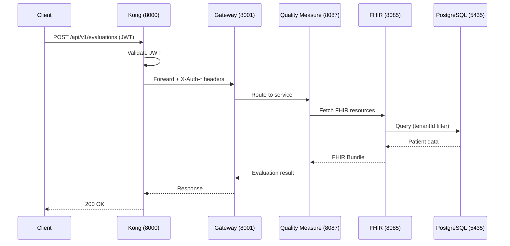

# HDIM Documentation Style Guide

**Purpose**: Ensure consistent, high-quality documentation across all HDIM materials.
**Version**: 1.0
**Last Updated**: December 30, 2025

---

## Table of Contents

1. [Voice and Tone](#voice-and-tone)
2. [Terminology Standards](#terminology-standards)
3. [Technical Claims Requirements](#technical-claims-requirements)
4. [Code Example Standards](#code-example-standards)
5. [Diagram Standards](#diagram-standards)
6. [Document Structure Standards](#document-structure-standards)
7. [Revision Control](#revision-control)

---

## Voice and Tone

### Technical Audience (CTOs, Architects, Engineers)

**Voice**: Direct, precise, technical
**Tone**: Confident but not promotional
**Style**: Show don't tell—provide proof points, benchmarks, code examples

| Principle | Example |
|-----------|---------|
| Be specific | "FHIR R4 native architecture" not "FHIR compliant" |
| Quantify claims | "<200ms p95 latency" not "fast queries" |
| Reference standards | "NCQA-certified HEDIS specifications" not "industry standards" |
| Cite sources | "(Dec 2024 load test, 1,000 concurrent users)" |

**Good Examples**:
> FHIR R4 native architecture eliminates HL7 v2→FHIR translation overhead, reducing integration complexity by 60% and data loss from 15% to 0%.

> CQL-native execution produces identical results to NCQA's reference CQL playground—no proprietary interpretation layer.

> Gateway Trust authentication reduces per-request latency by 200ms by eliminating redundant JWT validation and database lookups across 28 microservices.

**Bad Examples**:
> Our amazing platform makes integration super easy!

> We use cutting-edge AI technology for care gap detection.

> Industry-leading performance makes us the best choice.

---

### Business Audience (Executives, Health Plan Directors)

**Voice**: Results-focused, ROI-driven
**Tone**: Professional, authoritative
**Style**: Lead with business outcomes, support with technical proof

**Good Examples**:
> Reduce quality measure evaluation time by 40% (2.36h → 1.39h for 10K patients) through CQL-native execution.

> Decrease integration costs by eliminating the HL7 v2→FHIR translation layer—saving an estimated 60% in implementation time.

**Bad Examples**:
> Save lots of time with our fast quality measures!

> We're way faster than competitors.

---

## Terminology Standards

### Official Terms (MUST Use)

| Term | Correct Usage | Incorrect Usage |
|------|---------------|-----------------|
| FHIR R4 | "FHIR R4 compliant", "FHIR R4 native" | "FHIR compliant" (too vague) |
| CQL-native | "CQL-native execution" | "AI-powered CQL", "CQL engine" |
| HEDIS measures | "56 HEDIS quality measures" | "82 HEDIS measures" (outdated) |
| Microservices | "28 microservices" | "27 microservices" (incorrect) |
| PHI cache | "5-minute PHI cache TTL" | "short-term cache", "fast cache" |
| Gateway Trust | "Gateway Trust authentication" | "gateway auth", "header-based auth" |

### Service Names

Always use official service names from [TERMINOLOGY_GLOSSARY.md](/docs/TERMINOLOGY_GLOSSARY.md):

| Official Name | Acceptable | Never Use |
|---------------|------------|-----------|
| Quality Measure Service | QMS (in technical context) | quality-service, qm-service |
| FHIR Service | - | FHIR Mock, fhir-mock-service |
| CQL Engine Service | CQL Engine | cql-service |
| Care Gap Service | - | care-gaps-service |
| Gateway Service | Gateway | api-gateway |

### Technology Versions

| Technology | Correct | Incorrect |
|------------|---------|-----------|
| Java | "Java 21 LTS" | "Java 17", "Java" (unspecified) |
| Spring Boot | "Spring Boot 3.x" | "Spring Boot 2.x" |
| PostgreSQL | "PostgreSQL 15" | "Postgres", "PostgreSQL 14" |
| Redis | "Redis 7" | "Redis", "Redis 6" |
| HAPI FHIR | "HAPI FHIR 7.x" | "HAPI FHIR", "FHIR server" |

---

## Technical Claims Requirements

### Performance Claims

**Rule**: All performance claims MUST include:
1. Specific metric (e.g., "p95 latency", "avg execution time")
2. Quantified value (e.g., "<200ms", "500ms per patient")
3. Benchmark date or reference (e.g., "Dec 2024 load test")

**Template**:
```
[Metric] of [Value] ([Measurement Context])
```

**Good Examples**:
> FHIR query latency averages <200ms (p95) in production (Dec 2024 metrics, 1,000 concurrent users).

> CQL execution time: ~500ms per patient per measure (benchmarked against 56 HEDIS measures).

> Throughput: 220 evaluations/sec per tenant (load test with 10K patients).

**Bad Examples**:
> Our queries are super fast.

> Best-in-class performance.

> Faster than the competition.

---

### ROI Claims

**Rule**: ROI claims MUST include:
1. Baseline comparison (competitor or manual process)
2. Calculation methodology
3. Assumptions stated clearly

**Template**:
```markdown
## Claim: "[X]% improvement in [Metric]"

**Baseline (Competitor/Manual)**:
- [Description of baseline approach]
- [Baseline metric value]

**HDIM Approach**:
- [Description of HDIM approach]
- [HDIM metric value]

**Calculation**:
- [Math showing improvement percentage]

**Assumptions**:
- [List key assumptions]
```

**Good Example**:
> **Claim: 40% faster quality measure evaluations**
>
> Baseline (Competitor A): 850ms avg per patient per measure using proprietary CQL interpretation
> HDIM: 500ms avg per patient per measure using CQL-native execution
> Calculation: (850-500)/850 = 41% improvement
> Assumptions: 10K patients, 56 HEDIS measures, similar hardware

**Bad Example**:
> We're way faster than competitors.

---

### Compliance Claims

**Rule**: Compliance claims MUST reference:
1. Specific regulation (e.g., "HIPAA 45 CFR 164.312")
2. Control implementation (e.g., "AES-256 encryption at rest")
3. Evidence or certification status

**Good Examples**:
> HIPAA-compliant PHI caching (45 CFR 164.502 minimum necessary): 5-minute TTL enforced at Redis infrastructure level.

> Encryption: AES-256 at rest, TLS 1.3 in transit (required by HIPAA 45 CFR 164.312).

> SOC 2 Type II certification (in progress, expected Q2 2025).

**Bad Examples**:
> We're HIPAA compliant.

> Industry-leading security.

> Enterprise-grade compliance.

---

## Code Example Standards

### Requirements

All code examples MUST:

1. **Compile/run without errors** - Test before committing
2. **Follow project conventions** - See [CLAUDE.md](/CLAUDE.md)
3. **Include HIPAA-relevant comments** - Explain compliance controls
4. **Use placeholders for secrets** - Never hardcode credentials
5. **Demonstrate multi-tenant filtering** - Show tenantId usage

### Java Code Template

```java
// GOOD EXAMPLE - Complete with all required elements
@GetMapping("/{patientId}")
@PreAuthorize("hasAnyRole('ADMIN', 'EVALUATOR')")  // RBAC enforcement
@Audited(eventType = "PATIENT_ACCESS")             // HIPAA audit logging
public ResponseEntity<Patient> getPatient(
        @PathVariable String patientId,
        @RequestHeader("X-Tenant-ID") String tenantId) {  // Multi-tenant header

    // HIPAA: All queries filtered by tenantId for isolation
    return patientRepository.findByIdAndTenant(patientId, tenantId)
        .map(ResponseEntity::ok)
        .orElseThrow(() -> new ResourceNotFoundException("Patient", patientId));
}
```

```java
// BAD EXAMPLE - Missing security, audit, and tenant filtering
@GetMapping("/{patientId}")
public Patient getPatient(@PathVariable String patientId) {
    return patientRepository.findById(patientId).orElse(null);
}
```

### Configuration Template

```yaml
# GOOD EXAMPLE - Complete with comments
spring:
  datasource:
    url: jdbc:postgresql://${POSTGRES_HOST:localhost}:${POSTGRES_PORT:5435}/${POSTGRES_DB:healthdata_qm}
    username: ${POSTGRES_USER:healthdata}
    password: ${POSTGRES_PASSWORD}  # Never hardcode - use environment variable

# HIPAA Compliance - PHI cache TTL
cache:
  phi:
    ttl-seconds: 300  # 5 minutes maximum - DO NOT INCREASE (HIPAA requirement)

# Gateway Trust Authentication
gateway:
  auth:
    dev-mode: ${GATEWAY_AUTH_DEV_MODE:true}  # Set false in production
    signing-secret: ${GATEWAY_AUTH_SIGNING_SECRET}  # Required in production
```

### SQL Query Template

```sql
-- GOOD EXAMPLE - Multi-tenant filtering included
SELECT p.id, p.fhir_id, p.created_at
FROM patients p
WHERE p.tenant_id = :tenantId  -- REQUIRED: Multi-tenant isolation
  AND p.id = :patientId;

-- BAD EXAMPLE - Missing tenant filter (HIPAA violation)
SELECT * FROM patients WHERE id = :patientId;
```

---

## Diagram Standards

### Architecture Diagrams

**Tool**: ASCII art (for Markdown) or Mermaid (for rendered docs)
**Style**: Top-to-bottom flow (clients at top, data layer at bottom)
**Labels**: Include service names AND port numbers

**ASCII Template**:
```
┌─────────────────────────────────────────────────────┐
│                  Client Layer                        │
│  (Browser, Mobile App, External Systems)            │
└────────────────────────┬────────────────────────────┘
                         │ HTTPS
                         ▼
┌─────────────────────────────────────────────────────┐
│              Kong API Gateway (8000)                 │
│  - JWT validation, rate limiting, routing           │
└────────────────────────┬────────────────────────────┘
                         │
                         ▼
┌─────────────────────────────────────────────────────┐
│              Gateway Service (8001)                  │
│  - Header injection, service discovery              │
└────────────────────────┬────────────────────────────┘
                         │
         ┌───────────────┼───────────────┐
         │               │               │
         ▼               ▼               ▼
┌────────────┐   ┌────────────┐   ┌────────────┐
│ Service A  │   │ Service B  │   │ Service C  │
│   (port)   │   │   (port)   │   │   (port)   │
└────────────┘   └────────────┘   └────────────┘
         │               │               │
         └───────────────┼───────────────┘
                         │
                         ▼
┌─────────────────────────────────────────────────────┐
│                   Data Layer                         │
│  PostgreSQL (5435) │ Redis (6380) │ Kafka (9094)    │
└─────────────────────────────────────────────────────┘
```

**Mermaid Template**:


### Required Elements

- [ ] Service names with port numbers
- [ ] Data flow direction (arrows)
- [ ] Connection type labels (REST, Kafka, Redis)
- [ ] Legend if using non-standard symbols
- [ ] Approximate latency for critical paths (optional)

---

## Document Structure Standards

### Service README Structure

Follow [SERVICE_README_TEMPLATE.md](/docs/templates/SERVICE_README_TEMPLATE.md)

**Required Sections**:
1. Overview (2-3 sentences)
2. Responsibilities (bulleted list)
3. Technology Stack (table with rationale)
4. API Endpoints (with auth requirements)
5. Database Schema (key tables)
6. Kafka Topics (publishes and consumes)
7. Configuration (example YAML)
8. Testing (commands)
9. Monitoring (health checks, metrics)
10. Security (HIPAA compliance checklist)
11. References (ADRs, related docs)

### ADR Structure

Follow [ADR_TEMPLATE.md](/docs/templates/ADR_TEMPLATE.md)

**Required Sections**:
1. Context and Problem Statement
2. Decision Drivers (minimum 5)
3. Considered Options (minimum 3)
4. Decision Outcome (chosen option + rationale)
5. Consequences (positive, negative, neutral)
6. Pros and Cons of ALL Options (tables)
7. Implementation Notes (if applicable)
8. Links (related ADRs, references)

### GTM Materials Structure

**Required Elements**:
1. Technical proof points for all claims
2. ROI calculation methodology
3. Links to technical documentation
4. Competitive differentiation with specifics
5. No unsubstantiated buzzwords

---

## Revision Control

### Version History

All major documents must include version history at the bottom:

```markdown
---

## Version History

| Version | Date | Author | Changes |
|---------|------|--------|---------|
| 1.0 | 2025-12-30 | Architecture Team | Initial creation |
| 1.1 | 2025-01-15 | Engineering | Updated port numbers |
```

### Last Updated Footer

All documents must include "Last Updated" in header or footer:

```markdown
**Last Updated**: December 30, 2025
**Version**: 1.0
```

### Change Tracking

When updating documents:
1. Update version number (major.minor)
2. Update "Last Updated" date
3. Add entry to Version History table
4. Note what changed in the entry

---

## Prohibited Language

### Marketing Buzzwords to Avoid

| Avoid | Replace With | Rationale |
|-------|--------------|-----------|
| "AI-powered" | Specific tech (CQL execution, HCC v28 models) | Misleading—most features are deterministic |
| "Real-time" | Specific latency (<200ms p95, 5-minute cache) | Vague without definition |
| "Industry-leading" | Specific benchmark with source | Unsubstantiated |
| "Cutting-edge" | Specific technology (FHIR R4 native) | Vague |
| "Best-in-class" | Comparative metrics with sources | Unsubstantiated |
| "Seamless integration" | Specific integration approach | Vague |
| "Enterprise-grade" | Specific capabilities (HA, scale, compliance) | Vague |
| "Revolutionary" | Specific innovation | Hyperbolic |

### Placeholder Content

Never commit documentation with:
- `[TBD]` or `[TODO]`
- `lorem ipsum` text
- `[INSERT X HERE]`
- Incomplete sections

If content is not ready, note it explicitly:
> **Note**: Performance benchmarks pending Q1 2025 load testing.

---

## Quality Checklist

Before committing any documentation, verify against [DOCUMENTATION_QUALITY_CHECKLIST.md](/docs/templates/DOCUMENTATION_QUALITY_CHECKLIST.md):

- [ ] Terminology matches TERMINOLOGY_GLOSSARY.md
- [ ] Technical claims include proof points
- [ ] Code examples compile and follow conventions
- [ ] HIPAA compliance language correct
- [ ] No prohibited buzzwords
- [ ] All links verified
- [ ] Version history updated

---

## References

- [Terminology Glossary](/docs/TERMINOLOGY_GLOSSARY.md)
- [Service README Template](/docs/templates/SERVICE_README_TEMPLATE.md)
- [ADR Template](/docs/templates/ADR_TEMPLATE.md)
- [Documentation Quality Checklist](/docs/templates/DOCUMENTATION_QUALITY_CHECKLIST.md)
- [CLAUDE.md](/CLAUDE.md) - Project conventions
- [Gateway Trust Architecture](/backend/docs/GATEWAY_TRUST_ARCHITECTURE.md) - Gold standard example

---

## Version History

| Version | Date | Author | Changes |
|---------|------|--------|---------|
| 1.0 | 2025-12-30 | Documentation Team | Initial creation |

---

*This style guide is the authoritative standard for HDIM documentation quality.*
