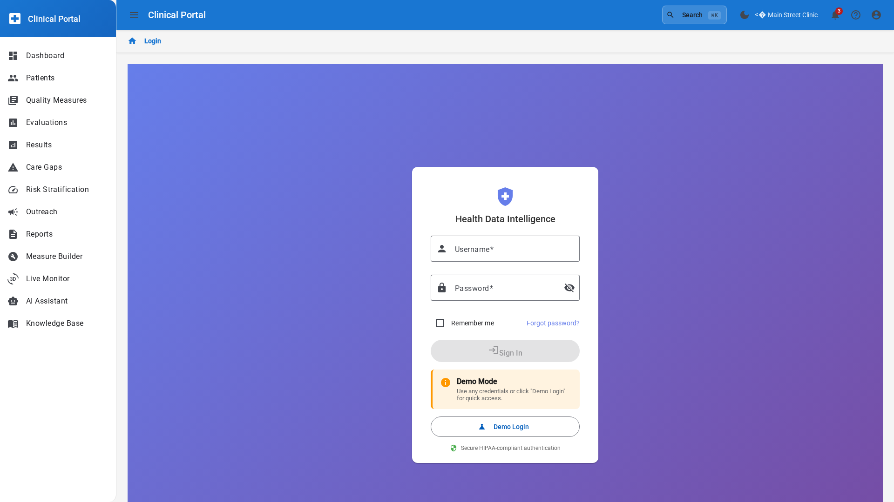
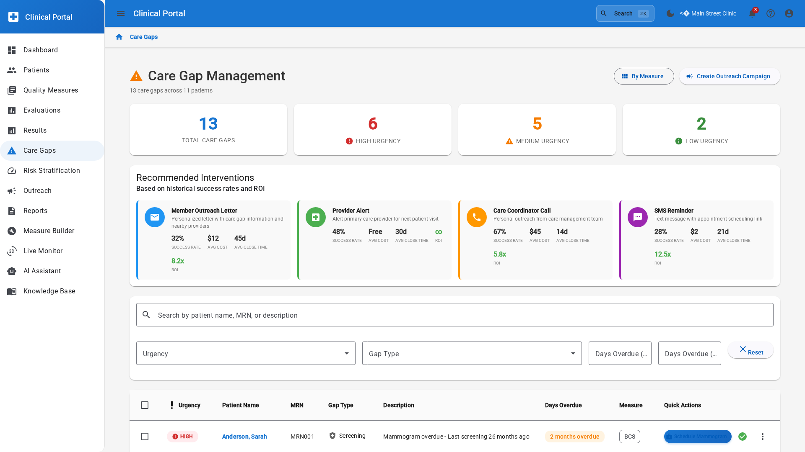
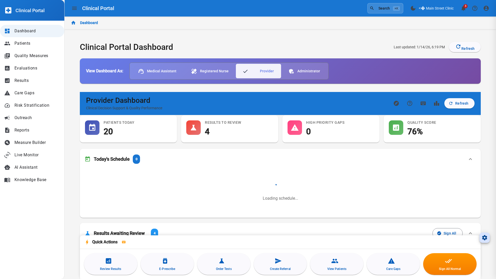
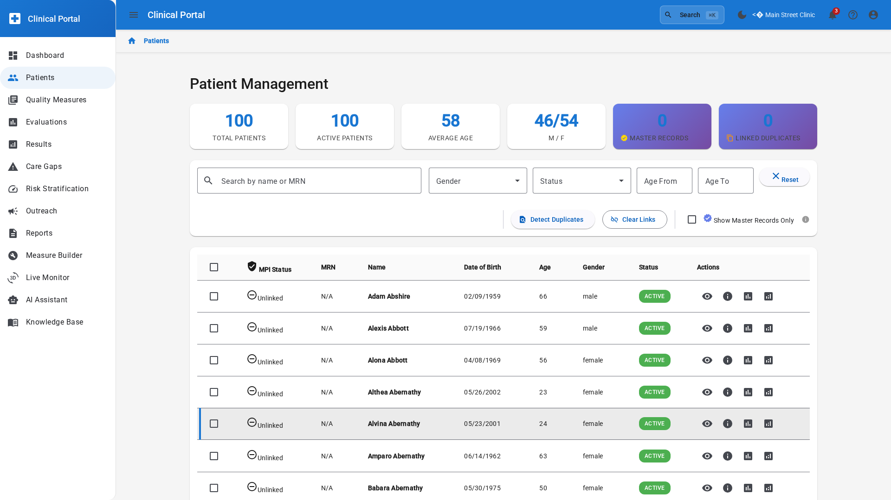
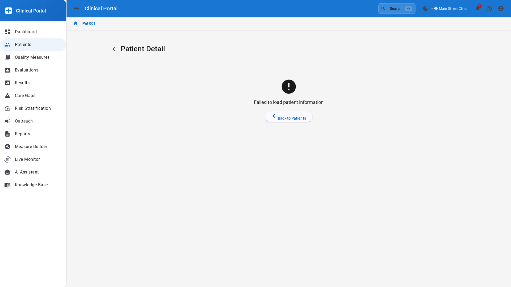
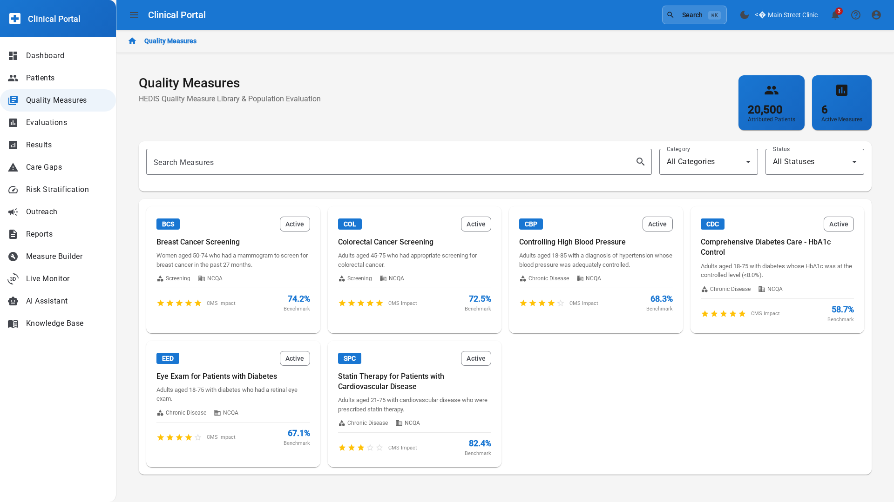
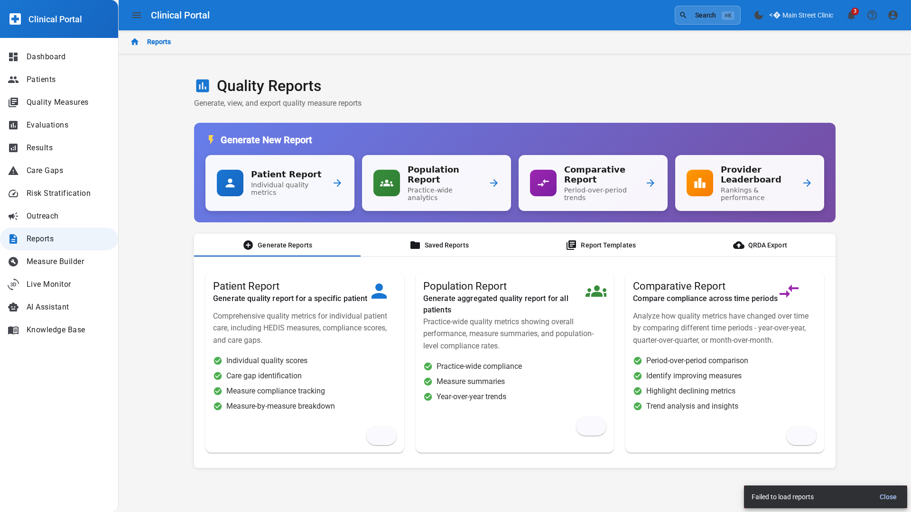

# Care Manager User Guide

## Overview

The Care Manager interface is designed to help you efficiently identify, track, and close care gaps for your patient population, improving quality measure performance and patient outcomes.

## Getting Started

### Login

1. Navigate to the Clinical Dashboard at `http://localhost:3000`
2. Enter your credentials:
   - **Email**: care.manager@demo.com
   - **Password**: Demo2026!
3. Click "Sign In"

### Dashboard Overview

Upon login, you'll see the Care Manager Dashboard with key metrics:

- **Open Care Gaps**: Total number of unresolved care gaps
- **High-Risk Patients**: Patients requiring immediate attention
- **Quality Measure Performance**: Progress toward quality targets
- **Recent Activity**: Latest gap closures and interventions

## Key Features

### 1. Care Gap Management

#### Viewing Care Gaps

The Care Gap Overview provides a comprehensive view of all open gaps:

1. Navigate to **Care Gaps** from the main menu
2. View gaps organized by:
   - **Priority** (High, Medium, Low)
   - **Measure Type** (HEDIS, CMS, Custom)
   - **Patient Risk Level**
   - **Days Open**

#### Gap Details

Click on any gap to view detailed information:

- Patient demographics
- Gap type and measure
- Evidence supporting the gap
- Recommended interventions
- Documentation requirements
- Due dates and deadlines

#### Closing a Care Gap

To close a care gap:

1. Open the gap detail page
2. Click **"Mark as Addressed"**
3. Select the intervention performed:
   - Service completed
   - Patient refused
   - Not clinically appropriate
   - Already completed (documentation found)
4. Enter supporting notes
5. Upload documentation (if available)
6. Click **"Close Gap"**

The gap will be marked as closed and quality measures will be updated automatically.

### 2. Patient Management

#### Patient List

View all patients assigned to you:

1. Navigate to **Patients**
2. Use filters to find patients:
   - **Risk Level** (High, Medium, Low)
   - **Open Gaps** (Yes/No)
   - **Last Visit Date**
   - **Chronic Conditions**

#### Patient Detail View

Click on a patient to see their complete profile:

- **Demographics**: Age, gender, contact information
- **Clinical Summary**: Conditions, medications, allergies
- **Care Gaps**: All open and closed gaps
- **Risk Scores**: HCC, RAF, predictive risk
- **Recent Encounters**: Visits, labs, procedures
- **Care Team**: Providers and care managers

### 3. Quality Measure Tracking

#### Quality Dashboard

Monitor your organization's quality performance:

1. Navigate to **Quality Measures**
2. View measures by:
   - **Program** (HEDIS, CMS Star Ratings, MIPS)
   - **Domain** (Prevention, Chronic Disease, Behavioral Health)
   - **Performance Status** (Met, Not Met, In Progress)

Key metrics displayed:
- **Numerator/Denominator**: Patients meeting/eligible for measure
- **Performance Rate**: Percentage achieving measure
- **Benchmark**: Industry benchmark comparison
- **Trend**: Performance over time

### 4. Analytics and Reporting

#### Analytics Dashboard

Access population-level insights:

1. Navigate to **Analytics**
2. View analytics by:
   - **Gap Closure Rates**: Trends over time
   - **Patient Stratification**: Risk distribution
   - **Intervention Effectiveness**: Success rates by type
   - **Provider Performance**: Gap closure by provider

#### Report Generation

Create custom reports:

1. Navigate to **Reports**
2. Select report type:
   - **Gap Closure Summary**
   - **Patient Outreach List**
   - **Quality Measure Performance**
   - **Provider Scorecard**
3. Configure filters and date range
4. Click **"Generate Report"**
5. Export to PDF or Excel

## Common Workflows

### Workflow 1: Daily Care Gap Review

**Goal**: Review and prioritize care gaps for the day

1. Login to Clinical Dashboard
2. Review **Dashboard** for high-priority gaps
3. Navigate to **Care Gaps**
4. Filter by:
   - Priority: High
   - Days Open: > 30
5. Select patients to contact
6. Document outreach attempts
7. Schedule appointments or interventions
8. Update gap status

**Time**: 15-30 minutes daily

### Workflow 2: Patient Outreach for Gap Closure

**Goal**: Contact patient and close care gaps

1. Navigate to **Patients**
2. Select patient with open gaps
3. Review patient detail and gap information
4. Contact patient (phone, portal message)
5. Schedule appropriate services
6. Document outreach in gap notes
7. If service completed, close gap with documentation
8. Update care plan

**Time**: 10-15 minutes per patient

### Workflow 3: Monthly Quality Review

**Goal**: Assess quality measure performance and identify improvement opportunities

1. Navigate to **Quality Measures**
2. Review performance for all measures
3. Identify measures below target
4. Navigate to **Analytics** for detailed breakdown
5. Generate **Gap Closure Report** for underperforming measures
6. Create action plan for improvement
7. Assign gaps to care team members
8. Schedule follow-up review

**Time**: 1-2 hours monthly

### Workflow 4: Preparing for Quality Reporting

**Goal**: Ensure data accuracy before reporting deadlines

1. Navigate to **Quality Measures**
2. Select the program (e.g., HEDIS, CMS Star)
3. Review each measure's performance
4. Identify gaps that could be closed before deadline
5. Generate **Patient Outreach List** for potential gap closures
6. Prioritize patients by likelihood of closure
7. Coordinate with care team for final push
8. Document all interventions
9. Verify data accuracy
10. Generate final reports

**Time**: Variable based on deadline proximity

## Tips and Best Practices

### Prioritization

- Focus on **high-risk patients** with multiple gaps first
- Target gaps that are **close to deadline**
- Prioritize gaps for **underperforming measures**
- Consider **patient engagement** - focus on responsive patients

### Documentation

- Always document **date and method** of outreach attempts
- Include **patient responses** and barriers to care
- Upload supporting **clinical documentation** when available
- Use **standardized codes** for refusals and contraindications

### Communication

- Use **patient portal** for non-urgent communication
- Follow up phone calls with **portal messages** for documentation
- Coordinate with **providers** before closing gaps as inappropriate
- Keep **care team** informed of significant patient status changes

### Quality Improvement

- Monitor **trends** in gap closure rates
- Identify **common barriers** to care
- Share **successful strategies** with team
- Request **process improvements** when needed

## Troubleshooting

### Common Issues

#### Issue: Gap doesn't appear after service completion

**Solution**:
1. Verify service was coded correctly in EHR
2. Check that data sync has completed (may take 24 hours)
3. Contact IT support if gap persists after 48 hours

#### Issue: Cannot close a gap

**Possible Causes**:
- Missing required documentation
- Service date is in the future
- Measure logic not yet recalculated
- Insufficient permissions

**Solution**:
1. Review gap closure requirements
2. Verify all required fields are completed
3. Ensure supporting documentation is attached
4. Contact supervisor if permissions issue

#### Issue: Patient shows as high-risk but appears stable

**Solution**:
1. Review risk score methodology
2. Check for recent encounter data
3. Verify chronic condition coding is accurate
4. Request risk score recalculation if data is outdated

### Getting Help

- **Technical Support**: support@hdim.com
- **Training Resources**: Navigate to **Help** > **Training Videos**
- **User Documentation**: Navigate to **Help** > **User Guides**
- **Report a Bug**: Navigate to **Help** > **Report Issue**

## Keyboard Shortcuts

| Shortcut | Action |
|----------|--------|
| `Ctrl + D` | Go to Dashboard |
| `Ctrl + G` | Go to Care Gaps |
| `Ctrl + P` | Go to Patients |
| `Ctrl + Q` | Go to Quality Measures |
| `Ctrl + F` | Focus search box |
| `Ctrl + N` | Create new note |
| `Esc` | Close modal/dialog |

## Appendix

### Gap Closure Codes

| Code | Description | Use Case |
|------|-------------|----------|
| `SERV_COMP` | Service Completed | Gap closed with documentation |
| `PAT_REF` | Patient Refused | Patient declined recommended service |
| `NOT_APPROP` | Not Clinically Appropriate | Provider deemed service unnecessary |
| `ALREADY_DONE` | Already Completed | Documentation of prior service found |
| `NOT_ELIGIBLE` | Not Eligible | Patient no longer meets denominator criteria |

### Quality Measure Reference

| Measure ID | Name | Description |
|------------|------|-------------|
| CMS122 | Diabetes HbA1c Testing | Annual HbA1c test for diabetic patients |
| CMS134 | Diabetes Eye Exam | Annual dilated eye exam for diabetic patients |
| CMS165 | Blood Pressure Control | BP < 140/90 for hypertensive patients |
| CMS156 | Use of High-Risk Medications | Avoid high-risk meds in elderly |

---

**Last Updated**: January 14, 2026  
**Version**: 1.0  
**For Support**: support@hdim.com
