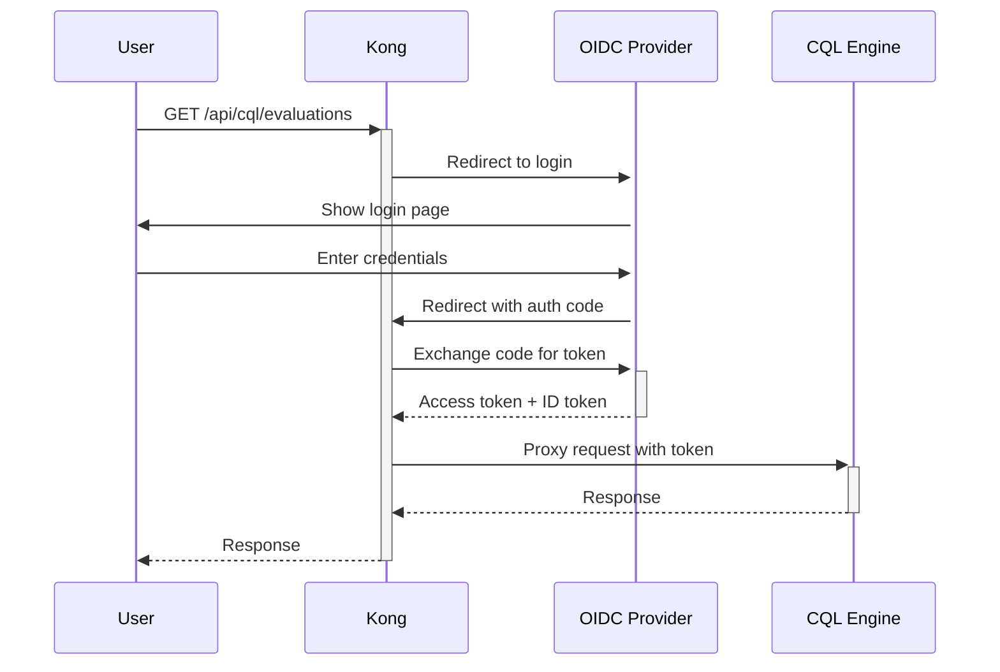

# Kong API Gateway for HealthData In Motion HIE Platform

This directory contains Kong API Gateway configuration for securing and managing the HIE platform APIs.

## Overview

Kong provides:
- **Centralized Authentication**: OIDC/OAuth2 integration with identity providers
- **Rate Limiting**: Protect services from overload
- **Security**: CORS, security headers, IP restrictions
- **SSL/TLS Termination**: HTTPS support
- **Request Transformation**: Header injection, request/response modification
- **Monitoring**: Request logging and metrics

## Quick Start

### 1. Start Kong and Services

```bash
# Start main platform services
cd /home/webemo-aaron/projects/healthdata-in-motion
docker compose up -d

# Start Kong API Gateway
docker compose -f kong/docker-compose-kong.yml up -d

# Wait for Kong to be healthy (30-60 seconds)
docker logs healthdata-kong --follow
```

### 2. Configure Kong Routes and Plugins

```bash
# Run basic Kong configuration
cd /home/webemo-aaron/projects/healthdata-in-motion
./kong/kong-setup.sh
```

This creates:
- **Services**: CQL Engine, Quality Measure, FHIR
- **Routes**: `/api/cql`, `/api/quality`, `/api/fhir`
- **Plugins**: CORS, rate limiting, security headers, logging

### 3. Configure Authentication (Choose One)

#### Option A: OIDC Authentication (Recommended for Production)

Requires: Okta, Auth0, Keycloak, Azure AD, or similar OIDC provider

```bash
# Set OIDC provider configuration
export OIDC_ISSUER="https://your-oidc-provider.com/realms/healthdata"
export OIDC_CLIENT_ID="healthdata-api-gateway"
export OIDC_CLIENT_SECRET="your-client-secret-here"
export OIDC_DISCOVERY="https://your-oidc-provider.com/realms/healthdata/.well-known/openid-configuration"

# Configure OIDC plugin
./kong/kong-oidc-setup.sh
```

#### Option B: Basic JWT Validation (Development)

For development/testing without full OIDC flow:

```bash
# Uses existing JWT validation in backend services
# Kong passes JWT tokens through to services
# No additional configuration needed
```

## Architecture

```
┌─────────────────────────────────────────────────────────────┐
│  Internet / HIE Network                                     │
└────────────────────────┬────────────────────────────────────┘
                         │
                    HTTPS (443)
                         │
                         ▼
┌─────────────────────────────────────────────────────────────┐
│  Kong API Gateway (Port 8000 HTTP, 8443 HTTPS)              │
│  ┌─────────────┬──────────────┬───────────────┬──────────┐  │
│  │ OIDC Auth   │ Rate Limit   │ Security      │ CORS     │  │
│  │ Plugin      │ Plugin       │ Headers       │ Plugin   │  │
│  └─────────────┴──────────────┴───────────────┴──────────┘  │
└────────┬──────────────┬──────────────┬────────────────────┘
         │              │              │
    /api/cql      /api/quality    /api/fhir
         │              │              │
         ▼              ▼              ▼
┌─────────────┐  ┌──────────────┐  ┌──────────┐
│ CQL Engine  │  │ Quality      │  │ FHIR     │
│ Service     │  │ Measure      │  │ Server   │
│ :8081       │  │ Service      │  │ :8083    │
│             │  │ :8087        │  │          │
└─────────────┘  └──────────────┘  └──────────┘
```

## API Endpoints

### Via Kong Gateway (Secured)

All requests go through Kong at `http://localhost:8000` (or `https://localhost:8443`)

| Endpoint | Backend Service | Description |
|----------|----------------|-------------|
| `GET /api/cql/evaluations` | CQL Engine | List quality measure evaluations |
| `POST /api/cql/evaluate` | CQL Engine | Evaluate quality measure for patient |
| `GET /api/quality/report/patient` | Quality Measure | Get patient quality report |
| `GET /api/quality/report/population` | Quality Measure | Get population quality report |
| `GET /api/fhir/Patient` | FHIR Server | Search patients |
| `GET /api/fhir/Observation` | FHIR Server | Search observations |

### Direct to Services (Bypasses Kong - Development Only)

| Endpoint | Description |
|----------|-------------|
| `http://localhost:8081/cql-engine/api/v1/cql/*` | CQL Engine Direct |
| `http://localhost:8087/quality-measure/quality-measure/*` | Quality Measure Direct |
| `http://localhost:8083/fhir/*` | FHIR Server Direct |

**⚠️ Production**: All traffic should go through Kong. Direct service access should be blocked by firewall rules.

## Authentication Flow

### OIDC Flow (Option A)



### Bearer Token Flow (Frontend API Calls)

```bash
# Frontend obtains token from OIDC provider
TOKEN="eyJhbGciOiJIUzI1NiIsInR5cCI6IkpXVCJ9..."

# Include in Authorization header
curl -H "Authorization: Bearer $TOKEN" \
     -H "X-Tenant-ID: default" \
     http://localhost:8000/api/cql/evaluations
```

## Kong Admin Interfaces

### Kong Admin API

```bash
# List all services
curl http://localhost:8001/services

# List all routes
curl http://localhost:8001/routes

# List all plugins
curl http://localhost:8001/plugins

# View specific service
curl http://localhost:8001/services/cql-engine-service
```

### Kong Admin GUI (Konga)

Access Konga at: http://localhost:1337

**First-time setup**:
1. Create admin account
2. Connect to Kong: `http://healthdata-kong:8001`
3. Navigate to Services, Routes, Plugins

**Features**:
- Visual service and route management
- Plugin configuration UI
- Health monitoring dashboard
- Consumer management
- Certificate management

## Multi-Tenancy with Kong

Kong supports tenant isolation through:

1. **Consumer-based routing** (recommended):
   ```bash
   # Create consumer for each tenant
   curl -X POST http://localhost:8001/consumers \
     -d "username=org-001-user" \
     -d "custom_id=org-001"

   # Associate with tenant
   # Kong extracts tenant from JWT claims and sets X-Tenant-ID header
   ```

2. **Header-based routing**:
   ```bash
   # Frontend includes X-Tenant-ID header
   curl -H "X-Tenant-ID: org-001" \
        -H "Authorization: Bearer $TOKEN" \
        http://localhost:8000/api/cql/evaluations
   ```

3. **Subdomain routing** (future):
   ```bash
   # org-001.healthdata.com → X-Tenant-ID: org-001
   # org-002.healthdata.com → X-Tenant-ID: org-002
   ```

## Security Best Practices

### 1. TLS/SSL Configuration

```bash
# Generate self-signed certificate for testing
openssl req -x509 -nodes -days 365 -newkey rsa:2048 \
  -keyout kong/certs/kong.key \
  -out kong/certs/kong.crt \
  -subj "/CN=localhost"

# Add certificate to Kong
curl -X POST http://localhost:8001/certificates \
  -F "cert=@kong/certs/kong.crt" \
  -F "key=@kong/certs/kong.key" \
  -F "snis=localhost"

# Update route to use HTTPS
curl -X PATCH http://localhost:8001/routes/cql-engine-api \
  -d "protocols[]=https"
```

**Production**: Use Let's Encrypt or commercial certificate authority.

### 2. IP Restriction

```bash
# Restrict API access to HIE network
curl -X POST http://localhost:8001/plugins \
  -d "name=ip-restriction" \
  -d "config.allow=10.0.0.0/8" \
  -d "config.allow=172.16.0.0/12" \
  -d "config.allow=192.168.0.0/16"
```

### 3. Request Size Limiting

```bash
# Prevent large payloads (DoS protection)
curl -X POST http://localhost:8001/plugins \
  -d "name=request-size-limiting" \
  -d "config.allowed_payload_size=10" \
  -d "config.size_unit=megabytes"
```

### 4. Bot Detection

```bash
# Block known bad user agents
curl -X POST http://localhost:8001/plugins \
  -d "name=bot-detection" \
  -d "config.allow=googlebot" \
  -d "config.allow=bingbot" \
  -d "config.deny=badbot"
```

## Rate Limiting

Kong enforces rate limits to prevent API abuse:

| Tier | Limit | Use Case |
|------|-------|----------|
| Global | 100 req/s, 1000 req/min | Platform-wide limit |
| Per Consumer | 50 req/s, 500 req/min | Per organization |
| Per Route | Varies | Endpoint-specific |

**Configure custom rate limits**:

```bash
# Per-consumer rate limiting
curl -X POST http://localhost:8001/consumers/org-001-user/plugins \
  -d "name=rate-limiting" \
  -d "config.second=50" \
  -d "config.minute=500" \
  -d "config.hour=5000" \
  -d "config.policy=cluster"
```

## Monitoring & Observability

### Prometheus Metrics

```bash
# Enable Prometheus plugin
curl -X POST http://localhost:8001/plugins \
  -d "name=prometheus"

# Scrape metrics
curl http://localhost:8001/metrics
```

**Key Metrics**:
- `kong_http_requests_total` - Total requests
- `kong_http_status` - HTTP status codes
- `kong_latency` - Request latency
- `kong_bandwidth` - Bytes transferred

### Request Logging

Logs are written to `/tmp/kong-access.log` in JSON format:

```json
{
  "request": {
    "method": "GET",
    "uri": "/api/cql/evaluations",
    "querystring": {"page": "0", "size": "5"},
    "headers": {
      "x-tenant-id": "default",
      "authorization": "Bearer ey..."
    }
  },
  "response": {
    "status": 200,
    "headers": {"content-type": "application/json"}
  },
  "latencies": {
    "proxy": 50,
    "kong": 5,
    "request": 55
  }
}
```

**Ship logs to ELK stack**:

```bash
# Configure Logstash output
curl -X POST http://localhost:8001/plugins \
  -d "name=tcp-log" \
  -d "config.host=logstash.example.com" \
  -d "config.port=5000"
```

## Troubleshooting

### Kong not starting

```bash
# Check Kong logs
docker logs healthdata-kong

# Common issues:
# - Database not ready: Wait for kong-database to be healthy
# - Port conflict: Check if 8000, 8001, 8443 are available
# - Migration failed: Run migration manually
docker compose -f kong/docker-compose-kong.yml run --rm kong-migration
```

### 502 Bad Gateway

```bash
# Check service connectivity
docker exec healthdata-kong curl -I http://healthdata-cql-engine:8081/cql-engine/actuator/health

# Verify service exists in Kong
curl http://localhost:8001/services/cql-engine-service

# Check upstreams
curl http://localhost:8001/upstreams
```

### Authentication Failing

```bash
# Check OIDC plugin configuration
curl http://localhost:8001/plugins | jq '.data[] | select(.name=="openid-connect")'

# Verify OIDC discovery
curl https://your-oidc-provider.com/realms/healthdata/.well-known/openid-configuration

# Test token validation
curl -H "Authorization: Bearer $TOKEN" \
     -v http://localhost:8000/api/cql/evaluations
```

### High Latency

```bash
# Check Kong latency
curl http://localhost:8001/status

# View per-route metrics
curl http://localhost:8001/metrics | grep kong_latency

# Enable caching
curl -X POST http://localhost:8001/plugins \
  -d "name=proxy-cache" \
  -d "config.strategy=memory" \
  -d "config.cache_ttl=300"
```

## Production Deployment

### 1. Database Setup

Use managed PostgreSQL in production:

```yaml
kong-database:
  image: postgres:16-alpine
  environment:
    POSTGRES_DB: kong
    POSTGRES_USER: kong
    POSTGRES_PASSWORD: ${KONG_DB_PASSWORD}  # From secrets manager
  volumes:
    - /mnt/kong-data:/var/lib/postgresql/data  # Persistent volume
```

### 2. High Availability

Deploy multiple Kong instances behind load balancer:

```bash
# Scale Kong horizontally
docker compose -f kong/docker-compose-kong.yml up -d --scale kong=3
```

### 3. SSL/TLS

Use production certificates:

```bash
# Let's Encrypt with Certbot
certbot certonly --standalone -d api.healthdata.com

# Add to Kong
curl -X POST http://localhost:8001/certificates \
  -F "cert=@/etc/letsencrypt/live/api.healthdata.com/fullchain.pem" \
  -F "key=@/etc/letsencrypt/live/api.healthdata.com/privkey.pem" \
  -F "snis=api.healthdata.com"
```

### 4. Secrets Management

Use environment variables or secrets vault:

```bash
# AWS Secrets Manager
export OIDC_CLIENT_SECRET=$(aws secretsmanager get-secret-value \
  --secret-id healthdata/oidc/client-secret \
  --query SecretString --output text)

# HashiCorp Vault
export OIDC_CLIENT_SECRET=$(vault kv get -field=client_secret secret/healthdata/oidc)
```

## Additional Resources

- **Kong Documentation**: https://docs.konghq.com/
- **Kong Plugin Hub**: https://docs.konghq.com/hub/
- **OIDC Plugin**: https://docs.konghq.com/hub/kong-inc/openid-connect/
- **Rate Limiting**: https://docs.konghq.com/hub/kong-inc/rate-limiting/
- **Monitoring**: https://docs.konghq.com/gateway/latest/production/monitoring/

## Support

For Kong-specific issues, consult:
- Kong Community: https://discuss.konghq.com/
- Kong GitHub: https://github.com/Kong/kong

For HealthData In Motion platform issues, see:
- Main README: `/backend/README.md`
- HIE Deployment Guide: `/HIE_DEPLOYMENT_READINESS.md`
